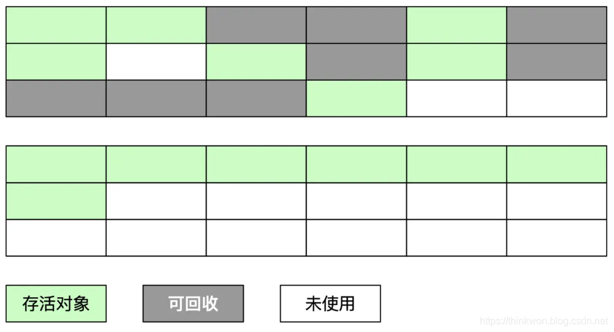
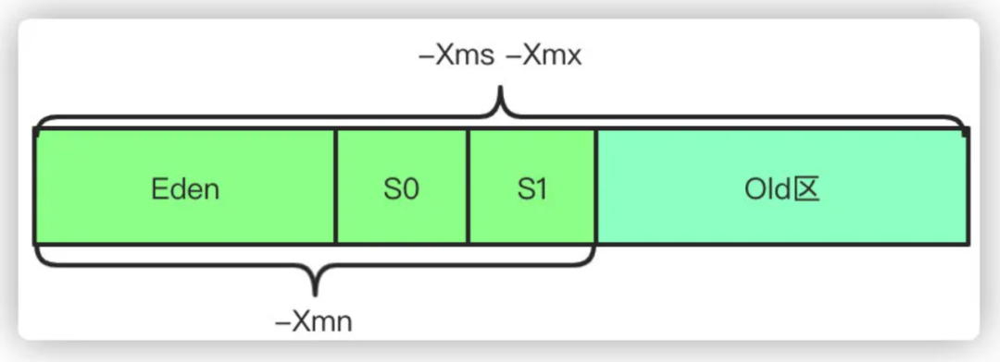

## Java内存区域

### 说一下 JVM 的主要组成部分及其作用？

JVM包含两个子系统和两个组件，两个子系统为Class loader(类装载)、Execution engine(执行引擎)；两个组件为Runtime data area(运行时数据区)、Native Interface(本地接口)。

- Class loader(类装载)：根据给定的全限定名类名(如：java.lang.Object)来装载class文件到运行时数据区中的方法区。
- Execution engine（执行引擎）：执行字节码中的指令。
- Native Interface(本地接口)：与native libraries交互，是与其它编程语言交互的接口。
- Runtime data area(运行时数据区域)：这就是我们常说的JVM的内存。

**作用** ：首先通过编译器把 Java 代码转换成字节码，类加载器（ClassLoader）再把字节码加载到内存中，将其放在运行时数据区（Runtime data area）的方法区内，而字节码文件只是 JVM 的一套指令集规范，并不能直接交给底层操作系统去执行，因此需要特定的解释器执行引擎（Execution Engine），将字节码翻译成底层系统指令，再交由 CPU 去执行，而这个过程中需要调用其他语言的本地库接口（Native Interface）来实现整个程序的功能。

### 说一下 JVM 运行时数据区

**Java 虚拟机在执行 Java 程序的过程中会把它所管理的内存区域划分为若干个不同的数据区域**。这些区域都有各自的用途，以及创建和销毁的时间，有些区域随着虚拟机进程的启动而存在，有些区域则是依赖线程的启动和结束而建立和销毁。Java 虚拟机所管理的内存被划分为如下几个区域：

不同虚拟机的运行时数据区可能略微有所不同，但都会遵从 Java 虚拟机规范， Java 虚拟机规范规定的区域分为以下 5 个部分：

- Java 堆（Java Heap）：Java 虚拟机中内存最大的一块，是被所有线程共享的，几乎所有的对象实例都在这里分配内存；
- 方法区（Method Area）：用于存储已被虚拟机加载的类信息、常量、静态变量、即时编译后的代码等数据。
- Java 虚拟机栈（Java Virtual Machine Stacks）：用于存储局部变量表、操作数栈、动态链接、方法出口等信息；
- 本地方法栈（Native Method Stack）：与虚拟机栈的作用是一样的，只不过虚拟机栈是服务 Java 方法的，而本地方法栈是为虚拟机调用 Native 方法服务的；
- 程序计数器（Program Counter Register）：当前线程所执行的字节码的行号指示器，字节码解释器的工作是通过改变这个计数器的值，来选取下一条需要执行的字节码指令，分支、循环、跳转、异常处理、线程恢复等基础功能，都需要依赖这个计数器来完成；

### 深拷贝和浅拷贝

浅拷贝（shallowCopy）只是增加了一个指针指向已存在的内存地址

深拷贝（deepCopy）是增加了一个指针并且申请了一个新的内存，使这个增加的指针指向这个新的内存，

使用深拷贝的情况下，不会出现浅拷贝时释放同一个内存的错误。

### 说一下堆栈的区别？

|              | 堆                                                           | 栈                                                           |
| ------------ | ------------------------------------------------------------ | ------------------------------------------------------------ |
| 物理地址     | 物理地址分配是不连续的，因此性能慢些。在GC的时候需要考虑到不连续的分配，所以有各种垃圾回收算法。 | 栈使用的是数据结构中的栈，具有先进后出的规则，物理地址分配是连续的，因此性能快 |
| 分配内存时机 | 堆因为是不连续的，所以分配的内存是在`运行期`确认的，因此大小不固定。一般堆大小远远大于栈。 | 栈是连续的，所以分配的内存大小要在`编译期`就确认，大小是固定的。 |
| 存放的内容   | 堆存放的是对象的实例和数组。此区域更关注的是数据的存储       | 栈存放：局部变量，操作数栈，返回结果。此区域更关注的是程序方法的执行。 |
| 程序的可见度 | 堆对于整个应用程序都是共享的、可见的。                       | 栈对当前线程是可见的，是线程私有。他的生命周期和线程相同。   |

## HotSpot虚拟机对象探秘

### 对象的创建

说到对象的创建，首先让我们看看 `Java` 中提供的几种对象创建方式：

| Header                             | 解释             |
| :--------------------------------- | :--------------- |
| 使用new关键字                      | 调用了构造函数   |
| 使用Class的newInstance方法         | 调用了构造函数   |
| 使用Constructor类的newInstance方法 | 调用了构造函数   |
| 使用clone方法                      | 没有调用构造函数 |
| 使用反序列化                       | 没有调用构造函数 |

下面是对象创建的主要流程：

虚拟机遇到一条new指令时，先检查常量池是否已经加载相应的类，如果没有，必须先执行相应的类加载。类加载通过后，接下来分配内存。若Java堆中内存是绝对规整的，使用“指针碰撞“方式分配内存；如果不是规整的，就从空闲列表中分配，叫做”空闲列表“方式。划分内存时还需要考虑一个问题-并发，也有两种方式：CAS同步处理，或者本地线程分配缓冲(Thread Local Allocation Buffer, TLAB)。然后将分配到的内存空间都初始化为零值，接着是做一些必要的对象设置(元信息、哈希码...)，最后执行`<init>`方法。

### 为对象分配内存

类加载完成后，接着会在Java堆中划分一块内存分配给对象。内存分配根据Java堆是否规整，有两种方式：

- 指针碰撞：如果Java堆的内存是规整，即所有用过的内存放在一边，而空闲的的放在另一边。分配内存时将位于中间的指针指示器向空闲的内存移动一段与对象大小相等的距离，这样便完成分配内存工作。
- 空闲列表：如果Java堆的内存不是规整的，则需要由虚拟机维护一个列表来记录哪些内存是可用的，这样在分配的时候可以从列表中查询到足够大的内存分配给对象，并在分配后更新列表记录。

选择哪种分配方式是由 Java 堆是否规整来决定的，而 Java 堆是否规整又由所采用的垃圾收集器是否带有压缩整理功能决定。

### 处理并发安全问题

在虚拟机中对象的创建是一个非常频繁的行为，哪怕只是修改一个指针所指向的位置，在并发情况下也是不安全的，可能出现正在给对象 A 分配内存，指针还没来得及修改，对象 B 又同时使用了原来的指针来分配内存的情况。解决这个问题有两种方案：

- 对内存分配的动作进行同步处理（采用 CAS + 失败重试来保障更新操作的原子性）；
- 把内存分配的动作按照线程划分在不同的空间之中进行，即每个线程在 Java 堆中预先分配一小块内存，称为本地线程分配缓冲（Thread Local Allocation Buffer, TLAB）。哪个线程要分配内存，就在哪个线程的 TLAB 上分配。只有 TLAB 用完并分配新的 TLAB 时，才需要同步锁。通过-XX:+UseTLAB参数来设定虚拟机是否使用TLAB。

### 对象的访问定位

`Java`程序需要通过 `JVM` 栈上的引用访问堆中的具体对象。对象的访问方式取决于 `JVM` 虚拟机的实现。目前主流的访问方式有 **句柄** 和 **直接指针** 两种方式。

> **指针：** 一种内存地址，代表一个对象在内存中的地址。
>
> **句柄：** 可以理解为指向指针的指针，维护着对象的指针。句柄不直接指向对象，而是指向对象的指针（句柄不发生变化，指向固定内存地址），再由对象的指针指向对象的真实内存地址。

#### 句柄访问

`Java`堆中划分出一块内存来作为**句柄池**，引用中存储对象的**句柄地址**，而句柄中包含了**对象实例数据**与**对象类型数据**各自的**具体地址**信息，具体构造如下图所示：

**优势**：引用中存储的是**稳定**的句柄地址，在对象被移动（垃圾收集时移动对象是非常普遍的行为）时只会改变**句柄中**的**实例数据指针**，而**引用**本身不需要修改。

#### 直接指针

如果使用**直接指针**访问，**引用** 中存储的直接就是**对象地址**。

**优势**：速度更**快**，节省了**一次指针定位**的时间开销。由于对象的访问在`Java`中非常频繁，因此这类开销积少成多后也是非常可观的执行成本。HotSpot 中采用的就是这种方式。

## 内存溢出异常

### Java会存在内存泄漏吗？请简单描述

内存泄漏是指不再被使用的对象或者变量一直存在于内存中。理论上来说，Java是有GC垃圾回收机制的，也就是说，不再被使用的对象，会被GC自动回收掉，自动从内存中清除。

但是，即使这样，Java也还是存在着内存泄漏的情况，Java导致内存泄露的原因很明确：长生命周期的对象持有短生命周期对象的引用就很可能发生内存泄露，尽管短生命周期对象已经不再需要，但是因为长生命周期对象持有它的引用而导致不能被回收，这就是Java中内存泄露的发生场景。

## 垃圾收集器

### 简述Java垃圾回收机制，GC是什么？垃圾回收器的基本原理是什么？垃圾回收器可以马上回收内存吗？有什么办法主动通知虚拟机进行垃圾回收？

Java垃圾回收机制：GC 是垃圾收集的意思（Gabage Collection），在java中，程序员是不需要显示的去释放一个对象的内存的，而是由虚拟机自行执行，这就是垃圾回收机制，垃圾回收机制有效的防止了内存泄露

垃圾回收器的基本原理：在JVM中，有一个垃圾回收线程，它是低优先级的，在正常情况下是不会执行的，只有在虚拟机空闲或者当前堆内存不足时，才会触发执行，扫描那些没有被引用的对象，并将它们添加到要回收的集合中，进行回收。

垃圾回收器可以马上回收内存吗？：程序员不能实时的对某个对象或所有对象调用垃圾回收器进行垃圾回收。但可以手动执行System.gc()主动通知虚拟机进行垃圾回收，但是Java语言规范并不能保证GC一定会执行。

### Java 中都有哪些引用类型？强引用、软引用、弱引用、幻象引用有什么区别？具体使用场景是什么？

在Java语言中，除了基本数据类型外，其他的都是指向各类对象的对象引用，根据其生命周期的长短，将引用分为4类。

不同的引用类型，主要体现的是对象不同的可达性状态和对垃圾收集的影响。

- 强引用：最常见的普通对象引用，通过关键字new创建的对象所关联的引用就是强引用，发生 gc 的时候不会被回收。
- 软引用：软引用的生命周期比强引用短一些。有用但不是必须的对象，在发生内存溢出之前会被回收。应用场景：软引用通常用来实现内存敏感的缓存。如果还有空闲内存，就可以暂时保留缓存，当内存不足时清理掉，这样就保证了使用缓存的同时，不会耗尽内存。
- 弱引用：弱引用的生命周期比软引用短。有用但不是必须的对象，在下一次GC时会被回收。应用场景：弱应用同样可用于内存敏感的缓存。
- 虚引用（幽灵引用/幻象引用）：无法通过虚引用获得对象，用 PhantomReference 实现虚引用。应用场景：虚引用的用途是在这个对象被 gc 时返回一个系统通知。

### 怎么判断对象是否可以被回收？在Java中，对象什么时候可以被垃圾回收

垃圾收集器在做垃圾回收的时候，首先需要判定的就是哪些内存是需要被回收的，哪些对象是「存活」的，是不可以被回收的；哪些对象已经「死掉」了，需要被回收。

一般有两种方法来判断：

- 引用计数器法：为每个对象创建一个引用计数器，有对象引用时计数器 +1，引用被释放时计数 -1，当计数器为 0 时就可以被回收。它有一个缺点不能解决循环引用的问题；
- 可达性分析算法：当一个对象到GC Roots不可达时，在下一个垃圾回收周期中尝试回收该对象。定义一系列的 GC ROOT 为起点。从起点开始向下开始搜索，搜索走过的路径称为引用链。当一个对象到 GC ROOT没有任何引用链相连的话，则对象可以判定是可以被回收的。

可达性分析算法详答

1. 当不能从GC Root寻找一条路径到达该对象时，将进行第一次标记。
2. 第一次标记后检查对象是否重写了finalize() 和是否已经被调用了finalize()方法。若没有重写finalize()方法或已经被调用，则进行回收。
3. 在已经重写finalize()方法且未调用的情况下，将对象加入一个F-Queue 的队列中，稍后进行第二次检查
4. 在第二次标记之前，对象如果执行finalize()方法并完成自救，对象则不会被回收。否则完成第二次标记，进行回收。值得注意的是finalize()方法并不可靠。

虚拟机默认采用的是可达性分析算法。

可以作为 GC ROOT 的对象包括：

1. 栈中引用的对象；
2. 静态变量、常量引用的对象；
3. 本地方法栈 native 方法引用的对象。

### JVM中的永久代中会发生垃圾回收吗

垃圾回收一般不会发生在永久代，如果永久代满了或者是超过了临界值，会触发完全垃圾回收(Full GC)。通过查看垃圾收集器的输出信息，就会发现永久代也是被回收的。所以正确的设置永久代大小可以有效避免Full GC。

Java8中已经移除了永久代，新加了一个叫做元数据区的native内存区，现在大多数的类元数据分配在本地化内存中。

### 说一下 JVM 有哪些垃圾回收算法？

- 标记-清除算法：标记无用对象，然后进行清除回收。缺点：效率不高，无法清除垃圾碎片。
- 复制算法：按照容量划分两个大小相等的内存区域，当一块用完的时候将活着的对象复制到另一块上，然后再把已使用的那块内存空间清理掉。缺点：内存使用率不高，只有原来的一半。
- 标记-整理算法：标记无用对象，让所有存活的对象都向一端移动，然后清除掉端边界以外的内存。
- 分代收集算法：根据对象存活周期的不同将内存划分为几块，一般是新生代和老年代，新生代采用复制算法，老年代采用标记整理算法。

#### 标记-清除算法

标记无用对象，然后进行清除回收。

标记-清除算法（Mark-Sweep）是一种常见的基础垃圾收集算法，它将垃圾收集分为两个阶段：

- 标记阶段：标记出可以回收的对象。
- 清除阶段：回收被标记的对象所占用的空间。

标记-清除算法之所以是基础的，是因为后面讲到的垃圾收集算法都是在此算法的基础上进行改进的。

**优点**：实现简单，不需要对象进行移动。

**缺点**：由于标记的过程需要遍历所有的 GC ROOT，清除的过程也要遍历堆中所有的对象，标记、清除过程效率低，产生大量不连续的内存碎片，提高了垃圾回收的频率。

标记-清除算法的执行的过程如下图所示

#### 复制算法

为了解决标记-清除算法的效率不高的问题，产生了复制算法。把内存空间划为两个相等的区域，每次只使用其中一个区域。垃圾收集时，遍历当前使用的区域，把存活对象复制到另外一个区域中，最后将已使用的内存空间一次清理掉。

**优点**：按顺序分配内存即可，实现简单、运行高效，不用考虑内存碎片。

**缺点**：可用的内存大小缩小为原来的一半，对象存活率高时会频繁进行复制。

复制算法的执行过程如下图所示

#### 标记-整理算法

在新生代中可以使用复制算法，但是在老年代就不能选择复制算法了，因为老年代的对象存活率会较高，这样会有较多的复制操作，导致效率变低。标记-清除算法可以应用在老年代中，但是它效率不高，在内存回收后容易产生大量内存碎片。因此就出现了一种标记-整理算法（Mark-Compact）算法，与标记-清除算法不同的是，在标记可回收的对象后将所有存活的对象压缩到内存的一端，使他们紧凑的排列在一起，然后对端边界以外的内存进行回收。回收后，已用和未用的内存都各自一边。

**优点**：解决了标记-清除算法存在的内存碎片问题。

**缺点**：需要进行局部对象移动，一定程度上降低了效率。

标记-整理算法的执行过程如下图所示

#### 分代收集算法

当前商业虚拟机都采用**分代收集**的垃圾收集算法。分代收集算法，顾名思义是根据对象的**存活周期**将内存划分为几块。一般包括**新生代**、**老年代**，新生代采用复制算法，老年代采用标记-整理算法，注：Java8中已经移除了永久代，添加了元数据区。如图所示：

**垃圾收集算法小结**

### 说一下 JVM 有哪些垃圾回收器？

如果说垃圾收集算法是内存回收的方法论，那么垃圾收集器就是内存回收的具体实现。下图展示了7种作用于不同分代的收集器，其中用于回收新生代的收集器包括Serial、ParNew、Parallel Scavenge，回收老年代的收集器包括Serial Old、Parallel Old、CMS，还有用于回收整个Java堆的G1收集器。不同收集器之间的连线表示它们可以搭配使用。

- Serial收集器(复制算法)：新生代单线程收集器，标记和清理都是单线程，优点是简单高效；
- ParNew收集器 (复制算法)：新生代并行收集器，实际上是Serial收集器的多线程版本，在多核CPU环境下有着比Serial更好的表现；
- Parallel Scavenge收集器 (复制算法)：新生代并行收集器，追求高吞吐量，高效利用 CPU。吞吐量 = 用户线程时间/(用户线程时间+GC线程时间)，高吞吐量可以高效率的利用CPU时间，尽快完成程序的运算任务，适合后台应用等对交互相应要求不高的场景；
- Serial Old收集器 (标记-整理算法)：老年代单线程收集器，Serial收集器的老年代版本；
- Parallel Old收集器 (标记-整理算法)：老年代并行收集器，吞吐量优先，Parallel Scavenge收集器的老年代版本；
- CMS(Concurrent Mark Sweep)收集器(标记-清除算法)：老年代并行收集器，追求最短GC回收停顿时间，具有高并发、低停顿的特点；
- G1(Garbage First)收集器 (标记-整理算法)：Java堆并行收集器，G1收集器是JDK1.7提供的一个新收集器，G1收集器基于“标记-整理”算法实现，也就是说不会产生内存碎片。此外，G1收集器不同于之前的收集器的一个重要特点是：G1回收的范围是整个Java堆(包括新生代，老年代)，而前六种收集器回收的范围仅限于新生代或老年代。

### 新生代垃圾回收器和老年代垃圾回收器都有哪些？有什么区别？

- 新生代回收器：Serial、ParNew、Parallel Scavenge
- 老年代回收器：Serial Old、Parallel Old、CMS
- 整堆回收器：G1

**新生代垃圾回收器一般采用的是复制算法**

**老年代垃圾回收器一般采用的是标记-整理的算法**

### 详细介绍一下 CMS 垃圾回收器？

CMS 是英文 Concurrent Mark-Sweep 的简称，是以牺牲吞吐量为代价来获得最短回收停顿时间的垃圾回收器。对于要求服务器响应速度的应用上，这种垃圾回收器非常适合。

在启动 JVM 的参数加上“-XX:+UseConcMarkSweepGC”来指定使用 CMS 垃圾回收器。

CMS 使用的是标记-清除的算法实现的，所以在 gc 的时候会产生大量的内存碎片，当剩余内存不能满足程序运行要求时，系统将会出现 Concurrent Mode Failure，临时 CMS 会采用 Serial Old 回收器进行垃圾清除，此时的性能将会被降低。

CMS 收集器是以获取最短停顿时间为目标的收集器。相对于其他的收集器 STW 的时间更短暂，可以并行收集是它的特点，同时它基于**标记-清除**算法。整个 GC 过程分为4步：

1. **初始标记**：标记 GC ROOT 能关联到的对象，需要 STW；
2. **并发标记**：从 GCRoots 的直接关联对象开始遍历整个对象图的过程，不需要 STW；
3. **重新标记**：为了修正并发标记期间，因用户程序继续运作而导致标记产生改变的标记，需要 STW；
4. **并发清除**：清理删除掉标记阶段判断的已经死亡的对象，不需要 STW。

从整个过程来看，并发标记和并发清除的耗时最长，但是不需要停止用户线程。而初始标记和重新标记的耗时较短，但是需要停止用户线程。总体而言，整个过程造成的停顿时间较短，大部分时候是可以和用户线程一起工作的。

### G1垃圾回收器的原理了解吗？

G1 作为 JDK9 之后的服务端默认收集器，不再区分年轻代和老年代进行垃圾回收。

把内存划分为多个 Region，每个 Region 的大小可以通过 **-XX:G1HeapRegionSize** 设置，大小为1~32M。

对于大对象的存储则衍生出 **Humongous** 的概念。超过 Region 大小一半的对象会被认为是大对象，而超过整个 Region 大小的对象被认为是超级大对象，将会被存储在连续的 N 个 Humongous Region 中。

G1 在进行回收的时候会在后台维护一个优先级列表，每次根据用户设定允许的收集停顿时间优先回收收益最大的 Region。

G1 的回收过程分为以下四个步骤：

1. **初始标记**：标记 GC ROOT 能关联到的对象，需要 STW；
2. **并发标记**：从 GCRoots 的直接关联对象开始遍历整个对象图的过程，扫描完成后还会重新处理并发标记过程中产生变动的对象；
3. **最终标记**：短暂暂停用户线程，再处理一次，需要 STW；
4. **筛选回收**：更新 Region 的统计数据，对每个 Region 的回收价值和成本排序，根据用户设置的停顿时间制定回收计划。再把Region 中存活对象复制到空的 Region，同时清理旧的 Region。需要 STW。

总的来说除了并发标记之外，其他几个过程也还是需要短暂的 STW。G1 的目标是在停顿和延迟可控的情况下尽可能提高吞吐量。

### 简述分代垃圾回收器是怎么工作的？

根据对象的**存活周期**将堆内存划分：老年代和新生代，新生代默认的空间占比总空间的 1/3，老年代的默认占比是 2/3。

新生代使用的是复制算法，新生代里有 3 个分区：Eden、From Survivor、To Survivor，它们的默认占比是 8:1:1，它的执行流程如下：

- 把 Eden + From Survivor 存活的对象放入 To Survivor 区；
- 清空 Eden 和 From Survivor 分区；
- From Survivor 和 To Survivor 分区交换，From Survivor 变 To Survivor，To Survivor 变 From Survivor。

每次在 From Survivor 到 To Survivor 移动存活的对象，年龄就 +1，当年龄到达 15（默认配置是 15）时，升级为老年代。大对象会直接进入老年代。

老年代当空间占用到达某个值之后就会触发全局垃圾回收，一般使用标记整理算法。

以上这些循环往复就构成了整个分代垃圾回收的整体执行流程。

## 内存分配策略

### 简述java内存分配与回收策略以及Minor GC和Major GC

所谓自动内存管理，最终要解决的也就是内存分配和内存回收两个问题。前面我们介绍了内存回收，这里我们再来聊聊内存分配。

对象的内存分配通常是在 Java 堆上分配（随着虚拟机优化技术的诞生，某些场景下也会在栈上分配，后面会详细介绍），对象主要分配在新生代的 Eden 区，如果启动了本地线程缓冲，则线程优先在 TLAB 上分配。少数情况下也会直接在老年代上分配。总的来说分配规则不是百分百固定的，其细节取决于哪一种垃圾收集器组合以及虚拟机相关参数有关，但是虚拟机对于内存的分配还是会遵循以下几种「普世」规则：

#### 对象优先在 Eden 区分配

多数情况，对象都在新生代 Eden 区分配。当 Eden 区没有足够的空间进行分配时，虚拟机将会发起一次 Minor GC。如果本次 GC 后还是没有足够的空间，则将启用分配担保机制在老年代中分配内存。

这里我们提到 Minor GC，如果你仔细观察过 GC 日常，通常我们还能从日志中发现 Major GC/Full GC。

- **Minor GC** 是指发生在新生代的 GC，因为 Java 对象大多都是朝生夕死，所以 Minor GC 非常频繁，一般回收速度也非常快；
- **Major GC/Full GC** 是指发生在老年代的 GC，出现了 Major GC 通常会伴随至少一次 Minor GC。Major GC 的速度通常会比 Minor GC 慢 10 倍以上。

#### 大对象直接进入老年代

所谓大对象是指需要大量连续内存空间的对象，频繁出现大对象是致命的，会导致在内存还有不少空间的情况下提前触发 GC，以获取足够的连续空间来安置新对象。

新生代使用的是复制算法，如果大对象直接在新生代分配，就会导致 Eden 区和两个 Survivor 区之间发生大量的内存复制，因此对于大对象都会直接在老年代进行分配。

#### 长期存活对象将进入老年代

虚拟机采用分代收集的思想来管理内存，会给每个对象定义了一个对象年龄的计数器，对象在 Eden 区出生，经过一次 Minor GC 对象年龄就会加 1，当年龄达到一定程度（默认 15） 就会被晋升到老年代，也就是长期存活对象将进入老年代。

## 虚拟机类加载机制

### 简述Java类加载机制？类加载机制的原理

Java中的所有类，都需要由类加载器装载到JVM中才能运行，同时对数据进行验证，准备，解析和初始化，最终形成可以被虚拟机直接使用的类型。

类加载器本身也是一个类，而它的工作就是把class文件从硬盘读取到内存中。在写程序的时候，我们几乎不需要关心类的加载，因为这些都是隐式装载的，除非我们有特殊的需求，像是反射，就需要显式的加载所需要的类。

类装载方式，有两种 ：

- 隐式装载， 程序在运行过程中当碰到通过new 等方式生成对象时，隐式调用类装载器加载对应的类到jvm中

- 显式装载， 通过class.forname()等方法，显式加载需要的类

Java中类的加载是动态的，它并不会一次性将所有类全部加载后再运行，而是保证程序运行的基础类(像是基类)完全加载到jvm中，至于其他类，则在需要的时候才加载，这是为了节省内存开销。

### 什么是类加载器，类加载器有哪些?

类加载器负责将字节码文件的类加载到虚拟机内存中。

主要有一下四种类加载器:

- 启动类加载器（Bootstrap ClassLoader）：用来加载Java核心类库，无法被Java程序直接引用。即用来加载JAVA_HOME/jre/lib目录中的，或者被 -Xbootclasspath 参数所指定的路径中并且被虚拟机识别的类库；
- 扩展类加载器（Extension ClassLoader）：用来加载 Java 的扩展库。负责加载JAVA_HOME/jre/lib/ext目录或-Djava.ext.dir系统变量指定的路径中的所有类库；
- 应用程序类加载器（Application ClassLoader）：用来加载用户类路径（classpath）上的指定类库，我们可以直接使用这个类加载器。一般情况，如果我们没有自定义类加载器，默认就是用这个加载器。
- 用户自定义类加载器：通过继承 java.lang.ClassLoader类的方式实现用户自定义类加载器。

### 说一下类装载的执行过程？

类装载分为以下 5 个步骤：

- 加载：根据查找路径找到相应的 class 文件然后导入；
- 验证：检查加载的 class 文件的正确性；
- 准备：给类中的静态变量分配内存空间；
- 解析：虚拟机将常量池中的符号引用替换成直接引用的过程。符号引用可以理解为一个标识，而直接引用直接指向内存中的地址；
- 初始化：对静态变量和静态代码块执行初始化工作。

### 什么是双亲委派模型？双亲委派模型工作流程是怎样的？双亲委派模型的好处是什么？

在介绍双亲委派模型之前先说下类加载器。对于任意一个类，都需要由加载它的类加载器和这个类本身一同确立在 JVM 中的唯一性，每一个类加载器，都有一个独立的类名称空间。类加载器就是根据指定全限定名称将 class 文件加载到 JVM 内存，然后再转化为 class 对象。

双亲委派模型：如果一个类加载器收到了类加载的请求，它首先不会自己去加载这个类，而是把这个请求委派给父类加载器去加载，每一层的类加载器都是如此，这样所有的加载请求都会被传送到顶层的启动类加载器中，只有当父加载器无法完成加载请求（它的搜索范围中没找到所需的类）时，子加载器才会尝试去加载此类。

**自下而上检查类是否已经被加载，自上而下尝试加载类**

双亲委派模型工作流程：

1. 当Application ClassLoader 收到一个类加载请求时，他首先不会自己去尝试加载这个类，而是将这个请求委派给父类加载器Extension ClassLoader去完成。
2. 当Extension ClassLoader收到一个类加载请求时，他首先也不会自己去尝试加载这个类，而是将请求委派给父类加载器Bootstrap ClassLoader去完成。 
3. Bootstrap ClassLoader尝试加载此类，如果Bootstrap ClassLoader加载失败，就会让Extension ClassLoader尝试加载。
4. Extension ClassLoader尝试加载此类，如果Extension ClassLoader也加载失败，就会让Application ClassLoader尝试加载。
5. Application ClassLoader尝试加载此类，如果Application ClassLoader也加载失败，就会让自定义加载器尝试加载。
6. 如果均加载失败，就会抛出ClassNotFoundException异常。

双亲委派模型的好处：**保证核心类库不被覆盖**。如果没有使用双亲委派模型，由各个类加载器自行加载的话，如果用户自己编写了一个称为java.lang.Object的类，并放在程序的ClassPath中，那系统将会出现多个不同的Object类， Java类型体系中最基础的行为就无法保证，应用程序也将会变得一片混乱。

## JVM调优

### 说一下 JVM 调优的工具？

JDK 自带了很多监控工具，都位于 JDK 的 bin 目录下，其中最常用的是 jconsole 和 jvisualvm 这两款可视化监控工具。

- jconsole：JDK 自带的可视化管理工具，用于对 JVM 中的内存、线程和类等进行监控，对垃圾回收算法有很详细的跟踪，功能简单；
- jvisualvm：JDK 自带的全能分析工具，可以分析：内存快照、线程快照、程序死锁、监控内存的变化、gc 变化等，功能强大。

常用的故障检测，监视，修理工具

| 工具名称                               | 主要作用                                       |
| -------------------------------------- | ---------------------------------------------- |
| jps (JVM Process Status Tool)          | 显示系统中所有的虚拟机进程                     |
| jstat (JVM Statistics Monitoring Tool) | 收集虚拟机各方面的运行数据                     |
| jinfo (Configuration Info for Java)    | 显示虚拟机配置信息                             |
| jmap (Memory Map for Java)             | 生成虚拟机的内存转储快照                       |
| jhat (JVM Heap Dump Browser)           | 分析堆内存转储快照，不推荐使用，消耗资源而且慢 |
| jstack (Stack Trace for Java）         | 显示线程堆栈快照                               |

### 谈谈你的GC调优思路?

谈到调优，这一定是针对特定场景、特定目的的事情， 对于 GC 调优来说，首先就需要清楚调优的目标是什么？从性能的角度看，通常关注三个方面，内存占用（footprint）、延时（latency）和吞吐量（throughput）

基本的调优思路可以总结为：

- 理解应用需求和问题，确定调优目标。假设，我们开发了一个应用服务，但发现偶尔会出现性能抖动，出现较长的服务停顿。评估用户可接受的响应时间和业务量，将目标简化为，希望 GC 暂停尽量控制在 200ms 以内，并且保证一定标准的吞吐量。
- 掌握 JVM 和 GC 的状态，定位具体问题，确定是否有 GC 调优的必要。具体有很多方法，比如，通过 jstat 等工具查看 GC 等相关状态，可以开启 GC 日志，或者是利用操作系统提供的诊断工具等。例如，通过追踪 GC 日志，就可以查找是不是 GC 在特定时间发生了长时间的暂停，进而导致了应用响应不及时。
- 接着需要思考选择的 GC 类型是否符合我们的应用特征，具体问题表现在哪里。是 Minor GC 过长，还是 Mixed GC 等出现异常停顿情况；如果不是，考虑切换到什么类型，如 CMS 和 G1 都是更侧重于低延迟的 GC 选项。
- 通过分析确定具体调整的参数或者软硬件配置。
- 验证是否达到调优目标，如果达到目标，即可以考虑结束调优；否则，重复进行分析、调整、验证。

### 常用的 JVM 调优的参数都有哪些？

1、性能调优要做到有的放矢，根据实际业务系统的特点，以一定时间的JVM日志记录为依据，进行有针对性的调整、比较和观察。

2、性能调优是个无止境的过程，要综合权衡调优成本和更换硬件成本的大小，使用最经济的手段达到最好的效果。

3、性能调优不仅仅包括JVM的调优，还有服务器硬件配置、操作系统参数、中间件线程池、数据库连接池、数据库本身参数以及具体的数据库表、索引、分区等的调整和优化。

4、通过特定工具检查代码中存在的性能问题并加以修正是一种比较经济快捷的调优方法。

常用的 JVM 调优的参数

- -Xms2g：初始化堆大小为 2g；
- -Xmx2g：堆最大内存为 2g；
- -Xmn1g：新生代内存大小为1g；-XX:NewSize 新生代大小，-XX:MaxNewSize 新生代最大值，-Xmn 则是相当于同时配置 -XX:NewSize 和 -XX:MaxNewSize 为一样的值；
- -XX:NewRatio=2：设置新生代的和老年代的内存比例为 1:2，即新生代占堆内存的1/3，老年代占堆内存的2/3；
- -XX:SurvivorRatio=8：设置新生代 Eden 和 两个Survivor 比例为 8:1:1；
- –XX:+UseParNewGC：对新生代使用并行垃圾回收器。
- -XX:+UseParallelOldGC：对老年代并行垃圾回收器。
- -XX:+UseConcMarkSweepGC：以牺牲吞吐量为代价来获得最短回收停顿时间的垃圾回收器。对于要求服务器响应速度的应用上，这种垃圾回收器非常适合。
- -XX:+PrintGC：开启打印 gc 信息；
- -XX:+PrintGCDetails：打印 gc 详细信息。