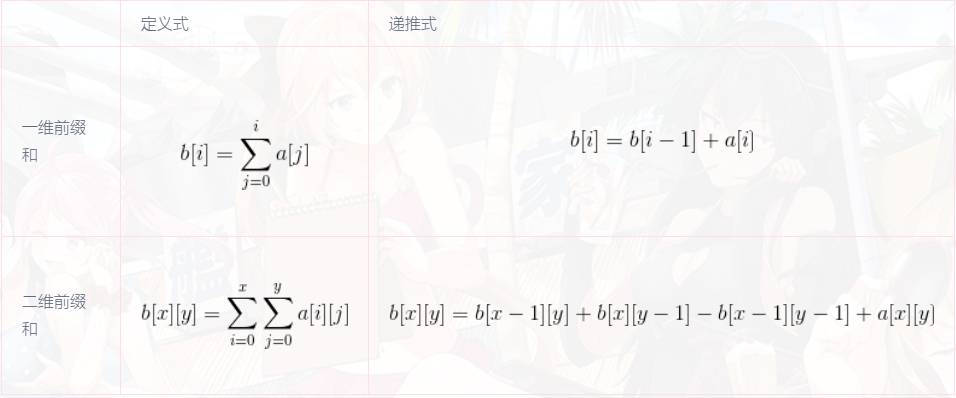
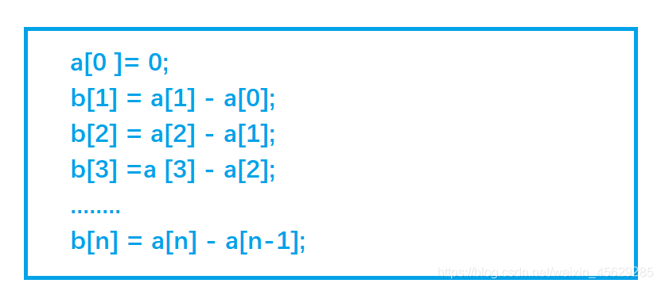

# 前缀和与差分


## 前缀和

【前缀和】

什么是前缀和？前缀和是一个数组的某项下标之前(包括此项元素)的所有数组元素的和。 

设b[]为前缀和数组，a[]为原数组，根据这句话可以得到前缀和的定义式和递推式：




【一维前缀和】

根据上面的定义，我们可以很容易得到 sum[i] = sum[i-1] + a[i] 　这样就可以得到前i个数的和

根据上述表达式我们可以以O(1)求出区间[i,j]的区间和  


![sum[i,j]=b[j]-b[i-1]](前缀和与差分.assets/gif.latex)


### 前缀和习题1: AcWing-795题：前缀和


输入一个长度为n的整数序列。

接下来再输入m个询问，每个询问输入一对l, r。

对于每个询问，输出原序列中从第l个数到第r个数的和。

**输入格式**
第一行包含两个整数n和m。

第二行包含n个整数，表示整数数列。

接下来m行，每行包含两个整数l和r，表示一个询问的区间范围。

**输出格式**
共m行，每行输出一个询问的结果。

**数据范围**
1≤l≤r≤n,
1≤n,m≤100000,
−1000≤数列中元素的值≤1000

**输入样例：**
5 3
2 1 3 6 4
1 2
1 3
2 4
**输出样例：**
3
6
10


**解题思想：**
直接求数组中某一段的和时间复杂度较高，而以下方法计算时只用了一次。
一维前缀和：
Sn = a1 + a2 + a3 + a4 + …+ an
sum(l, r) = al + …+ ar = S(r) - S(l - 1)


```c++
#include<iostream>
using namespace std;

const int N = 1e5+10;

int n,m;
int a[N],s[N];

int main()
{
    scanf("%d%d",&n,&m);
    
    for(int i=1;i<=n;i++) scanf("%d",&a[i]);
   
    //前缀和的初始化
    for(int i=1;i<=n;i++) s[i] = s[i-1] + a[i];
    
    while(m--)
    {
        int l,r;
        scanf("%d%d",&l,&r);
        //计算区间和
        printf("%d\n",s[r]-s[l-1]);
    }
    return 0;
}

```


### 前缀和习题2：AcWing-796题：子矩阵的和


输入一个n行m列的整数矩阵，再输入q个询问，每个询问包含四个整数x1, y1, x2, y2，表示一个子矩阵的左上角坐标和右下角坐标。

对于每个询问输出子矩阵中所有数的和。

**输入格式**

第一行包含三个整数n，m，q。

接下来n行，每行包含m个整数，表示整数矩阵。

接下来q行，每行包含四个整数x1, y1, x2, y2，表示一组询问。

**输出格式**

共q行，每行输出一个询问的结果。

**数据范围**

1≤n,m≤1000,
1≤q≤200000,
1≤x1≤x2≤n,
1≤y1≤y2≤m,
−1000≤矩阵内元素的值≤1000

**输入样例：**

3 4 3
1 7 2 4
3 6 2 8
2 1 2 3
1 1 2 2
2 1 3 4
1 3 3 4

**输出样例：**

17
27
21


**解题思路：**

先求前缀和，再求局部矩阵的和

前缀和公式：

```
S[i][j]=S[i][j-1]+S[i-1][j]-S[i-1][j-1]+a[i][j]
```

局部矩阵的和：给的两个点的坐标，求这两个点之间矩阵的和，坐标点分别为(x1,y1)，(x2,y2).

局部矩阵和公式：

```
S=S[x2][y2]-S[x1-1][y2]-S[x2][y1-1]+S[x1-1][y1-1]
```


```c++
#include <iostream>

using namespace std;

const int N = 1010;

int n,m,q;
int a[N][N],s[N][N];

int main(){
    scanf("%d%d%d",&n,&m,&q);
    
    for(int i=1;i<=n;i++){
        for(int j=1;j<=m;j++){
            scanf("%d",&a[i][j]);
        }
    }
    
    //求前缀和
    for(int i=1;i<=n;i++){
        for(int j=1;j<=m;j++){
            s[i][j]=s[i-1][j]+s[i][j-1]-s[i-1][j-1]+a[i][j];
        }
    }
    
    while(q--){
        int x1,y1,x2,y2;
        scanf("%d%d%d%d",&x1,&y1,&x2,&y2);
        //求局部矩阵和
        int result = s[x2][y2]-s[x2][y1-1]-s[x1-1][y2]+s[x1-1][y1-1];
        printf("%d\n",result);
    }
    
    return 0;
}
```


## 差分


**差分的基本概念：**

```java
如果有一数列 a[1],a[2],.…a[n]
且令 b[i]=a[i]-a[i-1],b[1]=a[1]

那么就有
a[i]=b[1]+b[2]+.…+b[i]
    =a[1]+a[2]-a[1]+a[3]-a[2]+.…+a[i]-a[i-1]
此时b数组称作a数组的差分数组
换句话来说a数组就是b数组的前缀和数组  例：
     原始数组a：9  3  6  2  6  8
     差分数组b：9 -6  3 -4  4  2
     可以看到a数组是b的前缀和
```


### 差分习题1：AcWing-797题：差分

输入一个长度为n的整数序列。

接下来输入m个操作，每个操作包含三个整数l, r, c，表示将序列中[l, r]之间的每个数加上c。

请你输出进行完所有操作后的序列。

**输入格式**

第一行包含两个整数n和m。

第二行包含n个整数，表示整数序列。

接下来m行，每行包含三个整数l，r，c，表示一个操作。

**输出格式**

共一行，包含n个整数，表示最终序列。

**数据范围**

1≤n,m≤1000001≤n,m≤100000,
1≤l≤r≤n1≤l≤r≤n,
−1000≤c≤1000−1000≤c≤1000,
−1000≤整数序列中元素的值≤1000−1000≤整数序列中元素的值≤1000

**输入样例：**

```
6 3
1 2 2 1 2 1
1 3 1
3 5 1
1 6 1
```

**输出样例：**

```
3 4 5 3 4 2
```


**解题思路（转）：**

[解题思路来源](https://www.acwing.com/solution/content/26588/)

类似于数学中的求导和积分，**差分可以看成前缀和的逆运算。**

**差分数组：**

首先给定一个原数组a：a[1], a[2], a[3],,,,,, a[n];

然后我们构造一个数组b ： b[1] ,b[2] , b[3],,,,,, b[i];

使得 a[i] = b[1] + b[2 ]+ b[3] +,,,,,, + b[i]

也就是说，a数组是b数组的前缀和数组，反过来我们把b数组叫做a数组的**差分数组**。换句话说，每一个a[i]都是b数组中从头开始的一段区间和。

考虑如何构造差分b数组？

最为直接的方法

如下：

a[0 ]= 0;

b[1] = a[1] - a[0];

b[2] = a[2] - a[1];

b[3] =a [3] - a[2];

........

b[n] = a[n] - a[n-1];

图示:




我们只要有b数组，通过前缀和运算，就可以在O(n) 的时间内得到a数组 。

**知道了差分数组有什么用呢？** 别着急，慢慢往下看。

**话说有这么一个问题：**

给定区间[l ,r ]，让我们把a数组中的[ l, r]区间中的每一个数都加上c,即 a[l] + c , a[l+1] + c , a[l+2] + c ,,,,,, a[r] + c;

暴力做法是for循环l到r区间，时间复杂度O(n)，如果我们需要对原数组执行m次这样的操作，时间复杂度就会变成O(n*m)。有没有更高效的做法吗? **考虑差分做法。**

**始终要记得，a数组是b数组的前缀和数组**，比如对b数组的b[i]的修改，会影响到a数组中从a[i]及往后的每一个数。

首先让差分b数组中的 b[l] + c ,a数组变成 a[l] + c ,a[l+1] + c,,,,,, a[n] + c;

然后我们打个补丁，b[r+1] - c, a数组变成 a[r+1] - c,a[r+2] - c,,,,,,,a[n] - c;

**为啥还要打个补丁？**

**我们画个图理解一下这个公式的由来:**


b[l] + c，效果使得a数组中 a[l]及以后的数都加上了c(红色部分)，但我们只要求l到r区间加上c, 因此还需要执行 b[r+1] - c,让a数组中a[r+1]及往后的区间再减去c(绿色部分)，这样对于a[r] 以后区间的数相当于没有发生改变。

因此我们得出**一维差分结论：**给a数组中的[ l, r]区间中的每一个数都加上c,只需对差分数组b做 b[l] + = c, b[r+1] - = c。时间复杂度为O(1), 大大提高了效率。


y神的代码没看懂，这个题解的做法易于理解

```c++
#include <iostream>

using namespace std;

const int N = 1e5+10;

int n,m;
int a[N],b[N];

int main(){
    scanf("%d%d",&n,&m);
    
    for(int i=1;i<=n;i++){
        scanf("%d",&a[i]);
        b[i]=a[i]-a[i-1];//构造差分数组
    }
    
    int l,r,c;
    while(m--){
        scanf("%d%d%d",&l,&r,&c);
        b[l]+=c;
        b[r+1]-=c;
    }
    
    for(int i=1;i<=n;i++){
        //前缀和计算原数组并输出
        a[i]=b[i]+a[i-1];
        printf("%d ",a[i]);
    }
    
    return 0;
}
```


### 差分习题2：AcWing-798题：差分矩阵

输入一个n行m列的整数矩阵，再输入q个操作，每个操作包含五个整数x1, y1, x2, y2, c，其中(x1, y1)和(x2, y2)表示一个子矩阵的左上角坐标和右下角坐标。

每个操作都要将选中的子矩阵中的每个元素的值加上c。

请你将进行完所有操作后的矩阵输出。

**输入格式**

第一行包含整数n,m,q。

接下来n行，每行包含m个整数，表示整数矩阵。

接下来q行，每行包含5个整数x1, y1, x2, y2, c，表示一个操作。

**输出格式**

共 n 行，每行 m 个整数，表示所有操作进行完毕后的最终矩阵。

**数据范围**

1≤n,m≤10001≤n,m≤1000,
1≤q≤1000001≤q≤100000,
1≤x1≤x2≤n1≤x1≤x2≤n,
1≤y1≤y2≤m1≤y1≤y2≤m,
−1000≤c≤1000−1000≤c≤1000,
−1000≤矩阵内元素的值≤1000−1000≤矩阵内元素的值≤1000

**输入样例：**

```
3 4 3
1 2 2 1
3 2 2 1
1 1 1 1
1 1 2 2 1
1 3 2 3 2
3 1 3 4 1
```

**输出样例：**

```
2 3 4 1
4 3 4 1
2 2 2 2
```


```c++
#include <iostream>

using namespace std;

const int N = 1010;

int n,m,q;
int a[N][N],b[N][N];

void insert(int x1,int y1,int x2,int y2,int c){
    b[x1][y1]+=c;
    b[x1][y2+1]-=c;
    b[x2+1][y1]-=c;
    b[x2+1][y2+1]+=c;
}

int main(){
    scanf("%d%d%d",&n,&m,&q);
    
    for(int i=1;i<=n;i++){
        for(int j=1;j<=m;j++){
            scanf("%d",&a[i][j]);
        }
    }
    
    for(int i=1;i<=n;i++){
        for(int j=1;j<=m;j++){
            insert(i,j,i,j,a[i][j]);
        }
    }
    
    while(q--){
        int x1,y1,x2,y2,c;
        cin>>x1>>y1>>x2>>y2>>c;
        insert(x1,y1,x2,y2,c);
    }
    
    for(int i=1;i<=n;i++){
        for(int j=1;j<=m;j++){
            //求二维差分数组b[i][j]的前缀和，求完前缀和之后即有：b[i][j]=a[i][j];
            b[i][j]+=b[i-1][j]+b[i][j-1]-b[i-1][j-1];
        }
    }
    
    for(int i=1;i<=n;i++){
        for(int j=1;j<=m;j++){
            printf("%d ",b[i][j]);
        }
        cout<<endl;
    }
    
    return 0;
}
```

