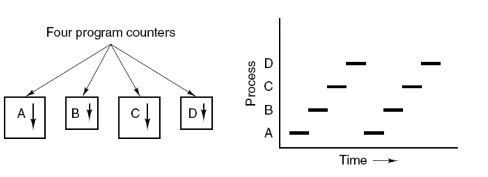

# 多线程详解


## 1 线程简介

**进程**是资源分配的基本单位。

进程控制块 (Process Control Block, PCB) 描述进程的基本信息和运行状态，所谓的创建进程和撤销进程，都是指对 PCB 的操作。

下图显示了 4 个程序创建了 4 个进程，这 4 个进程可以并发地执行。




**线程**是独立调度的基本单位。

一个进程中可以有多个线程，它们共享进程资源。

QQ 和浏览器是两个进程，浏览器进程里面有很多线程，例如 HTTP 请求线程、事件响应线程、渲染线程等等，线程的并发执行使得在浏览器中点击一个新链接从而发起 HTTP 请求时，浏览器还可以响应用户的其它事件。


**注意：**很多多线程是模拟出来的，真正的多线程是指有多个CPU，即多核，如服务器。如果是模拟出来的多线程，即在一个CPU的情况下，在同一个时间点，CPU只能执行一个代码，因为切换的很快，所以就有同时执行的错觉。

* **核心概念**
  *  线程就是独立的执行路径
  * 在程序运行时，即使没有自己创建线程，后台也会有多个线程，如主线程，gc线程。
  * main()称之为主线程，为系统的入口，用于执行整个程序。
  * 在一个进程中，如果开辟了多个线程，线程的运行由调度器安排调度，调度器是与操作系统紧密相关的，先后顺序是不能人为干预的。
  * 对同一份资源进行操作时，会存在资源抢夺的问题，需要加入并发控制。
  * 线程会带来额外的开销，如CPU调度时间，并发控制开销。
  * 每个线程在自己的工作内存交互，内存控制不当会造成数据不一致。


## 2 线程实现（重点）


### 2.1线程创建的方式（Thread,Runnable,Callable)

有三种创建方式：


### 2.2 继承Thread类

通过继承Thread类实现线程创建主要有以下三个步骤：

1. 自定义线程类继承Thread类

2. 重写run()方法，编写线程执行体

3. 创建线程对象，调用start()方法启动线程

   ```java
   //创建线程方式一：继承Thread类，重写run()方法，创建对象并调用start()方法
   public class TestThread1 extends Thread{
       public static void main(String[] args) {
           //创建一个线程对象
           TestThread1 testThread1 = new TestThread1();
           //调用start()方法开启线程
           testThread1.start();
           //main线程，主线程
           for (int i = 0; i < 10; i++) {
               System.out.println("我在看代码--"+i);
           }
       }
   
       @Override
       public void run() {
           //run方法线程
           for (int i = 0; i < 10; i++) {
               System.out.println("我在学习Java多线程--"+i);
           }
       }
   }
   ```


**线程不一定立即执行，由CPU调度安排**

注意这里调用start()方法和调用run()方法的区别，这也是普通方法调用和多线程的区别。


**案例：下载图片**

```java
package com.kuang.lesson04;

import org.apache.commons.io.FileUtils;

import java.io.File;
import java.io.IOException;
import java.net.URL;

//练习Thread,实现多线程下载图片
public class TestThread2 extends Thread{
    //URL链接
    private String url;
    //文件名称
    private String name;
    //有参构造
    public TestThread2(String url,String name)
    {
        this.url=url;
        this.name=name;
    }

    //重写run()方法,这也是下载图片线程的执行体
    @Override
    public void run()
    {
        //新建下载器对象
        WebDownloader webDownloader = new WebDownloader();
        //调用下载方法下载文件
        webDownloader.downloader(url, name);
        System.out.println("下载的文件名为："+name);
    }

    public static void main(String[] args) {
        //创建线程,这里的url是从百度图库中随便找的三个url
        TestThread2 t1 = new TestThread2("https://gimg2.baidu.com/image_search/src=http%3A%2F%2Fa1.att.hudong.com%2F24%2F78%2F20300000291746133783784887147.jpg&refer=http%3A%2F%2Fa1.att.hudong.com&app=2002&size=f9999,10000&q=a80&n=0&g=0n&fmt=jpeg?sec=1617242626&t=db0485b9ee2157de0e8d413d3a0116e1", "t1.jpg");
        TestThread2 t2 = new TestThread2("https://gimg2.baidu.com/image_search/src=http%3A%2F%2Fa2.att.hudong.com%2F27%2F81%2F01200000194677136358818023076.jpg&refer=http%3A%2F%2Fa2.att.hudong.com&app=2002&size=f9999,10000&q=a80&n=0&g=0n&fmt=jpeg?sec=1617242927&t=2551bb69336418c2cd0149e851e3ff93", "t2.jpg");
        TestThread2 t3 = new TestThread2("https://ss1.bdstatic.com/70cFuXSh_Q1YnxGkpoWK1HF6hhy/it/u=1089874897,1268118658&fm=26&gp=0.jpg", "t3.jpg");
        //启动线程
        t1.start();
        t2.start();
        t3.start();
    }

}
//下载器
class WebDownloader{
    //下载方法
    public void downloader(String url,String name)
    {
        try {
            //调用common-io  jar包中的类方法,可以将图片从URL链接上复制到文件中
            FileUtils.copyURLToFile(new URL(url),new File(name));
        } catch (IOException e) {
            e.printStackTrace();
            System.out.println("IO异常，downloader方法出现问题");
        }
    }
}
```


多线程下载图片主要分为三个步骤：


### 2.3 实现Runnable接口(重点)

通过实现Runnable接口实现线程创建主要分为三步:

1. 定义MyRunnable类实现Runnable接口
2. 实现run()方法，编写线程执行体
3. 创建线程对象，调用start()方法

```java
package com.kuang.lesson04;

import java.lang.management.ThreadInfo;

//创建线程方式2：通过实现Runnable接口创建线程
public class TestThread3 implements Runnable{
    public static void main(String[] args) {
        for (int i = 0; i < 20; i++) {
            System.out.println("这是main主线程"+i);
        }
        //创建Runnable接口的实现类对象
        TestThread3 testThread3 = new TestThread3();
        //调用start方法,执行线程需要在Thread对象中丢入Runnable接口的实现类
        new Thread(testThread3).start();
    }
    //重写run()方法
    @Override
    public void run()
    {
        for (int i = 0; i < 10; i++) {
            System.out.println("这是线程实现体"+i);
        }
    }
}

```


**两种创建线程方式的小结：**

* 继承Thread类方式
  *  子类继承Thread类具备多线程能力
  * 启动线程：子类对象.start
  * 不建议使用：避免OOP单继承局限性（Thread类本身也是通过实现Runnable接口实现线程的）
* 实现Runnable接口方式
  *  实现接口Runnable具有多线程能力
  * 启动线程：传入目标对象+Thread对象.start()
  * 推荐使用：避免单继承局限性，灵活方便，**方便同一个对象被多个线程使用**。


**初识并发问题：**

**并发问题根源之一：CPU切换线程执导致的原子性问题**，这也是下面的模拟抢火车票程序会出现不同的人抢到了同一张票的原因。

首先我们先理解什么叫原子性，原子性就指是把一个操作或者多个操作视为一个整体，在执行的过程不能被中断的特性叫原子性。

因为IO、内存、CPU缓存他们的操作速度有着巨大的差距，假如CPU需要把CPU缓存里的一个变量写入到磁盘里面，CPU可以马上发出一条对应的指令，但是指令发出后的很长时间CPU都在等待IO的结束，而在这个等待的过程中CPU是空闲的。

所以为了提升CPU的利用率，操作系统就有了进程和时间片的概念，同一个进程里的所有线程都共享一个内存空间，CPU每执行一个时间段就会切换到另外一个进程处理指令，而这执行的时间长度是是以时间片（比如每个时间片为1毫秒）为单位的，通过这种方式让CPU切换着不同的进程执行，让CPU更好的利用起来，同时也让我们不同的进程可以同时运行，我们可以一边操作word文档，一边用QQ聊天。

后来操作系统又在CPU切换进程执行的基础上做了进一步的优化，以更细的维度“线程”来切换任务执行，更加提高了CPU的利用率。但正是这种CPU可以在不同线程中切换执行的方式会使得我们程序执行的过程中产生原子性问题。

**比如说我们以一个变量赋值为例：**

语句1：Int number=0;

语句2：number=number+1;

在执行语句2的时候，我们的直觉number=number+1 是一个不可分割的整体，但是实际CPU操作过程中并非如此，我们的编译器会把number=number+1 拆分成多个指令交给CPU执行。


**number=number+1的指令可能如下：**

指令1：CPU把number从内存拷贝到CPU缓存。

指令2：把number进行+1的操作。

指令3：把number回写到内存。


在这个时候如果有多线程同时去操作number变量，就很有可能出现问题，因为CPU会在执行上面任何一个指令的时候切换线程执行指令，这个时候就可能出现执行结果与我们预期结果不符合的情况。

**比如如果现在有两个线程都在执行number=number+1，结果CPU执行流程可能会如下：**


接下来看课堂上模拟抢火车票的代码：

```java
package com.kuang.lesson04;

//一个对象被多个线程使用的例子
//以抢火车票为例
//发现问题：多个线程操作同一份资源时，出现并发问题，线程不安全，数据紊乱
public class TestThread4 implements Runnable{
    //设定火车票数为10，模拟三个人同时抢这十张票
    private int ticketNums=10;

    @Override
    public void run() {
        while(true)
        {
            if(ticketNums<=0)
            {
                break;
            }
            //模拟延时 200ms
            try {
                Thread.sleep(200);
            } catch (InterruptedException e) {
                e.printStackTrace();
            }
            //Thread.currentThread().getName()可以查看现在是谁在调用线程
            System.out.println(Thread.currentThread().getName()+"-->拿到了第"+ticketNums--+"票");
        }
    }

    public static void main(String[] args) {
        TestThread4 testThread4 = new TestThread4();
        new Thread(testThread4,"老师").start();
        new Thread(testThread4,"学生").start();
        new Thread(testThread4,"黄牛").start();
    }
}

```


期待的运行结果应该是三个人抢完十张票，并且每个人的票号都不相同，但是实际结果如下：


**案例:龟兔赛跑-Race**

1. 首先设置一个赛道距离，然后要离终点越来越近

2. 判断比赛是否结束

3. 打印出胜利者

4. 龟兔赛跑开始

5. 故事中兔子休息导致乌龟胜利，在代码中也让”兔子“进程休息

6. 最终，乌龟取得胜利

   ```java
   package com.kuang.lesson04;
   
   //模拟龟兔赛跑问题
   public class TestThread5 implements Runnable{
       private static String winner;
       @Override
       public void run() {
   
           for (int i = 0; i <=100; i++) {
               //每走十步让兔子睡一觉
               if(Thread.currentThread().getName().equals("兔子") && i%10==0)
               {
                   try {
                       Thread.sleep(1);
                   } catch (InterruptedException e) {
                       e.printStackTrace();
                   }
               }
               //判断比赛是否结束
               boolean flag=gameOver(i);
               //如果比赛结束，退出循环
               if(flag==true)
               {
                   break;
               }
               System.out.println(Thread.currentThread().getName()+"跑了"+i+"步");
           }
       }
   
       //判断比赛完成的函数
       private boolean gameOver(int steps){
           //先判断是否有winner
           if(winner!=null)
           {
               return true;
           }
           else
           {
               //如果步数大于等于100，则确定winner
               if(steps>=100)
               {
                   winner=Thread.currentThread().getName();
                   System.out.println("winner is "+winner);
                   return true;
               }
           }
           return false;
       }
   
       public static void main(String[] args) {
           TestThread5 testThread5 = new TestThread5();
           new Thread(testThread5,"兔子").start();
           new Thread(testThread5,"乌龟").start();
       }
   
   
   }
   
   ```

   

### 2.4 实现Callable接口(了解即可)

Callable是一个功能接口，因此可以用作lambda表达式或方法引用的复制目标。Callable接口类似于Runnable ，因为它们都是为其实例可能由另一个线程执行的类而设计的。 但是， Runnable不会返回结果，也不能抛出已检查的异常。

**主要步骤：**

1. 实现Callable接口，需要返回值类型
2. 重写call方法，需要抛出异常
3. 创建目标对象
4. 创建执行服务
5. 提交执行
6. 获取结果
7. 关闭服务


**演示：利用Callable改造下载图片案例**

```java
package com.kuang.lesson5;

import org.apache.commons.io.FileUtils;

import java.io.File;
import java.io.IOException;
import java.net.URL;
import java.util.concurrent.*;

//线程实现方式三：实现Callable接口
/*
Callable的好处：
1.可以定义返回值
2.可以抛出异常
 */
public class TestCallable implements Callable<Boolean> {
    //URL链接
    private String url;
    //文件名称
    private String name;
    //有参构造
    public TestCallable(String url,String name)
    {
        this.url=url;
        this.name=name;
    }
    @Override
    public Boolean call(){
        //新建下载器对象
        WebDownloader webDownloader2 = new WebDownloader();
        //调用下载方法下载文件
        webDownloader2.downloader(url, name);
        System.out.println("下载的文件名为："+name);
        return true;
    }

    public static void main(String[] args) throws ExecutionException, InterruptedException {
        //创建线程,这里的url是从百度图库中随便找的三个url
        TestCallable t1 = new TestCallable("https://gimg2.baidu.com/image_search/src=http%3A%2F%2Fa1.att.hudong.com%2F24%2F78%2F20300000291746133783784887147.jpg&refer=http%3A%2F%2Fa1.att.hudong.com&app=2002&size=f9999,10000&q=a80&n=0&g=0n&fmt=jpeg?sec=1617242626&t=db0485b9ee2157de0e8d413d3a0116e1", "t1.jpg");
        TestCallable t2 = new TestCallable("https://gimg2.baidu.com/image_search/src=http%3A%2F%2Fa2.att.hudong.com%2F27%2F81%2F01200000194677136358818023076.jpg&refer=http%3A%2F%2Fa2.att.hudong.com&app=2002&size=f9999,10000&q=a80&n=0&g=0n&fmt=jpeg?sec=1617242927&t=2551bb69336418c2cd0149e851e3ff93", "t2.jpg");
        TestCallable t3 = new TestCallable("https://ss1.bdstatic.com/70cFuXSh_Q1YnxGkpoWK1HF6hhy/it/u=1089874897,1268118658&fm=26&gp=0.jpg", "t3.jpg");

        //创建执行服务
        ExecutorService ser = Executors.newFixedThreadPool(3);

        //提交执行
        Future<Boolean> submit1 = ser.submit(t1);
        Future<Boolean> submit2 = ser.submit(t2);
        Future<Boolean> submit3 = ser.submit(t3);

        //获取结果
        Boolean rs1 = submit1.get();
        Boolean rs2 = submit2.get();
        Boolean rs3 = submit3.get();

        System.out.println(rs1);
        System.out.println(rs2);
        System.out.println(rs3);

        //关闭服务
        ser.shutdownNow();
    }
}

//下载器
class WebDownloader{
    //下载方法
    public void downloader(String url,String name)
    {
        try {
            //调用common-io  jar包中的类方法,可以将图片从URL链接上复制到文件中
            FileUtils.copyURLToFile(new URL(url),new File(name));
        } catch (IOException e) {
            e.printStackTrace();
            System.out.println("IO异常，downloader方法出现问题");
        }
    }
}

```


**演示：实现静态代理模式对比Thread**

```java
package com.kuang.lesson6;

//静态代理模式总结：
//真实对象和代理对象都要实现同一个接口
//代理对象要代理真是角色

//好处：代理对象可以做很多真实对象做不到的事情
// 真实对象就专注做自己的事情

public class StaticProxy {
    public static void main(String[] args) {
        //代理对象
        //WeddingCompany weddingCompany = new WeddingCompany(new YouMarry());
        //weddingCompany.HappyMarry();

        //对比下面两行代码,会发现其实Thread类其实也是一种静态代理模式
        new Thread(()-> System.out.println("十分感激")).start();

        new WeddingCompany(new YouMarry()).HappyMarry();
    }
}

//以结婚事件举例，讲解静态代理模式
interface Marry{
    void HappyMarry();
}

//你个人结婚
class YouMarry implements Marry{

    @Override
    public void HappyMarry() {
        System.out.println("你要结婚了，很开心");
    }
}

//婚庆公司帮助你结婚
class WeddingCompany implements Marry{
    //真是目标角色
    private Marry target;

    WeddingCompany(Marry target){
        this.target=target;
    }

    @Override
    public void HappyMarry() {
        before();
        this.target.HappyMarry();//这是真实对象
        after();
    }

    private void after() {
        System.out.println("结婚之后的布置！");
    }

    private void before() {
        System.out.println("结婚之前的布置!");
    }
}

```


### 2.5 Lambda表达式(扩展)

$$
\lambda是希腊字母中排序地十一位的字母，英语名词为Lambda
$$

* 使用Lambda表达式可以避免匿名内部类定义过多

* Lambda表达式其实质属于函数式编程的概念

  ```java
  (params) -> expression [表达式]
      (params) -> statement [语句]
          (params) -> {statements}
  ```

  比如：

  ```java
  a-> System.out.println("i like lambda -->"+a);
  
  new Thread(()->System.out.println("多线程学习。。")).start();
  ```


**为什么要使用Lambda表达式？**

* 避免匿名内部类定义过多
* 可以让你的代码看起来很简洁
* 去掉了一堆没用意义的代码，只留下核心逻辑


**Lambda表达式的学习：**

* 理解Functional Interface(函数式接口)是学习Java8 Lambda表达式的关键所在

* 函数式接口的定义：

  *  **任何接口，如果只包含唯一一个抽象方法**，那么它就是一个函数式接口

    **比如说Runnable接口就是一个函数式接口：**

    ```java
    @FunctionalInterface
    public interface Runnable {
        /**
         * When an object implementing interface <code>Runnable</code> is used
         * to create a thread, starting the thread causes the object's
         * <code>run</code> method to be called in that separately executing
         * thread.
         * <p>
         * The general contract of the method <code>run</code> is that it may
         * take any action whatsoever.
         *
         * @see     java.lang.Thread#run()
         */
        public abstract void run();
    }
    ```

    

  * 对于函数式接口，我们可以通过lambda表达式来创建该接口的对象


**Lambda表达式的推导：**

```java
package com.kuang.Lambda;

/*
推导lambda表达式
 */
public class TestLambda {
    //3.静态内部类
    static class Like2 implements ILike{
        @Override
        public void lambda() {
            System.out.println("i like lambda2");
        }
    }
    public static void main(String[] args) {
        //调用实现类
        ILike like = new Like();
        like.lambda();

        //调用静态内部类
        like=new Like2();
        like.lambda();

        //4.局部内部类
        class Like3 implements ILike{
            @Override
            public void lambda() {
                System.out.println("i like lambda3");
            }
        }

        //调用局部内部类
        like=new Like3();
        like.lambda();

        //5.匿名内部类，没有类的名称，必须借助接口或者父类来实现
        like=new ILike() {
            @Override
            public void lambda() {
                System.out.println("i like lambda4");
            }
        };
        like.lambda();

        //6.用lambda简化
        like=()-> System.out.println("i like lambda5");
        like.lambda();
    }
}


//1.定义函数式接口
interface ILike{
    void lambda();
}

//2.定义函数式接口的实现类
class Like implements ILike{
    @Override
    public void lambda() {
        System.out.println("i like lambda");
    }
}
```


**Lambda表达式的简化：**

```java
package com.kuang.Lambda;

public class TestLambda2 {
    public static void main(String[] args) {
        //有参方法的实现
        ILove love=(int a)-> {
            System.out.println("i love you "+a+"thousands!");
        };
        love.love(3000);

        //简化1.去掉参数类型
        love=(a)-> {
            System.out.println("i love you "+a+"thousands!");
        };
        love.love(520);

        //简化2.去掉括号
        love=a-> {
            System.out.println("i love you "+a+"thousands!");
        };
        love.love(521);

        //简化3，去掉花括号
        love=a-> System.out.println("i love you too");
        love.love(80);

        //注意：
        //1.lambda表达式只有在方法内部只有一条语句的时候才能去掉花括号,当有多条语句的时候不能去掉花括号，必须放在代码块中
        //2.前提是接口是函数式接口，才能用lambda表达式
        //3.多个参数也可以去掉参数类型，要去掉就都去掉,但多个参数不能省略括号
    }
}

//函数式接口
interface ILove{
    void love(int a);
}
```


Lambda讲解的很好的博客：[Lambda表达式详解](https://www.cnblogs.com/haixiang/p/11029639.html)


## 3 线程状态


### 3.1 线程的五种状态


**线程状态图：**


---


---


**线程的一些重要方法：**


---


### 3.2 线程停止


**如何让线程停止？：**


**代码实现：**

```java
package com.kuang.state;

//测试stop
//1.建议线程正常停止--->利用次数，不建议死循环
//2.建议使用标志位-->设置一个标志位
//3.不要使用stop或者destroy等过时或者jdk不建议使用的方法

public class TestStop implements Runnable{
    //1. 设置一个标志位
    private boolean flag = true;

    @Override
    public void run() {
        int i = 0;
        while(flag){
            System.out.println("run Thread "+i++);
        }
    }

    //改变flag状态
    public void stop(){
        this.flag = false;
    }

    public static void main(String[] args) {
        //创建线程
        TestStop testStop = new TestStop();
        //启动线程
        new Thread(testStop).start();

        for (int i = 0; i < 100000; i++) {
            if(i==90000){
                //调用stop方法切换标志位，让线程停止
                testStop.stop();
                System.out.println("线程要停止了");
            }
        }
    }
}

```


### 3.3 线程休眠_sleep


**案例：模拟网络延时**

```java
package com.kuang.state;

import java.text.SimpleDateFormat;
import java.util.Date;

//模拟网络延时,每过一秒打印一次系统时间
public class TestSleep {
    public static void main(String[] args) {
        //打印当前系统时间
        Date startTime = new Date(System.currentTimeMillis());

        while (true){
            try {
                //设定延时为1秒
                Thread.sleep(1000);
                //打印系统时间
                System.out.println(new SimpleDateFormat("HH:mm:ss").format(startTime));
                //更新当前系统时间
                startTime = new Date(System.currentTimeMillis());
            } catch (InterruptedException e) {
                e.printStackTrace();
            }
        }
    }
}
```


### 3.4 线程礼让


**建立两个线程执行，观察是否礼让成功：**

```java
package com.kuang.state;

public class TestYield {
    public static void main(String[] args) {
        MyYield myYield = new MyYield();

        new Thread(myYield,"a").start();
        new Thread(myYield,"b").start();
    }
}

class MyYield implements Runnable{
    @Override
    public void run() {
        System.out.println(Thread.currentThread().getName()+"线程开始执行");
        Thread.yield();//线程礼让
        System.out.println(Thread.currentThread().getName()+"线程停止执行");
    }
}
```


### 3.5 线程强制执行_join


**测试join强制执行：**

```java
package com.kuang.state;

//测试join
public class TestJoin implements Runnable{

    @Override
    public void run() {
        for (int i = 0; i < 100; i++) {
            System.out.println("线程vip来了"+i);
        }
    }

    public static void main(String[] args) throws InterruptedException {
        //启动我们的线程
        TestJoin testJoin = new TestJoin();
        Thread thread = new Thread(testJoin);
        thread.start();

        //主线程执行
        for (int i = 0; i < 500; i++) {
            if(i==100){
                thread.join();//插队
            }
            System.out.println("main"+i);
        }
    }
}
```


### 3.6 线程状态检测

* **Thread.State()**

  ```
  线程状态。 线程可以处于以下状态之一：
  NEW
  尚未启动的线程处于此状态。
  RUNNABLE
  在Java虚拟机中执行的线程处于此状态。
  BLOCKED
  被阻塞等待监视器锁定的线程处于此状态。
  WAITING
  无限期等待另一个线程执行特定操作的线程处于此状态。
  TIMED_WAITING
  正在等待另一个线程执行最多指定等待时间的操作的线程处于此状态。
  TERMINATED
  已退出的线程处于此状态。
  线程在给定时间点只能处于一种状态。 这些状态是虚拟机状态，不反映任何操作系统线程状态。
  ```

* **观察线程状态代码：**

  ```java
  package com.kuang.state;
  
  //观测线程状态
  public class TestState {
      public static void main(String[] args) throws InterruptedException {
  
          Thread thread = new Thread(()->{
              for (int i = 0; i < 5; i++) {
                  try {
                      Thread.sleep(100);
                  } catch (InterruptedException e) {
                      e.printStackTrace();
                  }
                  System.out.println("/////////");
              }
          });
  
          //观察此时线程状态(线程未启动)
          Thread.State state = thread.getState();
          System.out.println(state);//NEW
  
          //观察启动后线程状态
          thread.start();
          //更新线程状态
          state = thread.getState();
          System.out.println(state);//Run
  
          while(state!=Thread.State.TERMINATED){
              Thread.sleep(100);
              state = thread.getState();
              System.out.println(state);
          }
      }
  }
  ```


### 3.7 线程优先级问题

* Java提供一个线程调度器来监控程序中启动后进入就绪状态的所有线程，线程调度器按照优先级决定应该调度哪个线程来执行。
* 线程的优先级用数字表示，范围从1~10
  *  Thread.MIN_PRIORITY = 1;
  * Thread.MAX_PRIORITY = 10;
  * Thread.NORM_PRIORITY = 5;

* 使用以下方式改变或获取优先级
  *  getPriority().setPriority(int xxx)


**测试线程优先级：**

```java
package com.kuang.state;


//测试线程优先级
public class TestPriority {
    public static void main(String[] args) {
        //打印主线程名称以及优先级
        System.out.println(Thread.currentThread().getName()+"---->"+Thread.currentThread().getPriority());

        MyPriority myPriority = new MyPriority();

        //创建6个线程
        Thread t1 = new Thread(myPriority);
        Thread t2 = new Thread(myPriority);
        Thread t3 = new Thread(myPriority);
        Thread t4 = new Thread(myPriority);
        Thread t5 = new Thread(myPriority);
        Thread t6 = new Thread(myPriority);

        //注意先设置优先级，然后在启动线程

        //t1设置为默认优先级,不修改直接启动
        t1.start();

        //t2设置为1
        t2.setPriority(1);
        t2.start();

        t3.setPriority(3);
        t3.start();

        t4.setPriority(Thread.MAX_PRIORITY);
        t4.start();

        t5.setPriority(Thread.MIN_PRIORITY);
        t5.start();

        t6.setPriority(Thread.NORM_PRIORITY);
        t6.start();
    }
}

//线程类
class MyPriority implements Runnable{

    @Override
    public void run() {
        //打印当前线程名称以及优先级
        System.out.println(Thread.currentThread().getName()+"---->"+Thread.currentThread().getPriority());
    }
}
```


### 3.8 守护(daemon)线程

* 线程分为**用户线程**和**守护线程**
* 虚拟机必须确保用户线程执行完毕
* 虚拟机不用等待守护线程执行完毕
* 如：后台记录操作日志，监控内存，垃圾回收等待..

* 使用setDaemon(true or false)来设置守护线程，用户线程默认为false,守护线程设置为true


## 4 线程同步（重点）

* **并发**：同一个对象被多个线程同时操作。或者说多个线程同时操控同一份资源。(比如上万人同时抢票)
* 在现实生活中，我们会遇到"同一个资源，多个人都想使用"的问题，比如，食堂排队打饭，每个人都想吃饭，最天然的解决办法就是：排队，一个一个来。
* 处理多线程问题时，**多个线程访问同一个对象(并发问题)**，并且某些线程还想修改这个对象。这时候我们就需要线程同步。线程同步其实就是一种等待机制，多个需要同时访问此对象的线程进入这个**对象的等待池**形成队列，等待前面线程使用完毕，下一个线程再使用。
* 线程同步的形成条件：队列+锁


**线程同步：**

* 由于同一进程的多个线程共享同一块存储空间，在带来方便的同时，也带来了访问冲突问题，为了保证数据在方法中被访问时的正确性，在访问时加入**锁机制synchronized**,当一个线程获得对象的排他锁，独占资源，其他线程必须等待使用后释放锁。
* 存在以下问题：
  *  一个线程持有锁汇导致其他所有需要此锁的线程挂起
  * 在多线程竞争下，加锁，释放锁会导致比较多的 上下文切换 和 调度延时，引起性能问题
  * 如果一个优先级高的线程等待一个优先级低的线程释放锁，会导致优先级倒置，一起性能问题


### 4.1 三大线程不安全案例


#### 4.1.1 不安全买票案例

```java
package com.kuang.syn;

//不安全的买票
//线程不安全，会有负数
public class UnsafeBuyTickets {
    public static void main(String[] args) {
        BuyTickets buyTickets = new BuyTickets();

        new Thread(buyTickets,"学生").start();
        new Thread(buyTickets,"老师").start();
        new Thread(buyTickets,"黄牛党").start();
    }
}

//Runnable实现类——买票
class BuyTickets implements Runnable{
    //票数
    int ticketNums = 10;
    //默认标志位是true,改变为false可停止线程
    boolean flag = true;

    @Override
    public void run() {
        while(flag){
            try {
                buy();
            } catch (InterruptedException e) {
                e.printStackTrace();
            }
        }
    }

    private void buy() throws InterruptedException {
        //判断是否有票
        if(ticketNums<=0)
        {
            flag = false;
            return;
        }
        //模拟延时
        Thread.sleep(10);
        System.out.println(Thread.currentThread().getName()+"拿到"+ticketNums--);
    }
}

```


#### 4.1.2 不安全取钱案例

```java
package com.kuang.syn;

//不安全取钱案例
//同时取钱，出现负数余额
public class UnsafeBank {
    public static void main(String[] args) {
        Account account = new Account("结婚基金", 100);

        Drawing you = new Drawing(account, 50, "你");
        Drawing girlFriend = new Drawing(account, 60, "girlFriend");

        you.start();
        girlFriend.start();
    }
}

//银行账户类
class Account{
    String name;
    int money;

    public Account(String name, int money) {
        this.name = name;
        this.money = money;
    }
}

class Drawing extends Thread{
    //银行账户对象
    Account account;
    //取钱数目
    int drawMoney;
    //现有钱数
    int nowMoney;

    public Drawing(Account account,int drawMoney,String name){
        super(name);
        this.drawMoney = drawMoney;
        this.account = account;
    }

    @Override
    public void run() {
        //判断有没有钱
        if(account.money-drawMoney<=0)
        {
            System.out.println(Thread.currentThread().getName()+"钱不够，取不了");
            return;
        }

        //设置延时，让两个进程都能到达这里
        //sleep可以放大问题的发生性
        try {
            Thread.sleep(1000);
        } catch (InterruptedException e) {
            e.printStackTrace();
        }

        //卡内余额
        account.money = account.money-drawMoney;
        //手中的钱
        nowMoney = nowMoney+drawMoney;

        System.out.println(account.name+"余额为："+account.money);
        System.out.println(this.getName()+"手里的钱为："+nowMoney);
    }
}

```


**执行结果：**


#### 4.1.3 线程不安全的集合

```java
package com.kuang.syn;

import java.util.ArrayList;
import java.util.List;

//不安全的集合
public class UnsafeList {
    public static void main(String[] args) {
        List<String> list = new ArrayList<String>();

        for (int i = 0; i < 10000; i++) {
            new Thread(()->{
                list.add(Thread.currentThread().getName());
            }).start();
        }

        try {
            Thread.sleep(3000);
        } catch (InterruptedException e) {
            e.printStackTrace();
        }

        //期待值是10000，运行三次，其值分别为9997，9998，9995
        System.out.println(list.size());
    }
}
```


### 4.2 同步方法和同步块

#### 4.2.1 同步方法

* 由于我们可以通过private关键字来保证数据对象只能被方法访问，所以我们只需要针对方法提出一套机制，这套机制就是synchronized关键字，它包括两种用法：synchronized方法和synchronized块

```
同步方法：public synchronized void method(int args){}
```

* synchronized方法控制对"对象"的访问，每个对象对应一把锁，每个synchronized方法都必须获得调用该方法的对象的锁才能执行，否则线程会阻塞，方法一旦执行，就独占该锁，直到该方法返回才释放锁，后面被阻塞的线程才能获得这个锁，继续执行

```
缺陷：若将一个大的方法声明为synchronized将会影响效率
```


**对刚才不安全买票的代码进行改造，使其安全：**

只需要在buy()方法之前加synchronized即可

```java
package com.kuang.syn;

//不安全的买票
//线程不安全，会有负数
public class UnsafeBuyTickets {
    public static void main(String[] args) {
        BuyTickets buyTickets = new BuyTickets();

        new Thread(buyTickets,"学生").start();
        new Thread(buyTickets,"老师").start();
        new Thread(buyTickets,"黄牛党").start();
    }
}

//Runnable实现类——买票
class BuyTickets implements Runnable{
    //票数
    int ticketNums = 10;
    //默认标志位是true,改变为false可停止线程
    boolean flag = true;

    @Override
    public void run() {
        while(flag){
            try {
                buy();
            } catch (InterruptedException e) {
                e.printStackTrace();
            }
        }
    }

    //synchronized  同步方法，锁的是this
    private synchronized void buy() throws InterruptedException {
        //判断是否有票
        if(ticketNums<=0)
        {
            flag = false;
            return;
        }
        //模拟延时
        Thread.sleep(10);
        System.out.println(Thread.currentThread().getName()+"拿到"+ticketNums--);
    }
}
```


#### 4.2.2 同步块

* 同步块：synchronized(Obj){}
* Obi称之为 **同步监视器**
  *  Obi可以是任何对象，但是推荐使用共享资源作为同步监视器
  * 同步方法中无需指定同步监视器，因为同步方法的同步监视器就是this，就是这个对象本身，或者是class。

* 同步监视器的执行过程
  1. 第一个线程访问，锁的同步监视器，执行其中代码
  2. 第二个线程访问，发现同步监视器被锁定，无法访问
  3. 第一个线程访问完毕，解锁同步监视器
  4. 第二个线程访问，发现同步监视器没有锁，然后锁定并访问 


**使用同步块来改造上面的不安全银行和不安全集合的代码，使其安全：**


**不安全银行：**

```java
package com.kuang.syn;

//不安全取钱案例
public class UnsafeBank {
    public static void main(String[] args) {
        Account account = new Account("结婚基金", 100);

        Drawing you = new Drawing(account, 50, "你");
        Drawing girlFriend = new Drawing(account, 60, "girlFriend");

        you.start();
        girlFriend.start();
    }
}

//银行账户类
class Account{
    String name;
    int money;

    public Account(String name, int money) {
        this.name = name;
        this.money = money;
    }
}

class Drawing extends Thread{
    //银行账户对象
    Account account;
    //取钱数目
    int drawMoney;
    //现有钱数
    int nowMoney;

    public Drawing(Account account,int drawMoney,String name){
        super(name);
        this.drawMoney = drawMoney;
        this.account = account;
    }

    @Override
    public void run() {
        //synchronized 同步块 锁的对象一定要是改变的对象，需要增删改的对象
        synchronized (account){
            //判断有没有钱
            if(account.money-drawMoney<=0)
            {
                System.out.println(Thread.currentThread().getName()+"钱不够，取不了");
                return;
            }

            //设置延时，让两个进程都能到达这里
            //sleep可以放大问题的发生性
            try {
                Thread.sleep(1000);
            } catch (InterruptedException e) {
                e.printStackTrace();
            }

            //卡内余额
            account.money = account.money-drawMoney;
            //手中的钱
            nowMoney = nowMoney+drawMoney;

            System.out.println(account.name+"余额为："+account.money);
            System.out.println(this.getName()+"手里的钱为："+nowMoney);
        }

    }
}

```


**不安全集合(List)：**

```java
package com.kuang.syn;

import java.util.ArrayList;
import java.util.List;

//不安全的集合
public class UnsafeList {
    public static void main(String[] args) {
        List<String> list = new ArrayList<String>();

        for (int i = 0; i < 10000; i++) {
            new Thread(()->{
                synchronized (list){
                    list.add(Thread.currentThread().getName());
                }
            }).start();
        }

        try {
            Thread.sleep(3000);
        } catch (InterruptedException e) {
            e.printStackTrace();
        }

        //期待值是10000，运行三次，其值分别为9997，9998，9995
        System.out.println(list.size());
    }
}
```


**测试JUC安全类型的集合：**

```java
package com.kuang.syn;

import java.util.concurrent.CopyOnWriteArrayList;

//测试JUC安全类型的集合
public class TestJUC {
    public static void main(String[] args) {
        //在JUC中CopyOnWriteArrayList<String>本身就是安全的
        CopyOnWriteArrayList<String> list = new CopyOnWriteArrayList<>();

        for (int i = 0; i < 10000; i++) {
            new Thread(()->{
                list.add(Thread.currentThread().getName());
            }).start();
        }

        try {
            Thread.sleep(1000);
        } catch (InterruptedException e) {
            e.printStackTrace();
        }
        System.out.println(list.size());
    }
}
```


### 4.3 死锁

* 多个线程各自占用一些共享资源，并且互相等待其他线程占有的资源才能运行，而导致两个或者多个线程都在等待对方释放资源，都停止执行的情形。
* 某一个同步块同时拥有**"两个以上对象的锁"**时，就可能会发生"死锁"的问题。


* **产生死锁的四个必要条件**
  1.  互斥条件：一个资源每次只能被一个进程使用。
  2. 请求与保持条件：一个进程因请求资源而阻塞时，对已获得的资源保持不放。
  3. 不剥夺条件：进程已获得的资源，在未使用完之前，不能强行剥夺。
  4. 循环等待条件：若干进程之间形成一种头尾相接的循环等待关系。

* 上面列出了死锁的四个必要条件，我们只需要想办法破除其中的任意一个或多个条件就可以避免死锁发生。


* **死锁案例：**

  ```java
  package com.kuang.syn;
  
  //死锁:多个线程互相抱着对方持有的资源，形成互相僵持的局面
  //模拟女士化妆，模拟资源为镜子和口红(各只有一份),创建两个对象，让他们在同步块中争取这两份资源，形成死锁
  public class DeadLock {
      public static void main(String[] args) {
          MakeUp one = new MakeUp(0, "一号");
          MakeUp two = new MakeUp(1, "二号");
  
          one.start();
          two.start();
      }
  }
  
  //口红
  class Lipstick{
  
  }
  
  //镜子
  class Mirror{
  
  }
  
  class MakeUp extends Thread{
  
      //需要的资源(口红/镜子)只有一份，用static来确保只有一份
      static Lipstick lipstick = new Lipstick();
      static Mirror mirror = new Mirror();
  
      int choice;//选择
      String girlName;//使用化妆品的人
  
      MakeUp(int choice,String girlName){
          this.choice = choice;
          this.girlName = girlName;
      }
  
      @Override
      public void run() {
          //化妆
          try {
              makeup();
          } catch (InterruptedException e) {
              e.printStackTrace();
          }
      }
  
      //化妆
      private void makeup() throws InterruptedException {
          /*  形成死锁
          if(choice == 0){
              synchronized (lipstick){
                  //获得口红的锁
                  System.out.println(this.girlName+"获得口红的锁");
                  Thread.sleep(3000);
                  synchronized (mirror){
                      //一秒钟后获得镜子的锁
                      System.out.println(this.girlName+"获得镜子的锁");
                  }
              }
          }
          else {
              synchronized (mirror){
                  //获得镜子的锁
                  System.out.println(this.girlName+"获得镜子的锁");
                  Thread.sleep(3000);
                  synchronized (lipstick){
                      //一秒钟后获得镜子的锁
                      System.out.println(this.girlName+"获得口红的锁");
                  }
              }
          }
          */
  
          //死锁解决办法
          if(choice == 0){
              synchronized (lipstick){
                  //获得口红的锁
                  System.out.println(this.girlName+"获得口红的锁");
                  Thread.sleep(1000);
              }
              synchronized (mirror){
                  //一秒钟后获得镜子的锁
                  System.out.println(this.girlName+"获得镜子的锁");
              }
          }
          else {
              synchronized (mirror){
                  //获得镜子的锁
                  System.out.println(this.girlName+"获得镜子的锁");
                  Thread.sleep(1000);
              }
              synchronized (lipstick){
                  //一秒钟后获得镜子的锁
                  System.out.println(this.girlName+"获得口红的锁");
              }
          }
      }
  }
  ```

  

### 4.4 Lock(锁)

* 从JDK 5.0开始，Java提供了更强大的线程同步机制——通过显式定义同步锁对象来实现同步。同步锁使用Lock对象充当。
* java.util.concurrent.locks.Lock 接口时控制多个线程对共享资源进行访问的工具。锁提供了对共享资源的独占访问，每次只能有一个线程对Lock对象加锁，线程开始访问共享资源之前应该先获得Lock对象
* ReentrantLock 类实现了Lock, 它拥有synchronized相同的并发性和内存语义，在实现线程安全的控制中，比较常用的时ReentrantLock,可以显式加锁、释放锁。


**Lock锁基本框架：**

```java
class A{
    private final ReentrantLock lock = new ReentrantLock();

    public void m(){
        lock.lock();
        try{
                //保证线程安全的代码
        }finally {
            lock.unlock();
            //如果同步代码有异常，要将unlock()写入finally语句块
        }
    }
}
```


**Lock锁案例：**

```java
package com.kuang.syn;

import java.util.concurrent.locks.ReentrantLock;

public class TestLock {
    public static void main(String[] args) {
        TestLock2 lock2 = new TestLock2();

        new Thread(lock2).start();
        new Thread(lock2).start();
    }
}

class TestLock2 implements Runnable{

    int nums = 10;

    //定义lock锁
    private final ReentrantLock lock = new ReentrantLock();

    @Override
    public void run() {
        while (true){
            try{
                //加锁
                lock.lock();
                if(nums>0){
                    try {
                        Thread.sleep(1000);
                    } catch (InterruptedException e) {
                        e.printStackTrace();
                    }
                    System.out.println(nums--);
                }
                else
                {
                    break;
                }

            }finally {
                //解锁
                lock.unlock();
            }
        }
    }
}
```


**synchronized 与 Lock 的对比：**

* Lock时显式锁（手动开启和关闭锁，别忘记关闭锁），synchronized是隐式锁，出了作用域自动释放
* Lock只有代码块锁，synchronized有代码块锁和方法锁
* 使用Lock锁，JVM将花费较少的时间来调度线程，性能更好。并且具有更好的扩展性（提供更多的子类）
* 优先使用顺序：
  *  Lock > 同步代码块（已经进入了方法体，分配了相应资源）> 同步方法（在方法体之外）


## 5 线程通信问题


### 5.1 生产者和消费者问题


* **应用场景：生产者和消费者问题**

  *  假设仓库中只能存放一件产品，生产者将生产出来的产品放入仓库，消费者将仓库中的产品取走消费

  * 如果仓库中没有产品，则生产者将产品放入仓库，否则停止生产并等待，知道仓库中的产品被消费者取走为止

  * 如果仓库中放有产品，则消费者可以将产品取走消费，否则停止消费并等待，知道仓库中再次放入产品为止

    

    


* **问题分析：这是一个线程同步问题，生产则和消费者共享同一个资源，并且生产者和消费者之间相互依赖，互为条件。**

  *  对于生产者，没有生产产品之前，要通知消费者等待。而生产了产品之后，又需要马上通知消费者消费

  * 对于消费者，在消费之后，要通知生产者已经结束消费，需要生产新的产品以供消费

  * 在生产者消费者问题中，仅有synchronized是不够的

    *  synchronized 可阻止并发更新同一个共享资源，实现了同步

    * synchronized 不能用来实现不同线程之间的消息传递（通信）

      

* **Java提供了几个方法解决线程之间的通信问题：**
* 

* **注意：均是Object类的方法，都只能在同步方法或者同步代码块中使用，否则会抛出异常 IIIegalMonitorStateException**


* **解决方式1：并发协作模型"生产者/消费者模式"--->管程法**
  *  生产者：负责生产数据的模块（可能是方法，对象，线程，进程）；
  * 消费者：负责处理数据的模块（可能是方法，对象，线程，进程）；
  * 缓冲区：消费者不能直接使用生产者的数据，他们之间有个"缓冲区"
  * **生产者将生产好的数据放入缓冲区，消费者从缓冲区拿出数据**

```java
package com.kuang.syn;

//测试生产者消费者模型-->利用缓冲区解决：管程法

import java.util.zip.CheckedInputStream;

//生产者，消费者，产品，缓冲区
public class TestPC {
    public static void main(String[] args) {
        SynContainer synContainer = new SynContainer();

        new Productor(synContainer).start();
        new Consumer(synContainer).start();
    }
}

//生产者
class Productor extends Thread{
    //生产者和消费者都需要这一块缓冲区
    SynContainer container;

    public Productor(SynContainer container){
        this.container = container;
    }

    //生产

    @Override
    public void run() {
        for (int i = 0; i < 100; i++) {
            container.push(new Chicken(i));
            System.out.println("生产了"+i+"只鸡");
        }
    }
}

//消费者
class Consumer extends Thread{
    //生产者和消费者都需要这一块缓冲区
    SynContainer container;

    public Consumer(SynContainer container){
        this.container = container;
    }

    @Override
    public void run() {
        for (int i = 0; i < 100; i++) {
            System.out.println("消费了---"+container.pop().id+"只鸡");
        }
    }
}

//产品
class Chicken{
    int id;//编号

    public Chicken(int id) {
        this.id = id;
    }
}

//缓冲区
class SynContainer{
    //需要一个容器大小
    Chicken[] chickens = new Chicken[10];
    //容器计数器
    int count = 0;

    //生产者放入产品
    public synchronized void push(Chicken chicken){
        //如果容器满了，就需要等待消费者消费
        if(count==chickens.length){
            //通知消费者消费，生产者等待
            try {
                this.wait();
            } catch (InterruptedException e) {
                e.printStackTrace();
            }

        }
        //如果没有满，就需要丢入产品
        chickens[count] = chicken;
        count++;

        //可以通知消费者消费了
        this.notifyAll();
    }


    //消费者消费产品
    public synchronized Chicken pop(){
        //判断能否消费
        if(count==0){
            //等待生产者生产，消费者等待
            try {
                this.wait();
            } catch (InterruptedException e) {
                e.printStackTrace();
            }
        }
        //如果可以消费
        count--;
        Chicken chicken = chickens[count];

        //吃完了，通知生产者生产
        this.notifyAll();

        return chicken;
    }
}
```


* **解决方式2：并发协作模型"生产者/消费者模式"--->信号灯法**

```java
package com.kuang.syn;

//并发协作模型"生产者/消费者模式"--->信号灯法,标志位解决
public class TestPC2 {
    public static void main(String[] args) {
        TV tv = new TV();

        new Player(tv).start();
        new Watcher(tv).start();
    }
}

//生产者-->演员
class Player extends Thread{
    TV tv;
    public Player(TV tv){
        this.tv = tv;
    }

    @Override
    public void run() {
        for (int i = 0; i < 20; i++) {
            if(i%2==0){
                this.tv.play("腾讯视频");
            }
            else{
                this.tv.play("哔哩哔哩");
            }
        }
    }
}

//消费者-->观众
class Watcher extends Thread{
    TV tv;
    public Watcher(TV tv){
        this.tv = tv;
    }

    @Override
    public void run() {
        for (int i = 0; i < 20; i++) {
            tv.watch();
        }
    }
}

//产品——节目
class TV{
    //演员表演，观众等待  T
    //观众观看，演员等待  F
    String voice;//表演的节目
    boolean flag = true;

    //表演
    public synchronized void play(String voice){
        if(!flag){
            try {
                //演员等待
                this.wait();
            } catch (InterruptedException e) {
                e.printStackTrace();
            }
        }

        System.out.println("演员表演了："+voice);
        //通知观众观看
        this.notifyAll();//通知唤醒
        this.voice=voice;

        this.flag = !this.flag;
    }

    //观看
    public synchronized void watch(){
        if(flag){
            try {
                //观众等待
                this.wait();
            } catch (InterruptedException e) {
                e.printStackTrace();
            }
        }
        System.out.println("观看了"+voice);

        //通知演员表演
        this.notifyAll();
        this.flag = !this.flag;

    }
}
```


### 5.2 线程池

* 背景：经常创建和销毁、使用量特别大的资源，比如并发情况下的线程，对性能影响很大。
* 思路：提前创建好多个线程，放入线程池中，使用时直接获取，使用完放回池中。可以避免频繁创建销毁，实现重复利用。类似于生活中的公共交通工具。
* 好处：
  *  提高响应速度（减少了创建新线程的时间）
  * 降低资源消耗（重复利用线程池中的线程，不需要每次都创建）
  * 便于线程管理（...)
    *  corePoolSize:核心池的大小
    * maxximumPoolSize:最大线程数
    * keepAliveTime:线程没有任务时最多保持多长时间后会终止


**练习：**

```java
package com.kuang.syn;

import java.util.concurrent.ExecutorService;
import java.util.concurrent.Executors;

//测试线程池
public class TestPool {
    public static void main(String[] args) {
        //创建服务，创建线程池
        //newFixedThreadPool   参数为：线程池大小
        ExecutorService service = Executors.newFixedThreadPool(10);

        //执行
        service.execute(new MyThread());
        service.execute(new MyThread());
        service.execute(new MyThread());
        service.execute(new MyThread());
        service.execute(new MyThread());

        //关闭连接
        service.shutdown();
    }
}

class MyThread implements Runnable{
    @Override
    public void run() {
        System.out.println(Thread.currentThread().getName());
    }
}
```


* [课程笔记来源](https://www.bilibili.com/video/BV1V4411p7EF)

