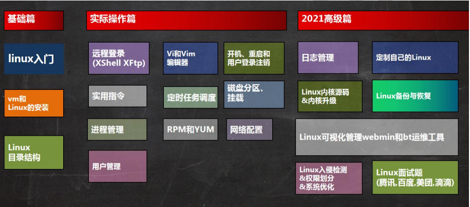
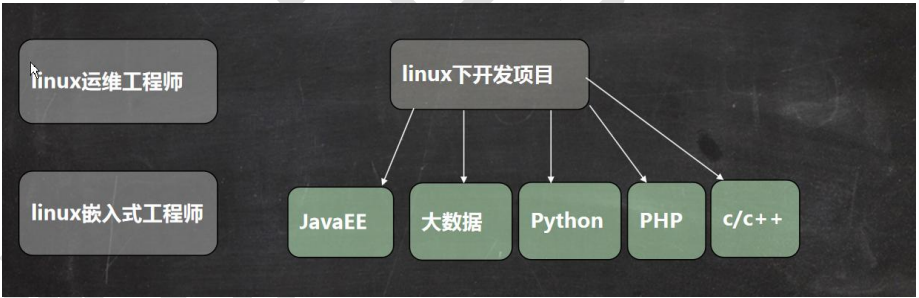
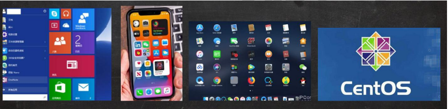
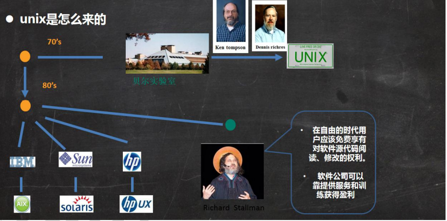
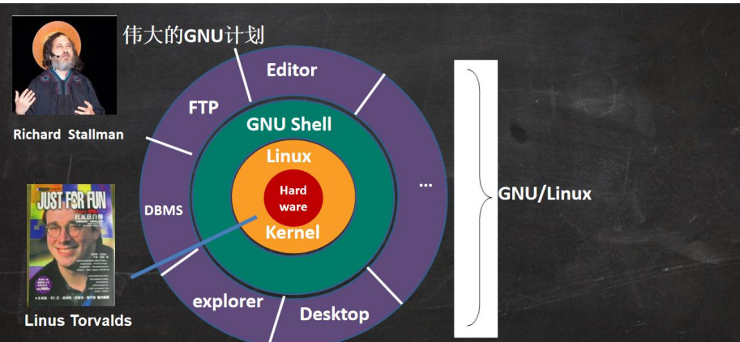
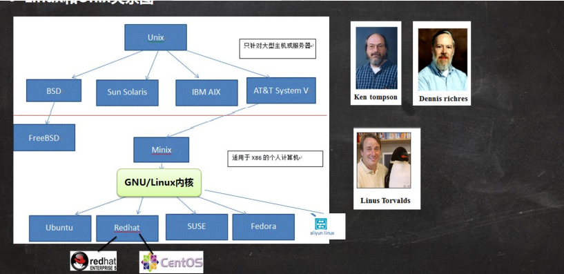
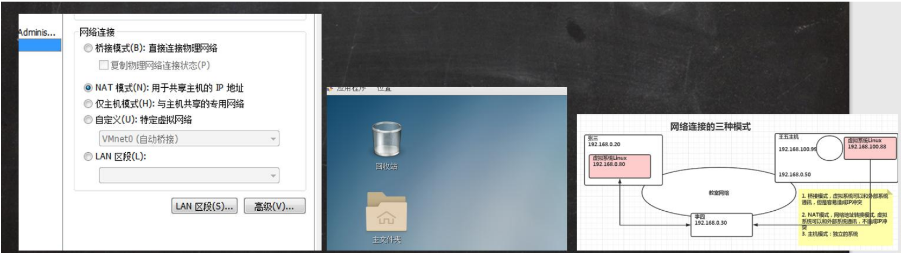
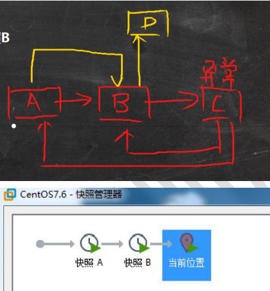

# 一、内容介绍

## 1、需要学习的内容大纲

## 2、Linux的三大应用领域

### 2.1 个人桌面领域的应用

​    此领域是传统Linux应用薄弱的环节，近些年来随着Ubuntu，fedora等优秀桌面环境的兴起，Linux在个人桌面领域的占有率逐渐的提高。

### 2.2 服务器领域

​    Linux在**服务器领域**的应用是最强的，Linux**免费、稳定、高效**等特点在这里得到了很好的体验，尤其是在一些高端领域尤为广泛（c/c++/java/python/go)

### 2.3 嵌入式领域

​    Linux运行稳定、对网络的良好支持性、低成本，且可以根据需要进行**软件裁剪**，内核最小可以达到几百KB等特点，使其近些年来在**嵌入式领域**的应用得到非常大的提高。

​    主要应用：机顶盒、数字电视、网络电话、程控交换机、手机、PDA、智能家居、智能硬件等都是其应用领域。以后**在物联网中应用会更加广泛**。

## 3、Linux使用在哪些地方

# 二、Linux入门

## 1、Linux概述

1、Linux是一个开源、免费的操作系统，其稳定性、安全性、处理多并发已经得到了业界的认可，目前很多企业级的项目（c/c++/php/python/java/go）都会部署到Linux/Unix系统上。

2、常见的操作系统（Windows，iOS，Android，MacOS，Linux，Unix）

3、Linux吉祥物-tux

4、xLinux之父——Linus Torvalds(Git创作者，著名黑客)

5、Linux主要发行版本：

Ubuntu（乌班图）、Redhat（红帽）、CentOS、Debian(蝶变)、Fedora，SuSE，OpenSUSE

## 2、Linux与Unix的关系

### 2.1 unix是怎么来的

### 2.2 Linux是怎么来的

### 2.3 Linux和Unix的关系

# 三、VM和Linux的安装

安装过程不在赘述（电脑是联想小新air14，根据视频教程安装一直蓝屏重启，需要下载VM最新版本）

这里Linux安装的版本是CentOS7.6版本，需要注意的是在安装过程中选择网络连接的模式时要选择NAT模式。

## 1、三种网络连接模式的区别

1、桥接模式

虚拟系统可以和外部系统通讯，但是容易造成IP冲突

2、NAT模式

网络地址转换模式，虚拟机系统可以和外部系统通讯，且不造成IP冲突

3、主机模式

一个独立的系统，不与外部通讯

## 2、虚拟机克隆

如果已经安装了一台Linux操作系统，但是还想要更多的，没有必要再重新安装，只需要克隆就可以。虚拟机克隆的两种方式：

1、方式一，直接拷贝一份安装好的虚拟机文件

2、方式二，使用VMware的克隆操作，注意在克隆时需要先关闭要克隆的Linux系统

## 3、虚拟机快照

如果你再使用虚拟机系统的时候，想回到原先的某一个状态，也就是说你担心可能有些误操作造成系统异常，需要回到原先的某个正常运行的状态，VMware1也提供了这样的功能，就找**快照管理。**

**应用实例：**

1、安装好一个系统后，先做一个快照A

2、进入到系统。创建一个文件夹，再保存一个快照B

3、回到系统刚刚安装好的状态，即 快照A

4、再试试回到快照B

5、示意图如下：

## 4、虚拟机迁移和删除

虚拟系统的本质其实就是文件（放在文件夹中），因此虚拟系统的迁移很方便，你可以把安装好的虚拟系统这个**文件整体拷贝或者剪切到另外位置**使用。删除也很简单，用**VMware进行移除**，再点击菜单->从磁盘删除即可，或者直接**手动删除虚拟机系统对应的文件夹**即可。

