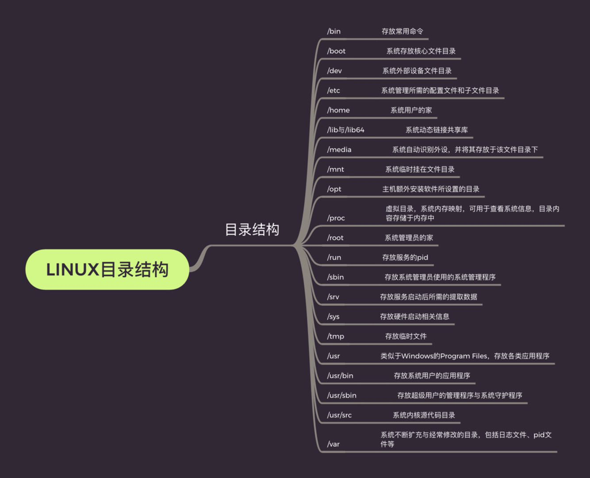
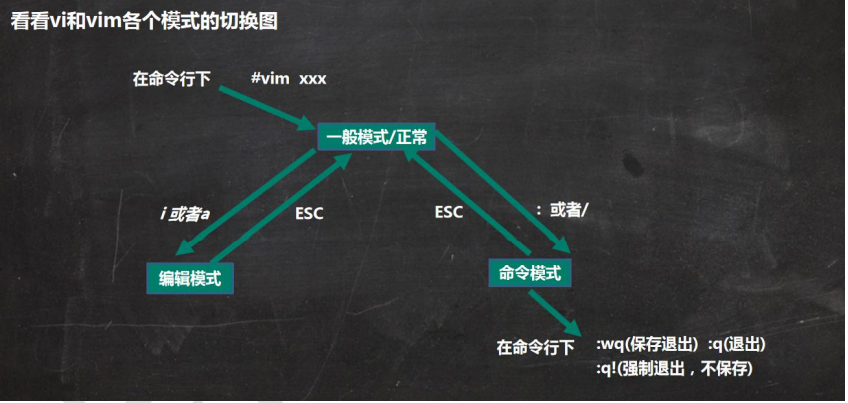

# 一、目录结构

## 1、基本介绍

1、Linux的文件系统是采用级层式的树状目录机构，在此结构中的最上层是根目录"/"，然后在此目录下再创建其他的目录。

2、在Linux的世界里，一切皆文件！！！

3、示意图




```
/bin：[常用]
bin 是 Binaries (二进制文件) 的缩写, 这个目录存放着最经常使用的命令。

/boot：
这里存放的是启动 Linux 时使用的一些核心文件，包括一些连接文件以及镜像文件。

/dev ：
dev 是 Device(设备) 的缩写, 该目录下存放的是 Linux 的外部设备，在 Linux 中访问设备的方式和访问文件的方式是相同的。

/etc：
etc 是 Etcetera(等等) 的缩写,这个目录用来存放所有的系统管理所需要的配置文件和子目录。

/home：[常用]
用户的主目录，在 Linux 中，每个用户都有一个自己的目录，一般该目录名是以用户的账号命名的，如上图中的 alice、bob 和 eve。

/lib：
lib 是 Library(库) 的缩写这个目录里存放着系统最基本的动态连接共享库，其作用类似于 Windows 里的 DLL 文件。几乎所有的应用程序都需要用到这些共享库。

/lost+found：
这个目录一般情况下是空的，当系统非法关机后，这里就存放了一些文件。

/media：
linux 系统会自动识别一些设备，例如U盘、光驱等等，当识别后，Linux 会把识别的设备挂载到这个目录下。

/mnt：
系统提供该目录是为了让用户临时挂载别的文件系统的，我们可以将光驱挂载在 /mnt/ 上，然后进入该目录就可以查看光驱里的内容了。

/opt：
opt 是 optional(可选) 的缩写，这是给主机额外安装软件所摆放的目录。比如你安装一个ORACLE数据库则就可以放到这个目录下。默认是空的。

/proc：
proc 是 Processes(进程) 的缩写，/proc 是一种伪文件系统（也即虚拟文件系统），存储的是当前内核运行状态的一系列特殊文件，这个目录是一个虚拟的目录，它是系统内存的映射，我们可以通过直接访问这个目录来获取系统信息。
这个目录的内容不在硬盘上而是在内存里，我们也可以直接修改里面的某些文件，比如可以通过下面的命令来屏蔽主机的ping命令，使别人无法ping你的机器：

echo 1 > /proc/sys/net/ipv4/icmp_echo_ignore_all

/root：[常用]
该目录为系统管理员，也称作超级权限者的用户主目录。

/sbin：
s 就是 Super User 的意思，是 Superuser Binaries (超级用户的二进制文件) 的缩写，这里存放的是系统管理员使用的系统管理程序。

/selinux：
 这个目录是 Redhat/CentOS 所特有的目录，Selinux 是一个安全机制，类似于 windows 的防火墙，但是这套机制比较复杂，这个目录就是存放selinux相关的文件的。

/srv：
 该目录存放一些服务启动之后需要提取的数据。

/sys：

这是 Linux2.6 内核的一个很大的变化。该目录下安装了 2.6 内核中新出现的一个文件系统 sysfs 。

sysfs 文件系统集成了下面3种文件系统的信息：针对进程信息的 proc 文件系统、针对设备的 devfs 文件系统以及针对伪终端的 devpts 文件系统。

该文件系统是内核设备树的一个直观反映。

当一个内核对象被创建的时候，对应的文件和目录也在内核对象子系统中被创建。

/tmp：
tmp 是 temporary(临时) 的缩写这个目录是用来存放一些临时文件的。

/usr：
 usr 是 unix shared resources(共享资源) 的缩写，这是一个非常重要的目录，用户的很多应用程序和文件都放在这个目录下，类似于 windows 下的 program files 目录。

/usr/bin：
系统用户使用的应用程序。

/usr/sbin：
超级用户使用的比较高级的管理程序和系统守护程序。

/usr/src：
内核源代码默认的放置目录。

/var：
var 是 variable(变量) 的缩写，这个目录中存放着在不断扩充着的东西，我们习惯将那些经常被修改的目录放在这个目录下。包括各种日志文件。

/run：
是一个临时文件系统，存储系统启动以来的信息。当系统重启时，这个目录下的文件应该被删掉或清除。如果你的系统上有 /var/run 目录，应该让它指向 run。
```


# 二、Vi 和Vim编辑器


## 1、vi和vim的基本介绍

Linux系统会内置vi文本编辑器

vim具有程序编辑的能力，可以看作是vi的加强版本，可以主动的以字体颜色辨识语法的正确性，方便程序设计，代码补全、编译及错误跳转等方便编程的功能特别丰富，在程序员中被广泛使用。


## 2、vi和vim常用的三种模式

### 2.1 正常模式

使用vim打开一个档案就直接进入一般模式了（这也是默认的模式）。在这个模式中，你可以使用**上下左右**按键来移动光标，你可以使用**删除字符** 或 **删除整行**来处理档案内容，也可以使用**复制、粘贴**来处理你的文件数据。


### 2.2 编辑模式

按下 i,I,o,O,a,A,r,R 等任何一个字母后才会进入编辑模式，一般来说按i即可。


### 2.3 命令行模式

输入esc再输入： ，在这个模式中，可以提供你相关指令，完成读取、存盘、替换、离开vim、显示行号等动作是在此模式下达成的。


### 2.4 各个模式的相互切换




### 2.5 vim快捷键练习

1、拷贝当前行，拷贝当前行向下的五行

```
一般模式下：
yy-拷贝当前行
5yy-拷贝当前行向下的五行
p-粘贴
```

2、删除当前行，删除当前行向下的五行

```
一般模式下：
dd-删除当前行
5dd-删除当前行向下的五行
```

3、在文件中查找某个单词

```
命令行模式下：
/关键字-查找关键字
```

4、设置文件的行号，取消文件的行号

```
命令行模式下：
:set nu-设置文件的行号
:set nonu-取消文件的行号
```

5、跳到文档的最末行和最首行

```
一般模式下：
G-跳到文档最末行
gg-跳到文档最首行
```

6、在文档中输入“hello”,然后撤销

```
按i进入编辑模式
输入“hello”
esc推出编辑模式进入一般模式
u-撤销
```


### 2.6 vim快捷键键盘图

