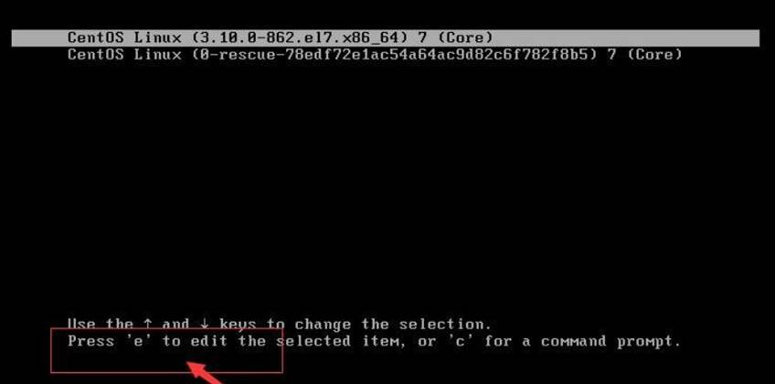
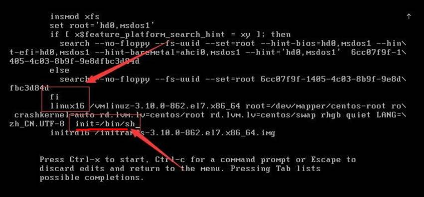
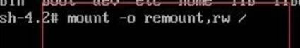
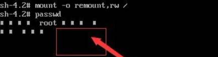
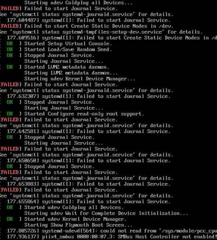

# 指定运行级别

## 1、基本介绍

运行级别说明：

```
0: 关机
1: 单用户【找回丢失密码】
2: 多用户状态没有网络服务
3: 多用户状态有网络服务
4: 系统未使用保留给用户
5: 图形界面
6: 系统重启
```

常用运行系统级别是 3 和 5，也可以指定默认运行级别


## 2、应用实例

案例：通过 init 来切换不同的运行级别，比如 由运行级别 5 切换到运行级别 3

```
切换运行级别指令： init[0123456]
init 3       - 切换至运行级别3
```


## 3、CentOS7运行级别说明

```
multi-user.target:analogous to runlevel 3    代表运行级别3
graphical.target:analogou to runlevel 5      代表运行级别5
#查看当前系统的运行级别
systemctl get-default
#设置系统运行级别
1、systemctl set-default multi-user.target    设置系统运行级别为3
2、systemctl graphical.target                 设置系统运行级别为5
```


# 找回root密码

**linux找回root密码(CentOS7.6)**


1. 首先，启动系统，进入开机界面，在界面中按“e”进入编辑界面。如图



2. 进入编辑界面，使用键盘上的上下键把光标往下移动，找到以““Linux16”开头内容所在的行数”，在行的最后面输入：init=/bin/sh。如图



3. 接着，输入完成后，直接按快捷键：Ctrl+x 进入**单用户模式**。

4. 接着，在光标闪烁的位置中输入：mount -o remount,rw /（注意：各个单词间有空格），完成后按键盘的回车键（Enter）。如图



5. 在新的一行最后面输入：passwd， 完成后按键盘的回车键（Enter）。输入密码，**然后再次确认密码即**可(**韩顺平提示:** **密码长度最好8位以上,但不是必须的**), 密码修改成功后，会显示passwd.....的样式，说明密码修改成功



6. 接着，在鼠标闪烁的位置中（最后一行中）输入：touch /.autorelabel（注意：touch与 /后面有一个空格），完成后按键盘的回车键（Enter）

7. 继续在光标闪烁的位置中，输入：exec /sbin/init（注意：exec与 /后面有一个空格），完成后按键盘的回车键（Enter）,等待系统自动修改密码(**韩顺平提示：这个过程时间可能有点长，耐心等待**)，完成后，系统会自动重启, **新的密码生效**了



