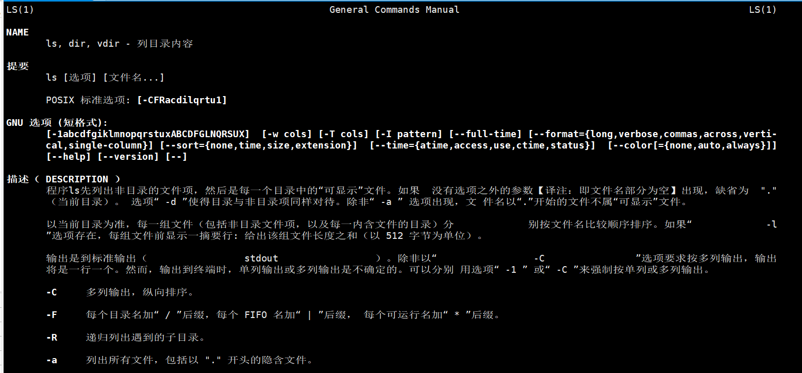
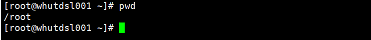
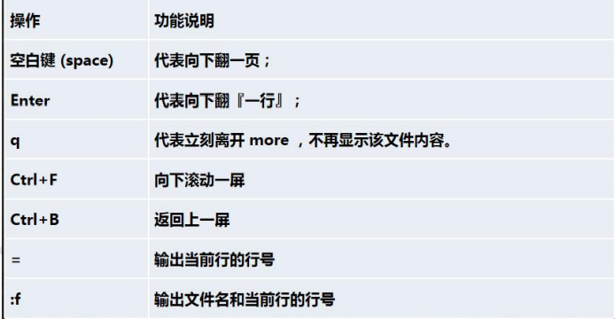
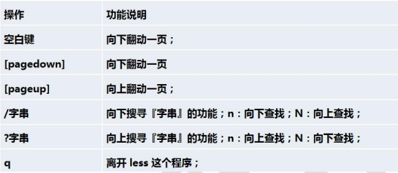

# 帮助指令

## 1、man 获得帮助信息

基本语法：man [命令或者配置文件] ，功能描述：获得帮助信息

案例：查看ls命令的帮助信息

```
man ls
```



在Linux下，隐藏文件是以.开头，选项可以组合使用，比如 ls -al : 单列输出该目录下所有文件


## 2、help 指令

基本语法： help指令（功能描述：获得shell内置命令的帮助信息）


## 3、应用案例

案例： 查看cd命令的帮助信息

```
help cd
man cd
```


# 文件目录类

## 1、pwd 指令

基本语法：pwd (功能描述：显示当前工作目录的绝对路径)

应用实例：显示当前工作目录的绝对路径

```
pwd
```




## 2、ls 指令

基本语法：ls [选项] [目录或是文件]

常用选项：

-a   :    显示当前目录所有的文件和目录，包括隐藏的

-l    :    以列表的形式显示信息

应用实例：以列表的形式查看当前目录的所有文件信息

```
ls -al
```


## 3、cd 指令

基本语法：cd [参数]  （功能描述：切换到指定目录）

理解：绝对路径和相对路径

```
cd~ 或者 cd    -回到自己的家目录，比如你是root用户，cd~ 或者 cd到/root目录下
cd..          -回到当前目录的上一级目录
```

应用案例：

```
# 使用绝对路径切换到root目录
cd /root
# 使用相对路径到/root目录，比如当前在/home/tom/目录下
cd ..     cd ..     cd /root
# 表示回到当前目录的上一级目录
cd ..
# 回到家目录
cd ~  或者 cd
```


## 4、mkdir 指令

mkdir 指令用于创建目录

**基本语法：**mkdir   [选项]   要创建的目录

**常用选项：**

-p :  创建多级目录

**应用案例：**

案例1：创建一个目录 /home/dog

```
mkdir /home/dog
```

案例2：创建多级目录 /home/animal/tiger

```
mkdir -p /home/animal/tiger
```


## 5、rmdir 指令删除空目录

rmdir指令用于删除空目录

**基本语法：**rmdir  [选项]  要删除的空目录

**应用实例：**删除一个目录  /home/dog

```
rmdir /home/dog
```

**使用细节：**rmdir删除的是空目录，如果目录下有内容时是无法删除的。如果要删除非空目录，需要使用rm -rf  [要删除的目录]

比如：

```
rm -rf /home/animal
```


## 6、touch 指令

touch 指令创建空文件

**基本语法：**touch  文件名称

**应用实例：**在/home目录下，创建一个空文件 hello.txt

```
cd /home
touch hello.txt
```


## 7、cp 指令

cp 指令拷贝文件到指定目录

**基本语法：**cp  [选项] source dest

**常用选项：**

-r  :   递归复制整个文件夹

**应用实例：**

案例1：将/home/hello.txt 拷贝到 /home/bbb 目录下

```
cp /home/hello.txt /home/bbb
```

案例2：递归复制整个文件夹，举例，比如将/home/bbb 整个目录拷贝到 /opt

```
cp -r /home/bbb /opt
```

**使用细节：**

强制覆盖不提示的方法：\cp  

```
\cp -r /home/bbb /opt
```


## 8、rm 指令

rm 指令移除文件或目录

**基本语法：**rm  [选项]  要删除的文件或目录

**常用选项：**

-r:递归删除整个文件夹

-f:强制删除不提示

**应用实例：**

案例1：将 /home/hello.txt 删除

```
rm /home/hello.txt
```

案例2：递归删除整个文件夹 /home/bbb

```
rm -r /home/bbb       -删除整个文件夹，有提示
rm -rf /home/bbb      -删除整个文件夹，不提示
```

**使用细节：**

强制删除不提示的方法，带上 -f 参数即可


## 9、mv 指令

mv 指令移动文件与目录或重命名

**基本语法：**

mv oldNameFile newNameFile        (功能描述：重命名)

mv /temp/movefile /targetFolder    (功能描述：移动文件)

**应用实例：**

案例1：将/home/cat.txt  文件重命名为 pig.txt

```
cd /home
mv cat.txt pig.txt
```

案例2：将 /home/pig.txt  文件移动到 /root 目录下

```
mv /home/pig.txt /root
```

案例3：移动整个目录，比如将/opt/bbb 移动到 /home下

```
mv /opt/bbb /home/
```


## 10、cat 指令

cat 查看文件内容

**基本语法：**

cat  [选项]  要查看的文件

**常用选项：**

-n : 显示行号

**应用实例：**

案例1：查看/etc/profile  文件内容，并显示行号

```
cat -n /etc/profile
```

**使用细节：**

cat只能浏览文件，而不能修改文件，为了浏览方便，一般会带上 管道命令|more

```
cat -n /etc/profile | more
```


## 11、more 指令

more 指令是一个基于VI编辑器的文本过滤器，它以全屏幕的方式按页显示文本文件的内容。more指令中内置了若干快捷键（交互的指令），操作说明如下图：



**基本语法：**more  要查看的文件

**应用实例：**采用more 查看文件 /etc/profile

```
more /etc/profile
```


## 12、less 指令

less 指令用来分屏查看文件内容，它的功能与more指令类似，但是比more指令更加强大，支持各种显示终端。less指令在显示文件内容时，并不是一次将整个文件加载之后才显示，而是根据显示选哟加载内容，对于显示大型文件具有较高的效率。

基本语法：less  要查看的文件

操作说明：



应用实例：

案例：采用less查看一个大文件， /opt/杂文.txt

```
less /opt/杂文.txt
```


## 13、echo 指令

echo 输出内容到控制台

**基本语法：**

echo  [选项]  [输出内容]

**应用实例：**

案例1：使用echo指令输出环境变量

```
echo $PATH          -输出环境变量
echo $HOSTNAME      -输出主机名
```

案例2：使用echo指令输出hello，world

```
echo "hello,world"
```


## 14、 head 指令

head用于显示文件的开头内容，默认情况下head指令显示文件的前10行内容

**基本语法：**

head  文件    （功能描述：查看文件头10行内容）

head -n 5 文件   （功能描述：查看文件头5行内容，5可以是任意行数）

**应用实例：**

案例：查看/etc/profile 的前面5行代码

```
head -n 5 /etc/profile
```


## 15、tail 指令

tail指令用来输出文件中尾部的内容，默认情况下tail指令显示文件的前10行内容。

**基本语法：**

1. tail  文件         （功能描述：查看文件尾10行内容）
2. tail -n 5  文件   （功能描述：查看文件尾5行内容，5可以是任意行数）
3. tail -f  文件         （功能描述：实时追踪该文档的所有更新）

**应用实例：**

案例1：查看/etc/profile 最后5行代码

```
tail -n 5 /etc/profile
```

案例2：实时监控 mydate.txt, 当看到文件有变化时，是否看到追加内容，实时的追加”hello，world"

```
tail -f /home/mydate.txt
```


## 16、> 指令 和 >> 指令

```
> 输出重定向和 >> 追加
```

**基本语法：**

1. ls -l > 文件      （功能描述：列表的内容写入到文件a.txt中（覆盖写））
2. ls -al >> 文件   （功能描述：列表的内容追加到文件aa.txt的末尾）
3. cat 文件1 > 文件2   （功能描述：将文件1的内容覆盖到文件2）
4. echo ”内容“ >> 文件  （向文件中追加内容）

**应用实例：**

案例1：将/home目录下的文件列表写入到/home/info.txt 中，覆盖写入

```
ls -l /home > /home/info.txt      #如果没有info.txt，则会创建
```

案例2：将当前日历信息追加到 /home/mycal 文件中

```
cal         #cal指令可以查看日历信息
cal >> /home/mycal   #将当前日历信息追加到/home/mycal文件中
```


## 17、ln 指令

软链接也称为符号链接，类似于Windows里的快捷方式，主要存放了链接其他文件的路径

**基本语法：**

ln -s  [原文件或目录]  [软链接名]   （功能描述：给原文件一个软链接）

**应用实例：**

案例1：在/home 目录下创建一个软链接myroot，连接到/root目录

```
ln -s /root  /home/myroot
```

案例2：删除软链接 myroot

```
rm /home/myroot
```

**细节说明：**

当我们使用pwd指令查看目录时，仍然看到的是软链接所在目录


## 18、history 指令

查看已经执行获得历史命令，也可以执行历史命令

**基本语法：**

history (功能描述：查看已经执行过的历史指令)

**应用实例：**

案例1：显示所有的历史命令

```
history
```

案例2：显示最近使用过的10个指令

```
history 10
```

案例3：执行历史编号为5的指令

```
!5
```


# 时间日期类

## 1、date 指令-显示当前日期

**基本语法：**

1. date                      (功能描述：显示当前时间)
2. date+%Y               (功能描述：显示当前年份)
3. date+%m              (功能描述：显示当前月份)
4. date+%d               (功能描述：显示当前是哪一天)
5. date "+%Y-%m-%d %H:%M:%S"    (功能描述：显示年月日时分秒)

**应用实例：**

案例1：显示当前时间信息

```
date
```

案例2：显示当前时间年月日

```
date "+%Y-%m-%d"
```

案例3：显示当前时间年月日时分秒

```
date "+%Y-%m-%d %H:%M:%S"
```


## 2、date指令-设置日期

基本语法：

date -s 字符串时间

应用实例：

案例：设置系统当前时间，比如设置成 2020-11-03 20：02：10

```
date -s "2020-11-03 20:02:10"
```


## 3、cal指令

查看日历指令  cal

**基本语法：**

cal  [选项]      （功能描述：不加选项，显示本月日历）

**应用实例：**

案例1：显示当前日历

```
cal
```

案例2：显示2020年日历

```
cal 2020
```

