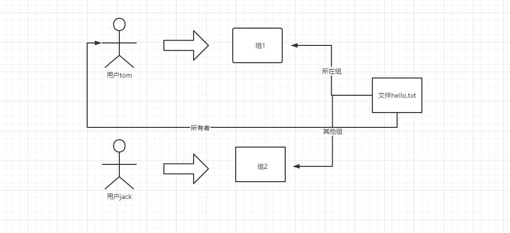
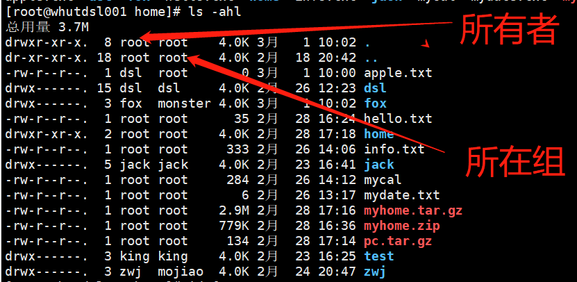
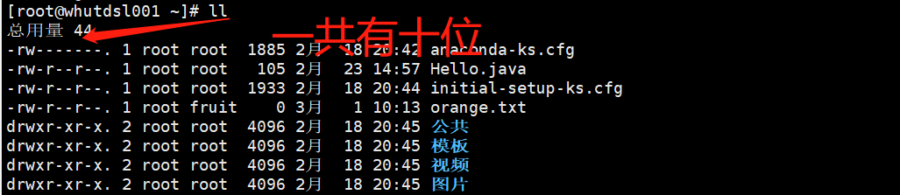
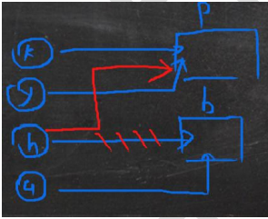
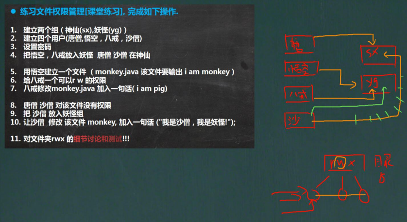

# 组管理

## 1、Linux组基本介绍

在Linux中的每一个用户必须属于一个组，不能独立于组外。在Linux中每个文件有**所有者、所在组、其他组**的概念。

在下图中，由用户tom创建了文件hello.txt，则tom就是文件hello.txt的所有者，用户tom所在的组1就是文件helo.txt的所在组。与文件无关的组2就是文件hello.txt的其他组。




## 2、文件/目录的所有者

一般为文件的创建者，谁创建了该文件，就自然的成为该文件的所有者。


### 2.1查看文件的所有者

指令：ls -ahl

应用实例：




### 2.2修改文件的所有者

指令：chown 用户名 文件名

应用案例：使用root用户创建一个文件apple.txt,然后将其所有者修改成tom

```
su - root               #切换到root用户
touch apple.txt         #创建文件apple.txt
chown tom apple.txt     #修改文件所有者为tom
```


## 3、组的创建

### 3.1 基本指令

groupadd 组名


### 3.2 应用实例

案例1：创建一个组，monster

```
groupadd monster
```

案例2：创建一个用户fox，并放入到monster组中

```
useradd -g monster fox
```


## 4、文件/目录 所在组

当某个用户创建了一个文件后，这个文件所在的组就是该用户所在的组（默认）


### 4.1 查看文件/目录所在组

基本指令：

```
ls -ahl
```

应用实例：使用用户fox创建一个文件，看看该文件属于哪个组

```
su - fox   #切换到用户fox
ls -ahl
```


### 4.2 修改文件/目录所在的组

基本指令：

chgrp 组名 文件名

应用实例：

使用root用户创建文件 orange.txt，看看当前这个文件属于哪个组，然后将这个文件所在组，修改到fruit组。

```
groupadd fruit          #新建组fruit
touch orange.txt        #创建空文件orange.txt
ls -ahl                 #查看新建文件所在组
chgrp fruit orange.txt  #改变新建文件所在组
```


## 5、其他组

除文件的所有者和所在组的用户外，系统的其他用户都是文件的其他组。


## 6、改变用户所在组

在添加用户时，可以指定将该用户添加到哪个组中，同样的用root的管理权限可以改变某个用户所在的组。


### 6.1 改变用户所在组

```
usermod -g 新组名 用户名    #改变用户的所在组

usermod -d 目录名 用户名    #改变用户登录的初始目录。  特别说明：用户需要有进入到新目录的权限。
```


### 6.2 应用实例

将zwj这个用户从原来所在组，修改到wudang组

```
id zwj                                  #查看用户zwj所在组
cat /etc/group | grep "wudang"          # 查看wudang组是否存在
usermod -g wudang zwj                   #修改zwj所在组为wudang
```


## 7、权限的基本介绍

ls -l 中显示的内容如下：




0-9位说明：

第0位确定文件类型（d, -, l, c, b)

**l是链接，相当于Windows的快捷方式**

**d是目录，相当于Windows的文件夹**

**c是字符设备文件，比如鼠标，键盘**

**b是块设备，比如硬盘**

**-是普通文件**

第1-3位确定**所有者**（该文件的所有者）拥有该文件的权限。 --User

第4-6位确定**所属组**（同用户组的）拥有该文件的权限  --Group

第7-9位确定**其他用户**拥有该文件的权限  --Other


## 8、rwx权限详解

### 8.1 rwx作用到文件

1. [r]代表可读（read）：可以读取，查看
2. [w]代表可写（write）：可以修改，但是不代表可以删除该文件，删除一个文件的前提条件是对该文件所在的目录有写权限，才能删除该文件
3. [x]代表可执行（execute）：可以被执行


### 8.2 rwx作用到目录

1. [r]代表可读（read）：可以读取，ls查看目录内容
2. [w]代表可写（write）：可以修改，对目录内创建+删除+重命名目录
3. [x]代表可执行（execute）：可以进入该目录


## 9、文件及目录权限实际案例


ls -l 中显示的内容如下：


**10个字符确定不同用户对文件能干什么**

第一个字符代表文件类型：- l d c b

其余字符每3个一组（rwx）读（r）写（w）执行（x）

第一组rwx：文件的拥有者的权限是读，写和执行

第二组rw-：与文件拥有者同一组的用户的权限是读、写但不能执行

第三组r--：不与文件拥有者同组的其他用户的权限是读，没有写和执行的权限


可用数字表示为：r=4,w=2,x=1  因此rwx=4+2+1=7,数字可以进行组合

其他说明：

```
1        #文件：硬连接数或目录 ：子目录数

root     #用户

root     #组

1885     #文件大小（字节）

2月 18:20:42     #最后修改日期

Hello.java       #文件名
```


## 10、修改权限 -chmod

### 10.1 基本说明

通过chmod指令，可以修改**文件或目录**的权限


### 10.2 第一种方式：+、-、=变更权限

u:所有者    g:所在组   o:其他人     a:所有人(u,g,o的总和)

```
chmod u=rwx,g=rx,o=x  文件/目录名
chmod o+w   文件/目录名
chmod a-x   文件/目录名
```

案例演示：

1、给abc文件的所有者读写执行的权限，给所在组成员读和执行权限，给其他组读和执行权限

```
chmod u=rwx,g=rx,o=rx abc
```

2、给abc文件的所有者除去执行的权限，增加所在组写的权限

```
chmod u-x,g+w abc
```

3、给abc文件的所有用户添加读的权限

```
chmod a+r abc
```


### 10.3 第二种方式：通过数字变更权限

r=4  w=2  x=1  rwx=4+2+1=7

chmod u=rwx,g=rx,o=x  文件/目录名

相当于  chmod 751 文件/目录名

案例演示：

要求：将/home/abc.txt文件的权限修改为 rwxr-xr-x

```
chmod 755 /home/abc.txt
```


## 11、修改文件所有者-chown

```
chown  newgroup    文件/目录                #改变所有者
chown  newowner:newgroup   文件/目录        #改变所有者和所在组
-R                                         #如果是目录  则使其下所有子文件或目录递归生效
```

案例演示：

1、请将/home/abc.txt文件的所有者修改成tom

```
chown tom /home/abc.txt
```

2、请将/home/test目录下所有的文件和目录的所有者都修改成tom

```
chown -R tom /home/test
```


## 12、修改文件/目录所在组-chgrp

基本介绍：

```
chgrp  newgroup  文件/目录      #改变所在组
```

案例演示：

1、请将/home/abc.txt文件的所在组修改成shaolin（少林）

```
groupadd shaolin
chgrp shaolin /home/abc.txt
```

2、请将/home/test目录下所有的文件和目录的所在组都修改成shaolin（少林）

```
chgrp -R shaolin /home/test
```


## 13、最佳实践-警察和土匪游戏

有两个组，分别是警察组-police和土匪组-bandit

警察组里面有两个警察，分别是警察jack和警察jerry

土匪组里面有两个土匪，分别是土匪xh和土匪xq

1、创建组

```
groupadd police
groupadd bandit
```

2、创建用户

```
useradd -g police jack
useradd -g police jerry
useradd -g bandit xh
useradd -g bandit xq
```

3、jack创建一个文件，自己可以读r和写w，本组人可以读，其他组没有任何权限

```
su - jack          #切换到jack登录
touch jack.txt     
chmod 640 jack.txt
```

4、jack修改该文件，让其他组人可以读，本组人可以读写

```
chmod o=r,g=rw jack.txt
```

5、xh投靠警察，看看是否可以读写

```
usermod -g police xh
```

6、测试，看看xh 是否可以读写，xq是否可以

```
结果是xh还不行，因为没有对文件所属目录的相应权限
结论：如果要对目录内的文件进行操作，需要有对该目录的相应权限
```

7、示意图




## 14、课后练习



