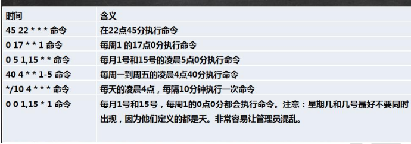
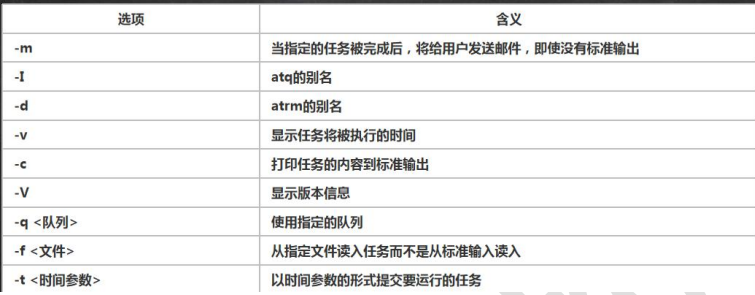

# 定时任务调度


## 1、crond 任务调度

crontab 指令进行定时任务的设置。


### 1.1 概述

任务调度：是指系统在某个时间执行的特定的命令或程序。

任务调度分类：

1、系统工作：有些重要的工作必须周而复始地执行。如病毒扫描等。

2、个别用户工作：个别用户可能希望执行某些程序，比如对mysql数据库的备份。

示意图：


### 1.2 基本语法

crontab [选项]


### 1.3 常用选项


### 1.4 快速入门

设置任务调度文件：/etc/crontab

设置个人调度任务：执行crontab -e 命令

接着输入任务到调度文件，比如：

```
*/1 * * * * ls -l /etc/ > /tmp/to.txt
#意思是说每小时的每分钟执行 ls -l /etc/ > /tmp/to.txt 命令一次
```


**参数细节说明：**

5个占位符的说明：


特殊符号的说明：


特殊时间执行案例：




### 1.5 应用实例

案例1：每隔一分钟，就将当前的日期信息，追加到/tmp/mydate 文件中

```
*/1 * * * * date >> /tmp/mydate
```

案例2：每隔一分钟，将当前日期和日历都追加到 /home/mycal 文件中

```
vim /home/my.sh      #新建一个脚本
date >> /home/mycal  cal >> /home/mycal    #在脚本中写入的内容
chmod u+x /home/my.sh      #给my.sh脚本增加执行权限
crontab -e     #打开定时任务开始编辑
*/1 * * * * /home/my.sh      #写入定时任务
```

案例3：每天凌晨2:00将MySQL数据库testdb，备份到文件中

```
crontab -e
0 2 * * * mysqldump -u root -p 123456 testdb > /home/db.bak
```


### 1.6 crond 相关指令

```
crontab -r :终止任务调度
crontab -l :列出当前有哪些任务调度
service crond restart :重启任务调度
```


## 2、at 定时任务

### 2.1 基本介绍

1. at 命令是一次性定时计划任务，at 的守护进程atd 会以后台模式运行，检查作业队列来运行
2. 默认情况下，atd 守护进程每60秒检查作业队列，有作业时，会检查作业运行时间，如果时间与当前时间匹配，则运行此作业
3. at 命令是一次性定时计划任务，执行完一个任务后就不再执行此任务了
4. 在使用at 命令的时候，一定要保证atd 进程的启动，可以使用相关指令来查看

```
ps -ef | grep atd        #ps -ef指令可以将所有的进程列出来，这条指令可以检测atd是否在运行
```

5. 画一个示意图：

   


### 2.2 at 命令格式

at [选项] [时间]

Ctrl + D 结束at命令的输入，需要执行两次


### 2.3 at 命令选项




### 2.4 at 时间定义

at 指定时间的方法：

1. 接受在当天的hh:mm(小时：分钟)式的时间指定。假如该时间已经过去，那么就放在第二天执行。例如： 04：00
2. 使用midnight（深夜），noon（中午），teatime（饮茶时间，一般来说是下午4点）等比较模糊的词语来指定时间
3. 采用12小时计时制，即在时间后面加上AM（上午）或者PM（下午）来说明是上午还是下午。例如：12pm
4. 指定命令行执行的具体日期，指定格式为month day（月 日）或 mm/dd/yy（月/日/年）或dd.mm.yy（日.月.年），指定的日期必须跟在指定时间的后面。例如：04：00 2021-03-1
5. 使用相对计时法。指定格式为 now+count time-units，now就是当前时间，time-units是时间单位，这里能够是minutes(分钟)，hours(小时)，days(天)，weeks(星期)。count是时间的数量，几天，几小时。例如：now+5 minutes
6. 直接使用today(今天)、tomorrow(明天)来指定完成命令的时间
7. 

### 2.5 应用实例

案例1：2天后的下午5点执行 /bin/ls /home


案例2：atq命令来查看系统中没有执行的工作任务

```
atq
```

案例3：明天下午5点钟，输出时间到指定文件内，比如/root/date100.log


案例4：2分钟后，输出时间到指定文件内，比如/root/date200.log


案例5：删除已经设置的任务，atrm 编号

```
atrm 4  #表示将job队列中编号为4的job删除
```

