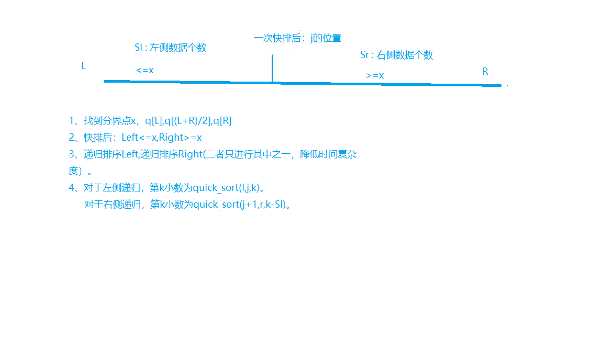
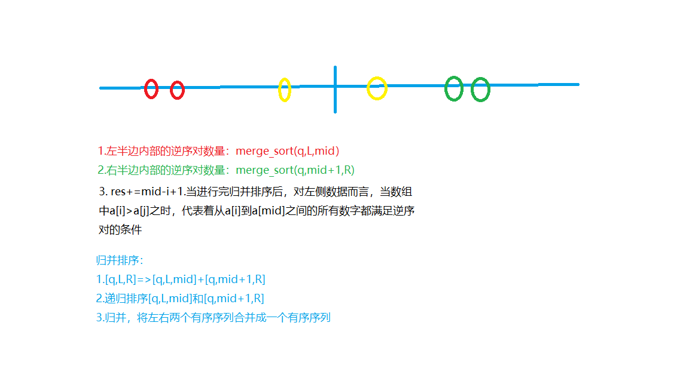

# 排序算法


## 快速排序

**快速排序（quick sirt）**是分治法技术的一个例子。他也被称为划分交换排序（partition exchange sort）。他利用递归调用来对元素进行排序。它是基于关键字比较的排序算法中著名的算法之一。

**划分：**数组A[low...high]被分成两个非空的子数组A[low...q]和A[q+1...high]，使得A[low...high]中的每个元素小于或等于A[q+1...high]中的每个元素。索引q作为此划分过程的一部分被计算得到。

**治理：**两个子数组A[low...q]和[q+1...high]通过递归调用快速排序算法进行排序。

**算法：快速排序算法的递归实现包括四个步骤**

1. 如果数组中只有一个元素或者没有元素需要排序，则算法返回
2. 选取数组中的一个元素作为“分界“点。（通常选取的是数组最左边的元素）
3. 将数组划分为两部分——一部分中的元素均大于分界点，另一部分中的元素均小于分界点
4. 原始数组的两个部分递归重复上述算法

### 快排模板:

```c++
void quick_sort(int q[],int l,int r){
    if(l>=r) return;
    
    int x = q[l+r>>1],i = l-1,j = r+1;
    while(i<j){
        do i++;while(q[i]<x);
        do j--;while(q[j]>x);
        if(i<j) swap(q[i],q[j]);
    }
    
    quick_sort(q,l,j);
    quick_sort(q,j+1,r);
}
```

### 习题1：AcWing-785题  快速排序

给定你一个长度为n的整数数列。

请你使用快速排序对这个数列按照从小到大进行排序。

并将排好序的数列按顺序输出。

**输入格式**

输入共两行，第一行包含整数 n。

第二行包含 n 个整数（所有整数均在1~109109范围内），表示整个数列。

**输出格式**

输出共一行，包含 n 个整数，表示排好序的数列。

**数据范围**

1≤n≤100000

**输入样例：**

```
5
3 1 2 4 5
```

**输出样例：**

```
1 2 3 4 5
```


```c++
#include <iostream>

using namespace std;

const int N = 1e6+10;

int n;
int q[N];

void quick_sort(int q[],int l,int r){
    if(l>=r) return;
    
    int x = q[l+r>>1],i = l-1,j = r+1;
    while(i<j){
        do i++;while(q[i]<x);
        do j--;while(q[j]>x);
        if(i<j) swap(q[i],q[j]);
    }
    
    quick_sort(q,l,j);
    quick_sort(q,j+1,r);
}

int main(){
    scanf("%d",&n);
    
    for(int i=0;i<n;i++) scanf("%d",&q[i]);
    
    quick_sort(q,0,n-1);
    
    for(int i=0;i<n;i++) {
        printf("%d ",q[i]);
    }
    
    return 0;
}
```


### 习题2：AcWing-786题  第k个数

给定一个长度为n的整数数列，以及一个整数k，请用**快速选择算法**求出数列从小到大排序后的第k个数。

**输入格式**

第一行包含两个整数 n 和 k。

第二行包含 n 个整数（所有整数均在1~109109范围内），表示整数数列。

**输出格式**

输出一个整数，表示数列的第k小数。

**数据范围**

1≤n≤100000,
1≤k≤n

**输入样例：**

```
5 3
2 4 1 5 3
```

**输出样例：**

```
3
```

```C++
//直接使用快排算法
#include <iostream>
using namespace std;

const int N = 1e5;

int n,k,q[N];

void quick_sort(int q[],int l,int r){
    if(l>=r) return;
    
    int x=q[l+r>>1],i=l-1,j=r+1;
    while(i<j){
        do i++;while(q[i]<x);
        do j--;while(q[j]>x);
        if(i<j) swap(q[i],q[j]);
    }
    quick_sort(q,l,j);
    quick_sort(q,j+1,r);
    
    
}

int main(){
    
    scanf("%d%d",&n,&k);
    
    for(int i=0;i<n;i++) scanf("%d",&q[i]);
    
    quick_sort(q,0,n-1);
    
    printf("%d ",q[k-1]);
    
    return 0;
    
}
```

上面是使用快速排序算法进行求解，时间复杂度为Nlog(N),使用快速选择算法进行求解时间复杂度为O(N):





```c++
#include <iostream>
using namespace std;

const int N = 1e5+10;

int n,k;
int q[N];

int quick_sort(int l,int r,int k)
{
    if(l==r) return q[l];
    
    int x=q[l],i=l-1,j=r+1;
    
    while(i<j){
        while(q[++i]<x);
        while(q[--j]>x);
        if(i<j) swap(q[i],q[j]);
    }
    
    int sl=j-l+1;
    if(k<=sl) return quick_sort(l,j,k);
    else return quick_sort(j+1,r,k-sl);
}

int main()
{
    cin>>n>>k;
    
    for(int i=0;i<n;i++)  cin>>q[i];
    
    cout<<quick_sort(0,n-1,k)<<endl;
    
    return 0;
}
```


## 归并排序

**归并排序（merging sort）**是分治法的一个例子。

**重要的说明：**

* 归并（merging）是将两个有序文件合并成一个更大的有序文件的过程。
* 选择（selection）是将文件分成两部分的过程：k个最小元素和n-k个最大元素
* 选择和归并互为逆操作
  *  选择是将列表分成两个列表
  * 归并是将两个文件合并来创建一个文件

* 归并排序和快速排序是互补的
* 归并排序以顺序方式访问数据
* 该算法可以用于对链表进行排序
* 归并排序对其输入序列的初始顺序不敏感
* 在快速排序中，大部分工作在递归调用之前完成。快速排序从最大的文件开始，并以最小文件结束，因此它需要使用堆栈。而且，该算法是不稳定的。
* 归并排序将列表分成两部分，然后对每个部分进行排序。归并排序从小的子文件开始并以最大的文件结束。因此它不需要使用堆栈。而且，该算法是稳定的。

**算法：归并排序算法的递归实现包括三个步骤**

1. 选取数组中的一个元素作为“分界“点。mid=(l+r)/2
2. 将数组划分为左右两部分，分别进行递归排序，得到左右两个有序数组
3. 将左右两个有序数组合二为一

### 归并排序模板：

```C++
void merging_sort(int q[],int l,int r){
    if(l>=r) return;
    
    int mid = l + r >>1;
    
    //递归排序左右两边
    merging_sort(q,l,mid);
    merging_sort(q,mid+1,r);
    
    //k为辅助数组初始下标，i为排序后的左边数组初始下标，j为排序后的右边数组初始下标
    int k=0,i=l,j=mid+1;
    
    //融合有序列表
    while(i<=mid && j<=r){
        if(q[i]<=q[j]) temp[k++]=q[i++];
        else temp[k++]=q[j++];
    }
    //将未插入的数据插入辅助数组中
    while(i<=mid) temp[k++]=q[i++];
    while(j<=r) temp[k++]=q[j++];
    //将辅助数组中的数据重新赋值给原数组
    for(i=l,j=0;i<=r;i++,j++) q[i]=temp[j];
    
}
```

### 习题1：AcWing-787题  归并排序

给定你一个长度为n的整数数列。

请你使用归并排序对这个数列按照从小到大进行排序。

并将排好序的数列按顺序输出。

**输入格式**

输入共两行，第一行包含整数 n。

第二行包含 n 个整数（所有整数均在1~109109范围内），表示整个数列。

**输出格式**

输出共一行，包含 n 个整数，表示排好序的数列。

**数据范围**

1≤n≤100000

**输入样例：**

```
5
3 1 2 4 5
```

**输出样例：**

```
1 2 3 4 5
```


```c++
#include <iostream>
using namespace std;

const int N = 1e6+10;

int n;
int q[N],temp[N];

void merging_sort(int q[],int l,int r){
    if(l>=r) return;
    
    int mid = l + r >>1;
    
    //递归排序左右两边
    merging_sort(q,l,mid);
    merging_sort(q,mid+1,r);
    
    //k为辅助数组初始下标，i为排序后的左边数组初始下标，j为排序后的右边数组初始下标
    int k=0,i=l,j=mid+1;
    
    //融合有序列表
    while(i<=mid && j<=r){
        if(q[i]<=q[j]) temp[k++]=q[i++];
        else temp[k++]=q[j++];
    }
    //将未插入的数据插入辅助数组中
    while(i<=mid) temp[k++]=q[i++];
    while(j<=r) temp[k++]=q[j++];
    //将辅助数组中的数据重新赋值给原数组
    for(i=l,j=0;i<=r;i++,j++) q[i]=temp[j];
    
}

int main(){
    scanf("%d",&n);
    
    for(int i=0;i<n;i++) scanf("%d",&q[i]);
    
    merging_sort(q,0,n-1);
    
    for(int i=0;i<n;i++) printf("%d ",q[i]);
    
    return 0;
}
```


### 习题2：AcWing-788 逆序对的数量

**题目描述**
给定一个长度为n的整数数列，请你计算数列中的逆序对的数量。

逆序对的定义如下：对于数列的第 i 个和第 j 个元素，如果满 i < j 且 a[i] > a[j]，则其为一个逆序对；否则不是。

**输入格式**
第一行包含整数n，表示数列的长度。

第二行包含 n 个整数，表示整个数列。

**输出格式**
输出一个整数，表示逆序对的个数。

**数据范围**
1≤n≤100000

**输入样例：**

```
6
2 3 4 5 6 1
```

**输出样例：**

```
5
```


**解题思路：**




```C++
#include <iostream>
using namespace std;

const int N = 1e5+10;

int n,q[N],temp[N];

typedef long long LL;

//使用res记录结果，返回整数类型
LL merge_sort(int q[],int l,int r){
    if(l>=r) return 0;
    
    int mid = l+r>>1;
    
    //LL res = merge_sort(q,l,mid)+merge_sort(q,mid+1,r);
    
    LL res=0;
    res+=merge_sort(q,l,mid);
    res+=merge_sort(q,mid+1,r);
    
    
    int k=0,i=l,j=mid+1;
    //融合有序列表
    while(i<=mid && j<=r){
        if(q[i]<=q[j]) temp[k++]=q[i++];
        else{
            //如果q[i]>q[j],记录个数
            res += mid-i+1;
            temp[k++]=q[j++];
        }
    }
    
    //收尾
    while(i<=mid) temp[k++]=q[i++];
    while(j<=r) temp[k++]=q[j++];
    
    for(int i=l,j=0;i<=r;i++,j++) q[i]=temp[j];
    
    return res;
}

int main(){
    scanf("%d",&n);
    
    for(int i = 0;i<n;i++) scanf("%d",&q[i]);
    
    cout<<merge_sort(q,0,n-1)<<endl;
    
    return 0;
    
}
```

