# 注解和反射


## 1、什么是注解

**Java 注解（java.Annotation)**是在 JDK5 时引入的新特性，注解（也被称为元数据）为我们在代码中添加信息提供了一种形式化的方法，使我们可以在稍后某个时刻非常方便地使用这些数据。注解类型定义指定了一种新的类型，一种特殊的接口类型。 在关键词 interface 前加 @ 符号也就是用 @interface 来区分注解的定义和普通的接口声明。目前大部分框架(如 Spring Boot 等)都通过使用注解简化了代码并提高的编码效率。


**注解的作用：**

- 提供信息给编译器： 编译器可以利用注解来探测错误和警告信息，如 @Override、@Deprecated。
- 编译阶段时的处理： 软件工具可以用来利用注解信息来生成代码、Html 文档或者做其它相应处理，如 @Param、@Return、@See、@Author 用于生成 Javadoc 文档。
- 运行时的处理： 某些注解可以在程序运行的时候接受代码的提取，值得注意的是，注解不是代码本身的一部分。如Spring 2.5 开始注解配置，减少了配置。
- 注解不是程序本身，可以对程序作出解释（这一点和注释（comment）没有什么区别）


**注解在哪里使用？：**

* 我们可以附加在package，class，method，field等上面，相当于给他们添加了额外的辅助信息，我们可以通过反射机制编程实现对这些元数据的访问

## 2、内置注解（5个）


@Override：定义在java.lang.Override中，此注释只适用于修辞方法，表示一个方法生命打算重写超类中的另一个方法声明，即覆盖父类方法

@Deprecated：定义在java.lang.Deprecated中，用于过时的类、方法、成员变量等。此注解可以用于修饰方法，属性，类，表示不鼓励程序员使用此注解中的元素，通常该注解中的元素很危险或者存在更好的选择

@SuppressWarning：定义在java.lang.SuooressWarning中，用来阻止编译时的警告信息。

* 与前两个注解有所不同的是，我们需要添加一个参数才能正确使用，这些参数都是以及定义好了的，我们选择性的使用就好了。
  *  @SuppressWarning("all")
  * @SuppressWarning("unchecked")
  * @SuppressWarning(value={"unchecked,"deprecation})
  * 等等......

@FunctionaInterface

指定接口必须为函数式接口

@SafeVarargs

一直"堆污染警告"


## 3、元注解


**元注解**的作用就是负责注解其他注解，Java定义了4个标准的meta-annotation类型，他们被用来提供对其他annotation类型说明

**4种元注解:** 

@Retention 保留期，能设定注解的存活时间

RententionPolicy:SOURCE 源代码阶段

RententionPolicy:CLASS 到编译阶段

RententionPolicy:RUNTIME 到运行阶段

其中：runtime>class>source

eg: 

```java
@Rentention(RententionPolicy:RUNTIME)
public @interface Xxx{}
```

 

@Documented

将注解中的元素包含到Javadoc中

 

@Target

限定注解能运用的地方

ElementType.ANNOTATION_TYPE 类上

ElementType.COUNSTRUCTOR 构造方法上

ElementType.FIELD 属性

 

@Inherited

标明注解是能被继承的，例如B继承了A，A添加了注解，那么B也会继承同样的注解


## 4、自定义注解

* 使用@interface自定义注解时，自动继承了java.lang.annotation.Annotation接口
* 分析：
  *  @interface用来声明一个注解，格式：public @ interface 注解名{定义内容}
  * 其中的每一个方法实际上是声明了一个配置参数
  * 方法的名称就是参数名称
  * 返回值类型就是参数的类型（返回值只能是基本类型String,Class,enum）
  * 可以通过default来声明参数的默认值
  * 如果只有一个参数成员，一般参数名为value
  * 注解元素必须要有值，我们定义注解元素时，经常使用空字符串，0为默认值


**demo:**

```java
package com.kuang.lesson7;

import java.lang.annotation.ElementType;
import java.lang.annotation.Retention;
import java.lang.annotation.RetentionPolicy;
import java.lang.annotation.Target;

//自定义注解
public class Test {
    //注解可以显式赋值，如果没有默认值，我们就必须给注解赋值
    @MyAnnotation(name = "倒戈")
    public void test(){

    }
}

//自定义注解
@Target({ElementType.TYPE,ElementType.METHOD})
@Retention(RetentionPolicy.RUNTIME)
@interface MyAnnotation{
    //注解的参数：参数类型+参数名
    String name() default "";
    int age() default 1;
    int id() default -1;//如果默认值为-1，代表不存在
}
```


## 5、反射概述


* **反射（Reflection）**是Java被视为动态语言的关键，反射机制允许程序在执行期间借助于Reflection API取得任何类的内部信息，并能直接操作任意对象的内部属性以及方法

```java
    Class c = Class.forName("java.lang.String")
```

* 加载完类之后，在堆内存的方法中就产生了一个Class类型的对象（一个类只有一个Class对象），这个对象就包含了完整的类的结构信息。我们可以通过这个对象看到类的结构。这个对象就像一面镜子，透过这个镜子看到类的结构，所以，我们形象的称之为：**反射（Reflection）**

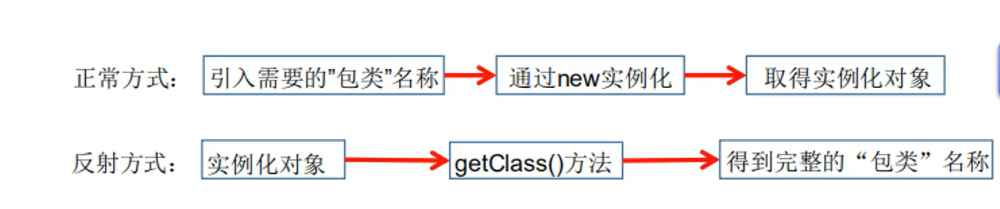


## 6、获得反射对象


**Java反射机制研究及应用：**

* 在运行时判断任意一个对象所属的类
* 在运行时构造任意一个类的对象
* 在运行时判断任意一个类所具有的成员变量和方法
* 在运行时获取泛型信息
* 在运行时调用任意一个对象的成员变量和方法
* 在运行时处理注解
* 生成动态代理
* ......

**Java反射的优点和缺点：**

* 优点：可以实现动态创建对象和编译，体现出很大的灵活性
* 缺点：对性能有影响。使用反射基本上是一种解释操作，我们可以告诉JVM，我们希望做什么并且它满足我们的要求。这类操作总是慢于直接执行相同的操作

**java反射相关的主要API：**

* java.lang.Class:代表一个类
* java.lang.reflect.Method:代表类的方法
* java.lang.reflect.Field:代表类的成员变量
* java.lang.reflect.Constructor:代表类的构造器
* ......


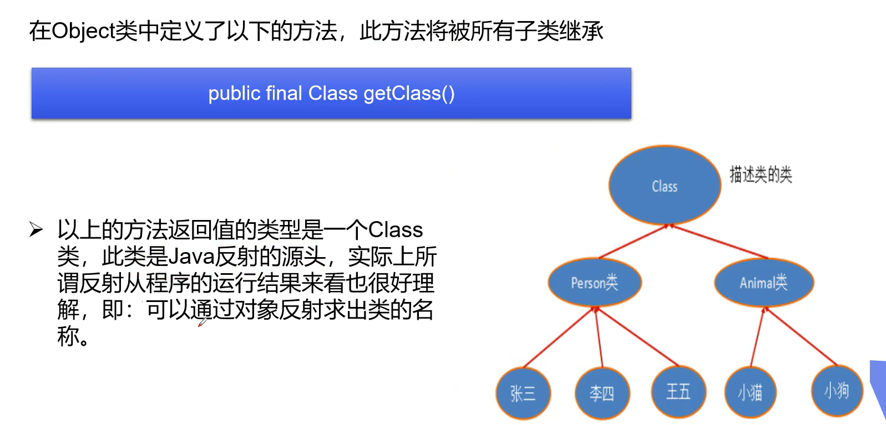


```java
package com.kuang.lesson7;

//什么叫反射
public class Test02 extends Object {
    public static void main(String[] args) throws ClassNotFoundException {
        //通过反射的方法来得到类的Class对象
        Class c1 = Class.forName("com.kuang.lesson7.User");
        System.out.println(c1);

        Class c2 = Class.forName("com.kuang.lesson7.User");
        Class c3 = Class.forName("com.kuang.lesson7.User");
        Class c4 = Class.forName("com.kuang.lesson7.User");

        //一个类在内存中只有一个Class对象
        //一个类被加载后，类的整个结构都会被封装在Class对象中
        System.out.println(c2.hashCode());
        System.out.println(c3.hashCode());
        System.out.println(c4.hashCode());
    }
}

//定义实体类 pojo/entity
class User{
    private String name;
    private int age;
    private  int id;

    public User() {
    }

    public User(String name, int age, int id) {
        this.name = name;
        this.age = age;
        this.id = id;
    }

    public String getName() {
        return name;
    }

    public void setName(String name) {
        this.name = name;
    }

    public int getAge() {
        return age;
    }

    public void setAge(int age) {
        this.age = age;
    }

    public int getId() {
        return id;
    }

    public void setId(int id) {
        this.id = id;
    }

    @Override
    public String toString() {
        return "User{" +
                "name='" + name + '\'' +
                ", age=" + age +
                ", id=" + id +
                '}';
    }
}

```


## 7、得到Class类的几种方式


**关于Class类：**对象照镜子后可以得到的信息：某个类的属性、方法和构造器、某个类到底实现了哪些接口。对于每个类而言，JRE都为其保留一个不变的Class类型的对象。一个Class对象包含了特定某个结构（class/interface/enum/annotation/primitive/void[]）的有关信息。

* Class本身也是一个类

* Class对象只能由系统建立对象

* 一个加载的类在JVM中只会有一个Class实例

* 一个Class对象对应的是一个加载到JVM中的一个.class文件

* 每个类的实例都会记得自己是由哪个Class实例所生成

* 通过Class可以完整地得到一个类中的所有被加载的结构

* Class类是Reflection的根源，针对任何你想动态加载、运行的类，唯有先获得相应的Class对象才行

  

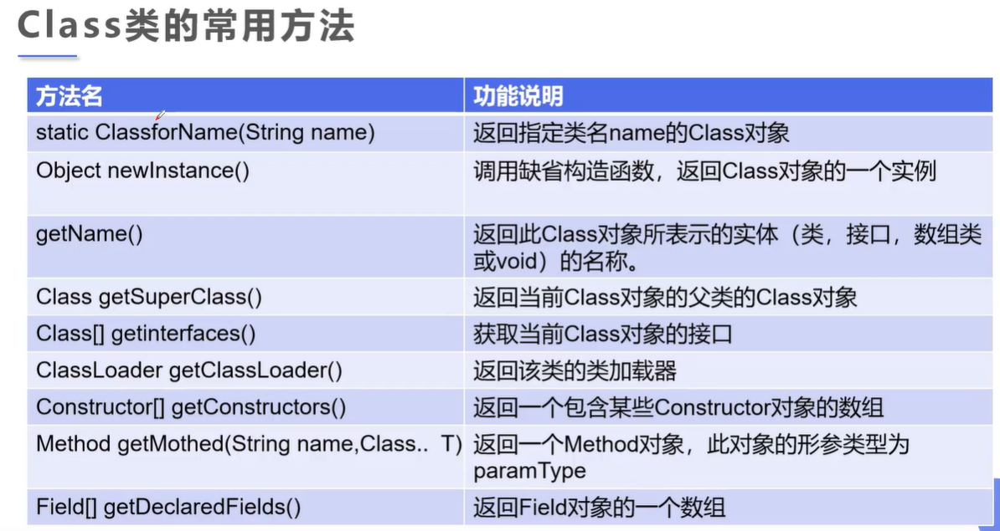


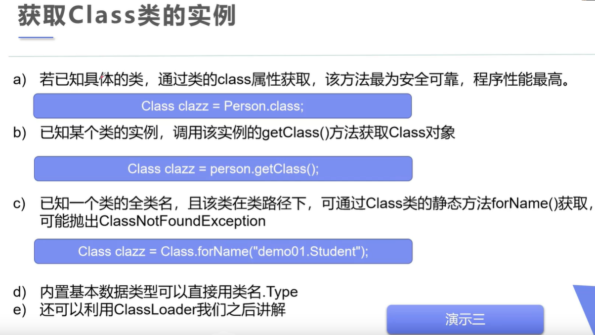


```java
package com.kuang.lesson7;

//测试Class类的创建方式有哪些
public class Test03 {
    public static void main(String[] args) throws ClassNotFoundException {
        Person person = new Student();
        System.out.println("这个人是:"+person.name);

        //1、通过对象获得
        Class c1 = person.getClass();
        //2、通过Class.forname获得
        Class c2 = Class.forName("com.kuang.lesson7.Student");
        //3、通过.class方式获得
        Class c3 = Student.class;
        //4、基本内置数据类型的包装类都有一个Type属性
        Class c4 = Integer.TYPE;
        //5、获得父类类型
        Class c5 = c1.getSuperclass();

        //通过hashcode判断是否是同一个Class对象
        System.out.println(c1.hashCode());
        System.out.println(c2.hashCode());
        System.out.println(c3.hashCode());

        System.out.println(c4);

        System.out.println(c5);
    }

}

class Person{
    public String name;

    public Person() {
    }

    public Person(String name) {
        this.name = name;
    }

    @Override
    public String toString() {
        return "Person{" +
                "name='" + name + '\'' +
                '}';
    }
}

class Student extends Person{
    public Student(){
        this.name = "学生";
    }
}

class Teacher extends Person{
    public Teacher(){
        this.name = "老师";
    }
}
```


## 8、所有类型的Class对象


**哪些类型可以有Class对象？**

* class：外部类，成员（成员内部类，静态内部类），局部内部类，匿名内部类
* interface：接口
* []:数组
* enum:枚举
* annotation:注解：@interface
* primitive type：基本数据类型
* void


**demo：**

```java
package com.kuang.lesson7;

import java.lang.annotation.ElementType;

public class Test04 {
    public static void main(String[] args) {
        Class c1 = Object.class;//类
        Class c2 = Comparable.class;//接口
        Class c3 = String[].class;//一维数组
        Class c4 = int[][].class;//二维数组
        Class c5 = Override.class;//注解
        Class c6 = ElementType.class;//枚举
        Class c7 = Integer.class;//基本数据类型
        Class c8 = void.class;//void
        Class c9 = Class.class;//Class

        System.out.println(c1);
        System.out.println(c2);
        System.out.println(c3);
        System.out.println(c4);
        System.out.println(c5);
        System.out.println(c6);
        System.out.println(c7);
        System.out.println(c8);
        System.out.println(c9);

    }
}

```


## 9、类加载内存分析


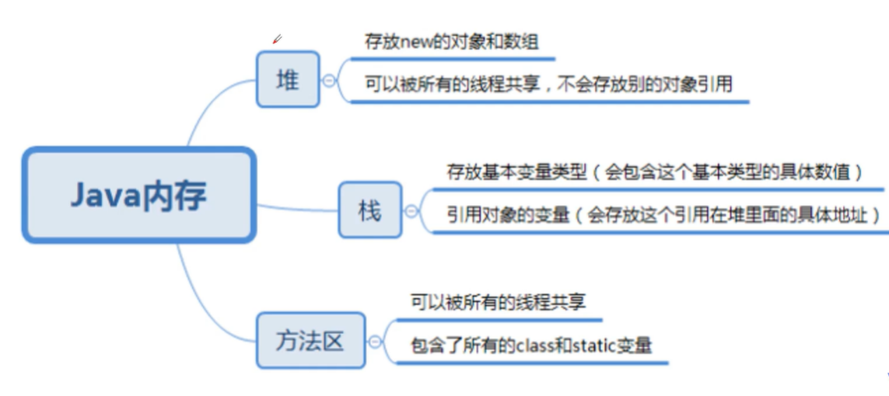


**类加载机制：**jvm把class文件加载到内存，并对数据进行校验、解析和初始化，最终形成jvm可以直接使用的java类型的过程。

**1、加载：**

将class文件字节码内容加载到内存中，并将这些静态数据转换成方法区中的运行时数据结构，在堆中生成一个代表这个类的java.lang.Class对象，作为方法区类数据的访问入口。

**2、链接：** 将java类的二进制代码合并到jvm的运行状态之中的过程

* 验证：确保加载的类信息符合jvm规范，没有安全方面的问题。

* 准备 ：正式为类变量（static变量）分配内存并设置类变量初始值的阶段，这些内存都将在方法区中进行分配。

* 解析：虚拟机常量池内的符号引用替换为直接引用的过程。（比如String s ="aaa",转化为 s的地址指向“aaa”的地址）

**3、初始化：**

* 初始化阶段是执行类构造器方法的过程。类构造器方法是由编译器自动收集类中的所有类变量的赋值动作和静态语句块（static块）中的语句合并产生的。

* 当初始化一个类的时候，如果发现其父类还没有进行过初始化，则需要先触发其父类的初始化

* 虚拟机会保证一个类的构造器方法在多线程环境中被正确加锁和同步

* 当访问一个java类的静态域时，只有真正声明这个静态变量的类才会被初始化。


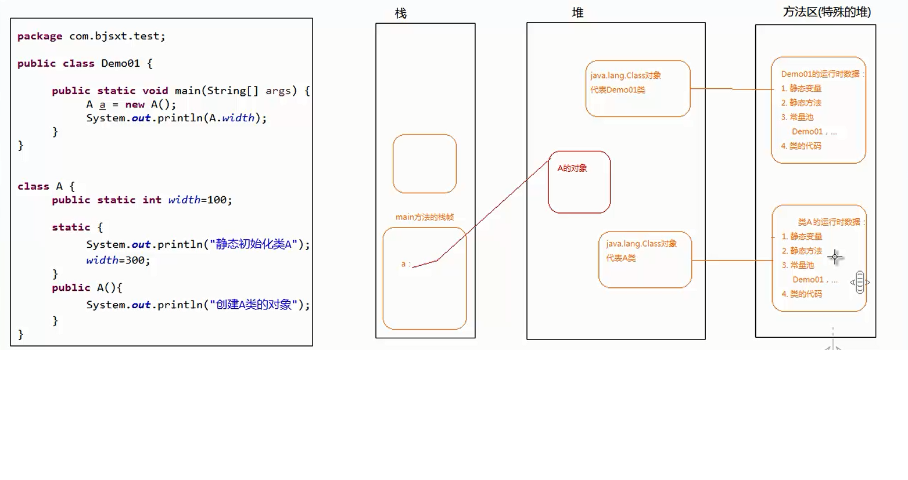


## 10、分析类初始化


**什么时候会发生类初始化？：**

* 类的主动引用（一定会发生类的初始化）
  * 当虚拟机启动，先初始化main方法所在的类
  * new一个类的对象
  * 调用类的静态成员（除了final常量）和静态方法
  * 使用java.lang.reflect包的方法对类进行反射调用
  * 当初始化一个类，如果其父类没有被初始化，则先会初始化它的父类

* 类的被动引用（不会发生类的初始化）
  *  当访问一个静态域时，只有真正声明这个域的类才会被初始化。如：当通过子类引用父类的静态变量，不会导致子类初始化
  * 通过数组定义类引用，不会触发此类的初始化
  * 引用常量不会触发此类的初始化（常量在链接阶段就存入调用类的常量池中了）


## 11、类加载器


**类加载的作用：**将class文件字节码内容加载到内存中，并将这些静态数据转换成方法区的运行时数据结构，然后在堆中生成一个代表这个类的java.lang.Class对象，作为方法区中类数据的访问入口。

**类缓存：**标准的JavaSE类加载器可以按要求查找类，但一旦某个类被加载到类加载器中，它将维持加载（缓存）一段时间。不过JVM垃圾回收机制可以回收这些Class对象


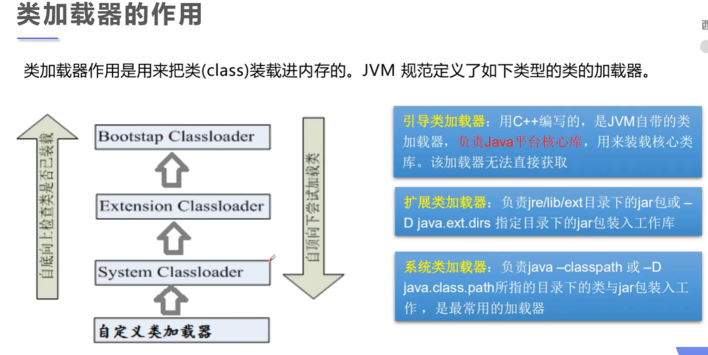


**类加载器的代理模式：双亲委托机制**

就是某个特定的类加载器在接收到加载类的请求后，首先将加载任务委托给父类加载器，一次追溯，直到最高的爷爷辈的，如果父类加载器可以完成类加载任务，就成功返回；只要父类加载器无法完成次加载任务时，才自己加载。

双亲机制是为了保证java核心库的类型安全，不会出现用户自己能定义java.lang.Object类的情况。

双亲委托机制是代理模式的一种，并不是所有的类加载器都采用双亲委托机制，tomcat服务器类加载器也使用代理模式，所不同的是他是首先尝试自己去加载某个类，如果找不到在代理给父类加载器。


```java
package com.kuang.lesson7;

public class Test05 {
    public static void main(String[] args) throws ClassNotFoundException {
        //获取系统类的加载器
        ClassLoader systemClassLoader = ClassLoader.getSystemClassLoader();
        System.out.println(systemClassLoader);

        //获取系统类加载器的父类加载器->扩展类加载器
        ClassLoader parent = systemClassLoader.getParent();
        System.out.println(parent);

        //获取扩展类加载器的父类加载器->根加载器(c,c++)
        ClassLoader parent1 = parent.getParent();
        System.out.println(parent1);

        //测试当前类是哪个加载器加载的
        ClassLoader classLoader = Class.forName("com.kuang.lesson7.Test05").getClassLoader();
        System.out.println(classLoader);

        //测试JDK内置的类是谁加载的
        ClassLoader classLoader1 = Class.forName("java.lang.Object").getClassLoader();
        System.out.println(classLoader1);

        //如何获得系统类加载器可以加载的路径
        System.out.println(System.getProperty("java.class.path"));
        
        /*
        加载路径如下:
        C:\Program Files\Java\jdk1.8.0_281\jre\lib\charsets.jar;
        C:\Program Files\Java\jdk1.8.0_281\jre\lib\deploy.jar;
        C:\Program Files\Java\jdk1.8.0_281\jre\lib\ext\access-bridge-64.jar;
        C:\Program Files\Java\jdk1.8.0_281\jre\lib\ext\cldrdata.jar;
        C:\Program Files\Java\jdk1.8.0_281\jre\lib\ext\dnsns.jar;
        C:\Program Files\Java\jdk1.8.0_281\jre\lib\ext\jaccess.jar;
        C:\Program Files\Java\jdk1.8.0_281\jre\lib\ext\jfxrt.jar;
        C:\Program Files\Java\jdk1.8.0_281\jre\lib\ext\localedata.jar;
        C:\Program Files\Java\jdk1.8.0_281\jre\lib\ext\nashorn.jar;
        C:\Program Files\Java\jdk1.8.0_281\jre\lib\ext\sunec.jar;
        C:\Program Files\Java\jdk1.8.0_281\jre\lib\ext\sunjce_provider.jar;
        C:\Program Files\Java\jdk1.8.0_281\jre\lib\ext\sunmscapi.jar;
        C:\Program Files\Java\jdk1.8.0_281\jre\lib\ext\sunpkcs11.jar;
        C:\Program Files\Java\jdk1.8.0_281\jre\lib\ext\zipfs.jar;
        C:\Program Files\Java\jdk1.8.0_281\jre\lib\javaws.jar;
        C:\Program Files\Java\jdk1.8.0_281\jre\lib\jce.jar;
        C:\Program Files\Java\jdk1.8.0_281\jre\lib\jfr.jar;
        C:\Program Files\Java\jdk1.8.0_281\jre\lib\jfxswt.jar;
        C:\Program Files\Java\jdk1.8.0_281\jre\lib\jsse.jar;
        C:\Program Files\Java\jdk1.8.0_281\jre\lib\management-agent.jar;
        C:\Program Files\Java\jdk1.8.0_281\jre\lib\plugin.jar;
        C:\Program Files\Java\jdk1.8.0_281\jre\lib\resources.jar;
        C:\Program Files\Java\jdk1.8.0_281\jre\lib\rt.jar;
        D:\JavaSE\out\production\StudyNet;D:\JavaSE\src\com\lib\commons-io-1.4.jar;
        C:\Program Files\JetBrains\IntelliJ IDEA 2020.3.2\lib\idea_rt.jar
         */
    }
}

```


## 12、获取类的运行时结构


通过反射获取运行时类的完整结构: Field,Method,Constructor,Superclass,interface,Annotation

* 实现的所有接口
* 所继承的父类
* 全部的构造器
* 全部的方法
* 全部的Field
* 注解
* ......


```java
package com.kuang.lesson7;

import java.lang.reflect.Constructor;
import java.lang.reflect.Field;
import java.lang.reflect.Method;

//获得类的信息
public class Test06 {
    public static void main(String[] args) throws ClassNotFoundException, NoSuchFieldException, NoSuchMethodException {
        //创建class对象
        Class c1 = Class.forName("com.kuang.lesson7.User");

        //获得类的名字
        System.out.println(c1.getName());//获得包名+类名
        System.out.println(c1.getSimpleName());//获得类名

        //获得类的属性
        //Field[] fields1 = c1.getFields();  只能找到public属性
        System.out.println("========================");
        Field[] fields = c1.getDeclaredFields();//可以找到类中全部的属性
        for(Field field:fields){
            System.out.println(field);
        }

        //获得指定属性的值
        Field name = c1.getDeclaredField("name");
        System.out.println(name);

        //获得类的方法
        System.out.println("========================");
        Method[] methods = c1.getMethods();  //获得本类及其父类的全部public方法
        for(Method method:methods){
            System.out.println("getMethods:"+method);
        }

        methods = c1.getDeclaredMethods();  //获得本类的所有方法
        for(Method method:methods){
            System.out.println("getDeclaredMethods:"+method);
        }

        //获得指定的方法
        Method getName = c1.getMethod("getName", null);
        Method setName = c1.getMethod("setName", String.class);
        System.out.println(getName);
        System.out.println(setName);

        //获得类的构造器
        System.out.println("========================");
        Constructor[] constructors = c1.getConstructors();
        for (Constructor constructor : constructors) {
            System.out.println(constructor);
        }

        System.out.println("========================");
        Constructor[] declaredConstructors = c1.getDeclaredConstructors();
        for (Constructor declaredConstructor : declaredConstructors) {
            System.out.println("#"+declaredConstructor);
        }

        //获得指定的构造器
        Constructor declaredConstructor = c1.getDeclaredConstructor(String.class, int.class, int.class);
        System.out.println("指定："+declaredConstructor);

    }
}
```


## 13、动态创建对象执行方法


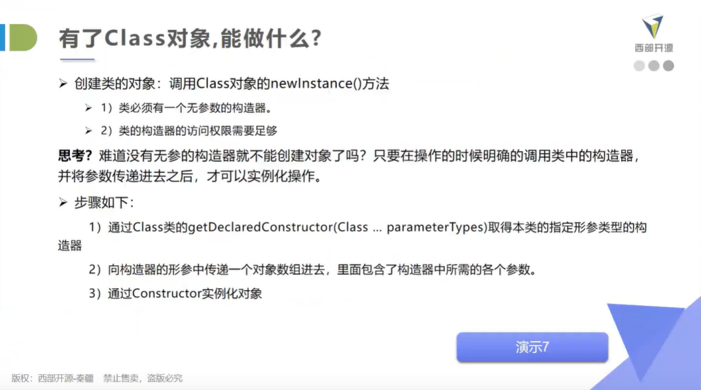


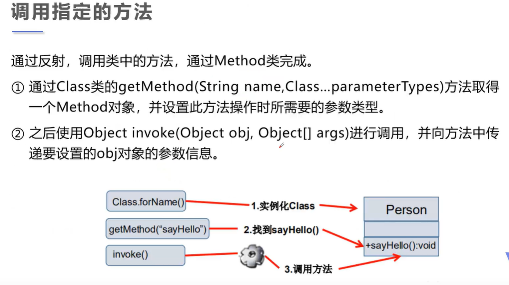


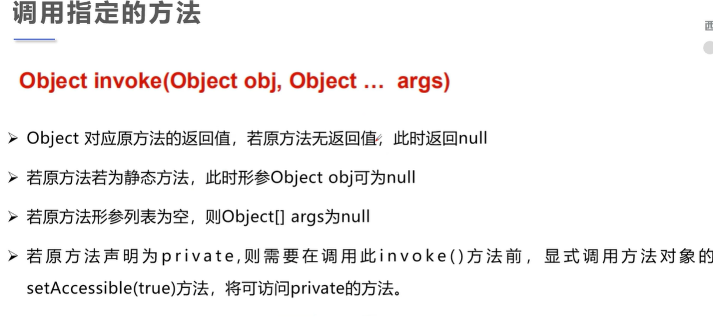

**关于setAccessible:**


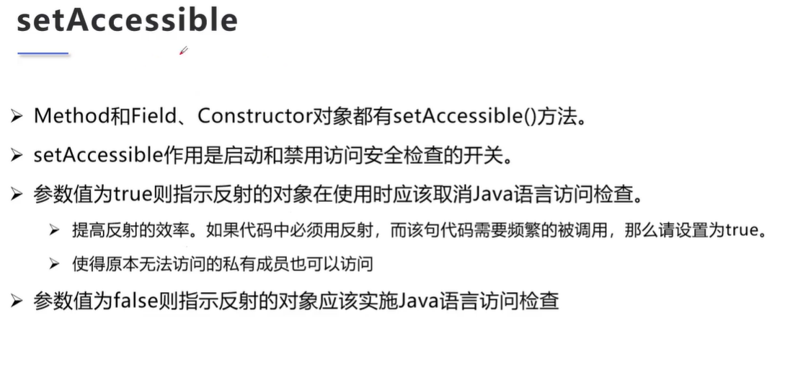

**demo:**


```java
package com.kuang.lesson7;

import java.lang.reflect.Constructor;
import java.lang.reflect.Field;
import java.lang.reflect.InvocationTargetException;
import java.lang.reflect.Method;

//动态的创建对象，通过反射
public class Test07 {
    public static void main(String[] args) throws ClassNotFoundException, IllegalAccessException, InstantiationException, NoSuchMethodException, InvocationTargetException, NoSuchFieldException {
        //获得Class对象
        Class c1 = Class.forName("com.kuang.lesson7.User");

        //构造一个对象
        User user = (User) c1.newInstance();//本质上是调用了类的无参构造器
        System.out.println(user);

        //通过构造器创建对象
        Constructor constructor = c1.getDeclaredConstructor(String.class, int.class, int.class);
        User user1 = (User) constructor.newInstance("道格", 001, 19);
        System.out.println(user1);

        //通过反射调用普通方法
        User user2 = (User) c1.newInstance();
        Method setName = c1.getDeclaredMethod("setName", String.class);
        //invoke : 激活的意思
        //(对象，"方法的值")
        setName.invoke(user2, "倒戈");
        System.out.println(user2.getName());

        //通过反射操作属性
        User user3 = (User) c1.newInstance();
        Field name = c1.getDeclaredField("name");

        //不能直接操作私有属性，我们需要关闭程序的安全检测,属性或者方法的setAccessible(true)
        name.setAccessible(true);
        name.set(user3,"三百");
        System.out.println(user3.getName());
    }
}

```


## 14、获取泛型信息


**反射操作泛型(Generic)：**

* Java采用泛型擦除的机制来引入泛型，Java中的泛型仅仅是给编译器javac使用的，确保数据的安全性和免去强制类型转换问题，但是，一旦编译完成，所有和泛型相关的类型全部被擦除
* 为了通过反射来操作这些类型，Java新增了ParameterizedType,GenericArrayType,TypeVariable和WildcardType几种类型来代表不能被归一到Class类中的类型但是又和原始类型齐名的类型
  *  ParameterizedType：表示一种参数化类型，比如Collection<String>
  * GenericArrayType：表示一种元素类型是参数化类型或者类型变量的数组类型
  * TypeVariable：是各种类型变量的公共父接口
  * WildcardType：代表一种通配符类型表达式


**demo：**

```java
package reflection;

import java.lang.reflect.Method;
import java.lang.reflect.ParameterizedType;
import java.lang.reflect.Type;
import java.util.List;
import java.util.Map;


/**
 * 通过反射获取泛型信息
 *
 */
public class Demo{  
    //定义两个带泛型的方法
    public void test01(Map<String,Person> map,List<Person> list){
        System.out.println("Demo.test01()");
    }   
    public Map<Integer,Person> test02(){
        System.out.println("Demo.test02()");
        return null;
    }   


    public static void main(String[] args) {
        try {           
            //获得指定方法参数泛型信息
            Method m = Demo.class.getMethod("test01", Map.class,List.class);
            Type[] t = m.getGenericParameterTypes();

            for (Type paramType : t) {
                System.out.println("#"+paramType);
                if(paramType instanceof ParameterizedType){
                    //获取泛型中的具体信息
                    Type[] genericTypes = ((ParameterizedType) paramType).getActualTypeArguments();
                    for (Type genericType : genericTypes) {
                        System.out.println("泛型类型："+genericType);
                    }
                }
            }   

            //获得指定方法返回值泛型信息
            Method m2 = Demo.class.getMethod("test02", null);
            Type returnType = m2.getGenericReturnType();
            if(returnType instanceof ParameterizedType){
                    Type[] genericTypes = ((ParameterizedType) returnType).getActualTypeArguments();

                    for (Type genericType : genericTypes) {
                        System.out.println("返回值，泛型类型："+genericType);
                    }                   
            }       

        } catch (Exception e) {
            e.printStackTrace();
        }   
    }
}
```


## 15、获取注解信息


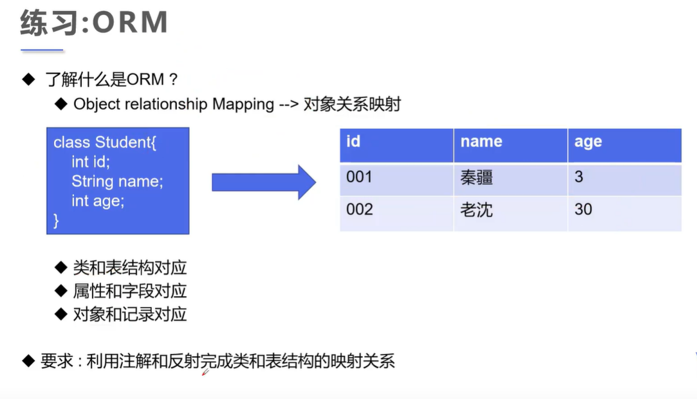


**demo:**

```java
package com.kuang.lesson7;

import java.lang.annotation.*;
import java.lang.reflect.Field;

//通过反射操作注解
public class Test08 {
    public static void main(String[] args) throws ClassNotFoundException, NoSuchFieldException {
        Class c1 = Class.forName("com.kuang.lesson7.Student2");

        //通过反射获得注解
        Annotation[] annotations = c1.getAnnotations();
        for (Annotation annotation : annotations) {
            System.out.println(annotation);
        }

        //获得注解的value值
        dao annotation = (dao) c1.getAnnotation(dao.class);
        String value = annotation.value();
        System.out.println(value);
        
        //获得类中属性的注解
        Field f = c1.getDeclaredField("name");
        Fielddao annotation1 = f.getAnnotation(Fielddao.class);
        System.out.println(annotation1);
        System.out.println(annotation1.columeName());
        System.out.println(annotation1.type());
        System.out.println(annotation1.length());

    }
}


@dao("db_student")
class Student2{
    @Fielddao(columeName = "db_id",type = "int",length = 10)
    private int id;
    @Fielddao(columeName = "db_age",type = "int",length = 10)
    private int age;
    @Fielddao(columeName = "db_name",type = "varchar",length = 4)
    private String name;

    public Student2() {
    }

    public Student2(int id, int age, String name) {
        this.id = id;
        this.age = age;
        this.name = name;
    }

    public int getId() {
        return id;
    }

    public void setId(int id) {
        this.id = id;
    }

    public int getAge() {
        return age;
    }

    public void setAge(int age) {
        this.age = age;
    }

    public String getName() {
        return name;
    }

    public void setName(String name) {
        this.name = name;
    }

    @Override
    public String toString() {
        return "Student2{" +
                "id=" + id +
                ", age=" + age +
                ", name='" + name + '\'' +
                '}';
    }
}

//自定义注解-类名的注解
@Target(ElementType.TYPE)
@Retention(RetentionPolicy.RUNTIME)
@interface  dao{
    String value();
}

//自定义注解-属性的注解
@Target(ElementType.FIELD)
@Retention(RetentionPolicy.RUNTIME)
@interface Fielddao{
    String columeName();
    String type();
    int length();
}
```