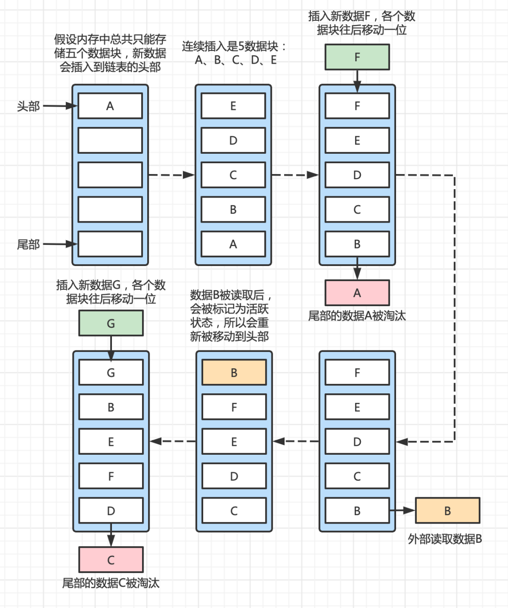

# 1-10

## 1、反转链表 

[题目链接](https://leetcode.cn/problems/reverse-linked-list/)

### 解题思路：

递归或者双指针迭代


### 递归解法：

```cpp
/**
 * Definition for singly-linked list.
 * struct ListNode {
 *     int val;
 *     ListNode *next;
 *     ListNode() : val(0), next(nullptr) {}
 *     ListNode(int x) : val(x), next(nullptr) {}
 *     ListNode(int x, ListNode *next) : val(x), next(next) {}
 * };
 */
class Solution {
public:
    ListNode* reverseList(ListNode* head) {
        //头节点不存在或者第二个节点不存在，直接返回head
        if(!head || !head->next) return head;
        //递归调用
        auto tail = reverseList(head->next);
        //更新head节点与head->next节点之间的指针
        head->next->next = head;
        head->next = nullptr;
        //返回反转后的节点
        return tail;
    }
};
```


### 双指针迭代解法：

```cpp
/**
 * Definition for singly-linked list.
 * struct ListNode {
 *     int val;
 *     ListNode *next;
 *     ListNode() : val(0), next(nullptr) {}
 *     ListNode(int x) : val(x), next(nullptr) {}
 *     ListNode(int x, ListNode *next) : val(x), next(next) {}
 * };
 */
class Solution {
public:
    ListNode* reverseList(ListNode* head) {
        if(!head) return head;
        //从最前面两个节点开始迭代
        auto a = head, b = head->next;
        //当指针b依然存在
        while(b)
        {
            auto c = b->next;
            //改变指针指向
            b->next = a;
            //移动a指针到b指针的位置
            a = b;
            //移动b指针到c指针的位置
            b = c;
        }

        head->next = nullptr;
        //双指针迭代结束时a指针指向最后一个节点，b指针指向null
        return a;

    }
};
```


## 2、无重复字符的最长子串

[题目链接](https://leetcode.cn/problems/longest-substring-without-repeating-characters/)

### 解题思路：

> 双指针迭代+Hash
>

```c++
class Solution {
public:
    int lengthOfLongestSubstring(string s) {
        //使用hash表来存储字符出现的次数
        unordered_map<char, int> hash;

        //记录结果
        int res = 0;

        //双指针迭代，当j遍历到当前字符出现了两次，i指针向前遍历，指向--操作，直到hash值变为1
        for(int i = 0, j = 0; j < s.length(); j ++)
        {
            hash[s[j]] ++;
            while(hash[s[j]] > 1) hash[s[i++]] --;
            res = max(res, j - i + 1);
        }

        return res;
    }
};
```


## 3、LRU缓存机制

[题目链接](https://leetcode.cn/problems/lru-cache/)

### 什么是LRU?

LRU (Least recently used：最近最少使用)算法在缓存写满的时候，会根据所有数据的访问记录，淘汰掉未来被访问几率最低的数据。也就是说该算法认为，最近被访问过的数据，在将来被访问的几率最大。

图示：



本题解题思路和上图一样，使用双向链表来存储数据,以Node形式—(key, value)，使用hash表来判断当前节点Node是否存在

```c++
class LRUCache {
public:
    //使用双链表维护key-value
    struct Node{
        int key, val;
        Node *left, *right;
        Node(int _key, int _val): key(_key), val(_val), left(NULL), right(NULL){}
    }*L,*R;

    //哈希表维护key, Node(key, value)
    unordered_map<int, Node*> hash;
    int n;

    //删除节点p
    void remove(Node* p){
        p->right->left = p->left;
        p->left->right = p->right;
    }

    //在双链表最左侧插入节点，代表此节点最近使用了一次，注意双链表中越靠右侧代表使用次数越少
    void insert(Node* p){
        p->right = L->right;
        p->left = L;
        L->right->left = p;
        L->right = p;
    }

    LRUCache(int capacity) {
        n = capacity;
        //定义的双链表左右节点
        L = new Node(-1, -1), R = new Node(-1, -1);
        L->right = R, R->left = L;
    }
    
    int get(int key) {
        //不存在key,则返回-1
        if(hash.count(key) == 0) return -1;
        //key存在，则取出双链表中的点，先删除此点，再将此点插入到双链表最左侧，代表最近更新了一次
        auto p = hash[key];
        remove(p);
        insert(p);
        return p->val;
    }
    
    void put(int key, int value) {
        //如果key已经存在
        if(hash.count(key)){
            auto p = hash[key];
            //更新val并且更新节点位置
            p->val = value;
            remove(p);
            insert(p);
        }else{
            //如果容量已满
            if(hash.size() == n){
                auto p = R->left;
                //从双链表中删除
                remove(p);
                //从哈希表中删除
                hash.erase(p->key);
                //从内存溢出的角度删除p点
                delete p;
            }
            auto p = new Node(key, value);
            hash[key] = p;
            insert(p);
        }
    }
};

/**
 * Your LRUCache object will be instantiated and called as such:
 * LRUCache* obj = new LRUCache(capacity);
 * int param_1 = obj->get(key);
 * obj->put(key,value);
 */
```


## 4、数组中的第K个最大的数

[题目链接](https://leetcode.cn/problems/kth-largest-element-in-an-array/)

快速选择算法 或者 堆排序（手写）

### 快选：

```c++
class Solution {
public:
    int quick_select(vector<int>& nums, int l, int r, int k)
    {
        if(l >= r) return nums[l];
        int x = nums[l + r >> 1], i = l - 1, j = r + 1;
        while(i < j)
        {
            do i++; while(nums[i] > x);
            do j--; while(nums[j] < x);
            if(i < j){
                swap(nums[i], nums[j]);
            }
        }

        if(j - l + 1 >= k) return quick_select(nums, l, j, k);
        else return quick_select(nums, j + 1, r, k - (j - l + 1));

    }

    int findKthLargest(vector<int>& nums, int k) {
        return quick_select(nums, 0, nums.size() - 1, k);
    }
};
```

### 堆排序：

```c++
class Solution {
public:
    
    //down操作-将较小的值down下去
    void down(vector<int>& nums, int u, int len)
    {

        int t = u;
        if(u*2<= len && nums[u*2] > nums[t]) t = u*2;
        if(u*2 + 1 <= len && nums[u*2 + 1] > nums[t]) t = u*2 + 1;
        if(t != u)
        {
            //交换数据
            swap(nums[t], nums[u]);
            down(nums, t, len);
        }
    }

    //使用堆排序
    int findKthLargest(vector<int>& nums, int k) {
        int len = nums.size();
        vector<int> tmp(len + 1);
        for(int i = 1; i <= len; i++)
        {
            tmp[i] = nums[i - 1];
        }
        //堆排 构建大根堆 时间复杂度O(n)
        for(int i = len / 2; i; i--)
        {
            down(tmp, i, len);
        }

        while(k-- - 1)
        {
            tmp[1] = tmp[len];
            len--;
            down(tmp, 1, len);
        }
        return tmp[1];

    }
};
```


## 5、K个一组翻转链表

[题目链接](https://leetcode.cn/problems/reverse-nodes-in-k-group/)

### 解题思路：

> 1、反转之前先判断未反转的链表元素是否有k个
>
> 2、对接下来k个元素进行反转操作
>
> 3、改变反转后的链表头节点和尾节点的指向
>
> 4、依次循环执行

### 代码实现：

```c++
/**
 * Definition for singly-linked list.
 * struct ListNode {
 *     int val;
 *     ListNode *next;
 *     ListNode() : val(0), next(nullptr) {}
 *     ListNode(int x) : val(x), next(nullptr) {}
 *     ListNode(int x, ListNode *next) : val(x), next(next) {}
 * };
 */
class Solution {
public:
    ListNode* reverseKGroup(ListNode* head, int k) {
        auto dummy = new ListNode(-1);
        dummy->next = head;
        for(auto p = dummy;;)
        {
            auto q = p;
            //先判断当前节点后面是否有足量的k个元素
            for(int i = 0; i < k && q; i ++) q = q->next;
            //如果元素数量不足，直接break
            if(!q) break;
            auto a = p->next, b = a->next;
            //反转链表
            for(int i = 0; i < k - 1; i ++)
            {
                auto c = b->next;
                b->next = a;
                a = b;
                b = c;
            }
            //改变节点指向
            auto c = p->next;
            p->next = a;
            c->next = b;
            //更新p节点
            p = c;

        }

        return dummy->next;
    }
};
```


## 6、三数之和

[题目链接](https://leetcode.cn/problems/3sum/)

### 解题思路：双指针算法

> 1、枚举每个数，先确定nums[i]，在排序后的情况下，通过双指针l，r分别从左边l = i + 1和右边n - 1
> 往中间靠拢，找到nums[i] + nums[l] + nums[r] == 0的所有符合条件的搭配
> 2、判重处理
> 当i>0(i不是第一个数)&&nums[i] == nums[i - 1]，表示当前确定好的数与上一个一样，需要直接continue
> 同理，j&nums[j]==nums[j-1] 需要直接continue

时间复杂度：O(n*2)

### 代码实现：

```c++
class Solution {
public:
    vector<vector<int>> threeSum(vector<int>& nums) {
        vector<vector<int>> res;
        if(nums.size() < 3) return res;
        sort( nums.begin(), nums.end());
        for(int i = 0; i < nums.size(); i ++){
            //遇到重复元素则跳过
            if(i && nums[i] == nums[i - 1]) continue;
            for(int j = i + 1, k = nums.size() - 1; j < k; j ++){
                if(j > i + 1 && nums[j] == nums[j - 1]) continue;
                //找到满足需要的最小的k  试探法：如果k的左侧元素满足条件就用左侧的元素
                while(j < k - 1 && nums[i] + nums[j] + nums[k - 1] >= 0) k--;
                if(nums[i] + nums[j] + nums[k] == 0){
                    res.push_back({nums[i], nums[j], nums[k]});
                }
            }
        }

        return res;
    }
};
```


## 7、补充题4.手撕快速排序

[题目链接](https://leetcode.cn/problems/sort-an-array/)

算法入门笔记中有相应的笔记，迅速写出

### 代码实现：

```c++
class Solution {
public:

    //快排模板
    void quick_sort(vector<int>& nums, int l, int r)
    {
        if(l >= r) return;
        int x = nums[l + r >> 1], i = l - 1, j = r + 1;
        while(i < j){
            do i++; while(nums[i] < x);
            do j--; while(nums[j] > x);
            if(i < j){
                swap(nums[i], nums[j]);
            }
        }
        quick_sort(nums, l, j);
        quick_sort(nums, j + 1, r);

    }

    vector<int> sortArray(vector<int>& nums) {
        quick_sort(nums, 0, nums.size() - 1);
        return nums;
    }
};
```


## 8、最大子序和

[题目链接](https://leetcode.cn/problems/maximum-subarray/)

### 算法1：动态规划 O(n)

> 1、设 f(i) 表示以第 i 个数字为结尾的最大连续子序列的 总和 是多少。
> 2、初始化 f(0)=nums[0]。
> 3、转移方程 f(i)=max(f(i−1)+nums[i],nums[i])。可以理解为当前有两种决策，一种是将第 i 个数字和前边的数字拼接起来；另一种是第 i 个数字单独作为一个新的子序列的开始。
> 4、最终答案为 ans=max(f(k)),0≤k<n。

**时间复杂度**
状态数为 O(n)，转移时间为O(1)，故总时间复杂度为 O(n)。
**空间复杂度**
未优化空间之前：需要额外 O(n) 的空间存储状态。

优化空间之后：需要额外O(1)的空间存储状态。

可以通过一个变量来替代数组将空间复杂度优化到常数。

### 代码实现1：

```c++
class Solution {
public:
    int maxSubArray(vector<int>& nums) {
        int n = nums.size();
        int ans;
        //动态规划 f(i)表示以第i个数字为结尾的最大连续子序列的总和是多少
        vector<int> f(n);
        f[0] = nums[0];
        ans = f[0];
        for(int i = 1; i < n; i ++){
            //取最大值
            f[i] = max(f[i - 1] + nums[i], nums[i]);
            ans = max(ans, f[i]);
        }

        return ans;
    }
};
```

### 代码实现2：

```c++
class Solution {
public:
    int maxSubArray(vector<int>& nums) {
        int res = INT_MIN;
        //空间优化版的动态规划
        for(int i = 0, last = 0; i < nums.size(); i ++){
            last = max(nums[i], last + nums[i]);
            res = max(res, last);
        }
        return res;
    }
};
```


### 算法2：分治 O(nlogn)

> 1、考虑区间 [l, r] 内的答案如何计算，令 mid = (l + r) / 2，则该区间的答案由三部分取最大值，分别是：
>       (1). 区间 [l, mid] 内的答案（递归计算）。
>       (2). 区间 [mid + 1, r] 内的答案（递归计算）。
>       (3). 跨越 mid 和 mid + 1 的连续子序列。
> 2、其中，第 (3) 部分只需要从 mid 开始向 l 找连续的最大值，以及从 mid+1 开始向 r 找最大值即可，在线性时间内可以完成。
> 3、递归终止条件显然是 l == r ，此时直接返回 nums[l]。


**时间复杂度**
由递归主定理 T(n)=2T(n/2)+O(n)，解出总时间复杂度为 O(nlog⁡n)。
或者每一层时间复杂度是 O(n)，总共有 O(log⁡n) 层，故总时间复杂度是 O(nlog⁡n)。
**空间复杂度**
需要额外 O(logn) 的空用于递归的系统栈。

代码实现：

```c++
class Solution {
public:
    int calc(int l, int r, vector<int>& nums) {
        if (l == r)
            return nums[l];
        int mid = (l + r) >> 1;
        int lmax = nums[mid], lsum = 0, rmax = nums[mid + 1], rsum = 0;

        for (int i = mid; i >= l; i--) {
            lsum += nums[i];
            lmax = max(lmax, lsum);
        }

        for (int i = mid + 1; i <= r; i++) {
            rsum += nums[i];
            rmax = max(rmax, rsum);
        }

        return max(max(calc(l, mid, nums), calc(mid + 1, r, nums)), lmax + rmax);
    }

    int maxSubArray(vector<int>& nums) {
        int n = nums.size();
        return calc(0, n - 1, nums);
    }
};
```


### 算法3:分治 O(n)

> 1、对于一个区间 [l,r]，维护四个值，分别是：总和 sum；非空最大子段和 s；前缀非空最大子段和 ls；后缀非空最大子段和 rs。
> 2、分别递归左右子区间。
> 3、合并时，对于 sum 则是左右子区间的 sum 之和。
> 4、对于 s，则有三种情况取最大值：左区间的 s；右区间的 s；左区间的 rs 加上右区间的 ls。
> 5、对于 ls，则有两种情况取最大值：左区间的 ls；左区间的 sum 加上右区间的 ls。
> 6、对于 rs 同理。
> 7、合并后返回递归的结果。

**时间复杂度**
由递归主定理 T(n)=2T(n/2)+O(1)，解出总时间复杂度为 O(n)。
**空间复杂度**
需要额外 O(log⁡n) 的空用于递归的系统栈。

### 代码实现：

```c++
struct Node {
    int sum, s, ls, rs;
    Node(int sum_, int s_, int ls_, int rs_) {
        sum = sum_; s = s_; ls = ls_; rs = rs_;
    }
};

class Solution {
public:
    Node solve(int l, int r, const vector<int> &nums) {
        if (l == r)
            return Node(nums[l], nums[l], nums[l], nums[l]);

        int m = (l + r) >> 1;

        Node left = solve(l, m, nums);
        Node right = solve(m + 1, r, nums);

        return Node(
            left.sum + right.sum,
            max(max(left.s, right.s), left.rs + right.ls),
            max(left.ls, left.sum + right.ls),
            max(right.rs, left.rs + right.sum)
        );
    }

    int maxSubArray(vector<int>& nums) {
        return solve(0, nums.size() - 1, nums).s;
    }
};
```


## 9、合并两个有序链表

[题目链接](https://leetcode.cn/problems/merge-two-sorted-lists/)

### 解题思路：

> 迭代法遍历即可

**时间复杂度**：O(n)


### 代码实现：

```c++
/**
 * Definition for singly-linked list.
 * struct ListNode {
 *     int val;
 *     ListNode *next;
 *     ListNode() : val(0), next(nullptr) {}
 *     ListNode(int x) : val(x), next(nullptr) {}
 *     ListNode(int x, ListNode *next) : val(x), next(next) {}
 * };
 */
class Solution {
public:
    ListNode* mergeTwoLists(ListNode* list1, ListNode* list2) {
        auto dummy = new ListNode(-1);
        auto tail = dummy;

        //按链表取较小值，遍历至其中一个链表为空或者两个链表都为空时结束
        while(list1 && list2)
        {
            if(list1->val <= list2->val){
                tail->next = list1;
                tail = tail->next;
                list1 = list1->next;
            }else{
                tail->next = list2;
                tail = tail->next;
                list2 = list2->next;
            }
        }
        //如果list1非空
        if(list1){
            tail->next = list1;
        }
        //如果list2非空
        if(list2){
            tail->next = list2;
        }

        return dummy->next;
    }
};
```


## 10、两数之和

[题目链接](https://leetcode.cn/problems/two-sum/)

### 解题思路：(哈希表) O(n)

使用C++中的哈希表——unordered_map<int, int> hash.

循环一遍 nums 数组，在每步循环中我们做两件事：

> 1、判断 target−nums[i] 是否在哈希表中；
> 2、将 nums[i] 插入哈希表中；

解释：由于数据保证有且仅有一组解，假设是 [i,j] (i<j)，则我们循环到 j 时，nums[i]一定在哈希表中，且有 nums[i]+nums[j]==target， 所以我们一定可以找到解。

**时间复杂度：**由于只扫描一遍，且哈希表的插入和查询操作的复杂度是 O(1)O(1)，所以总时间复杂度是 O(n)O(n).


### 代码实现：

```c++
class Solution {
public:
    vector<int> twoSum(vector<int>& nums, int target) {
        vector<int> res;
        //使用hash表记录数组中值对应的下标
        unordered_map<int, int> hash;
        for(int i = 0; i < nums.size(); i++){   
            //      
            if(hash.count(target - nums[i])){
                res.push_back(i);
                res.push_back(hash[target - nums[i]]);
                return res;
            }
            hash[nums[i]] = i;
        }

        return res;
    }
};
```


# 11-20


# 21-30


# 31-40


# 41-50

