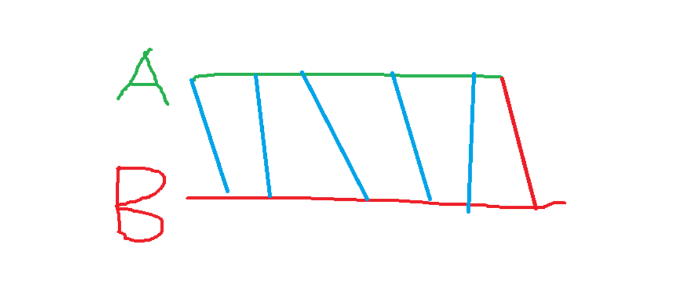

# 双指针算法


**双指针**，指的是在遍历对象的过程中，不是普通的使用单个指针进行访问，而是使用两个相同方向（*快慢指针*）或者相反方向（*对撞指针*）的指针进行扫描，从而达到相应的目的。

换言之，双指针法充分使用了数组有序这一特征，从而在某些情况下能够简化一些运算。


**双指针算法模板：**

```c++
for (int i = 0, j = 0; i < n; i ++ )
{
    while (j < i && check(i, j)) j ++ ;

    // 具体问题的逻辑`8
}
```


常见问题分类：
    (1) 对于一个序列，用两个指针维护一段区间
    (2) 对于两个序列，维护某种次序，比如归并排序中合并两个有序序列的操作


## 习题1：AcWing799. 最长连续不重复子序列


给定一个长度为 n 的整数序列，请找出最长的不包含重复的数的连续区间，输出它的长度。

**输入格式**

第一行包含整数 n。

第二行包含 n 个整数（均在 0∼1050∼105 范围内），表示整数序列。

**输出格式**

共一行，包含一个整数，表示最长的不包含重复的数的连续区间的长度。

**数据范围**

1≤n≤10^5

**输入样例：**

```
5
1 2 2 3 5
```

**输出样例：**

```
3
```

**核心思路：**

遍历数组a中的每一个元素a[i], 对于每一个i，找到j使得双指针[j, i]维护的是以a[i]结尾的最长连续不重复子序列，长度为i - j + 1, 将这一长度与r的较大者更新给r。
对于每一个i，如何确定j的位置：由于[j, i - 1]是前一步得到的最长连续不重复子序列，所以如果[j, i]中有重复元素，一定是a[i]，因此右移j直到a[i]不重复为止（由于[j, i - 1]已经是前一步的最优解，此时j只可能右移以剔除重复元素a[i]，不可能左移增加元素，因此，j具有“单调性”、本题可用双指针降低复杂度）。
用数组s记录子序列a[j ~ i]中各元素出现次数，遍历过程中对于每一个i有四步操作：cin元素a[i] -> 将a[i]出现次数s[a[i]]加1 -> 若a[i]重复则右移j（s[a[j]]要减1） -> 确定j及更新当前长度i - j + 1给r。

**注意细节：**

当a[i]重复时，先把a[j]次数减1，再右移j。


```c++
#include <iostream>
using namespace std;

const int N=1e5+10;

int a[N],s[N];
int n;

int main(){
    
    cin>>n;
    
    for(int i=0;i<n;i++) cin>>a[i];
    
    int res=0;
    
    for(int i=0,j=0;i<n;i++)
    {
        s[a[i]]++;
        while(s[a[i]]>1){
            s[a[j]]--;
            j++;
        }
        res=max(res,i-j+1);
    }
    
    cout<<res<<endl;
    
    return 0;
}
```


## 习题2：AcWing800. 数组元素的目标和


给定两个升序排序的有序数组 A 和 B，以及一个目标值 x。

数组下标从 0 开始。

请你求出满足 A[i]+B[j]=x 的数对 (i,j)。

数据保证有唯一解。

**输入格式**

第一行包含三个整数 n,m,x，分别表示 A 的长度，B 的长度以及目标值 x。

第二行包含 n 个整数，表示数组 A。

第三行包含 m 个整数，表示数组 B。

**输出格式**

共一行，包含两个整数 i 和 j。

**数据范围**

数组长度不超过 105。
同一数组内元素各不相同。
1≤数组元素≤10^9

**输入样例：**

```
4 5 6
1 2 4 7
3 4 6 8 9
```

**输出样例：**

```
1 1
```

**核心思路：**

注意两个数组都是升序排列的，对两个数组分别设置一个指针，一个从前往后开始遍历，一个从后往前开始遍历，判断 j-- 的条件是A[I]+B[j]>x。


```c++
#include <iostream>
using namespace std;

const int N=1e5+10;

int A[N],B[N];

int n,m,x;

int main()
{
    cin>>n>>m>>x;
    for(int i=0;i<n;i++) cin>>A[i];
    for(int i=0;i<m;i++) cin>>B[i];
    
    for(int i=0,j=m-1;i<n;i++)
    {
        while(A[i]+B[j]>x && j>=0) j--;
        
        if(A[i]+B[j]==x && j>=0){
            cout<<i<<" "<<j<<endl;
        }
    }
    
    return 0;
}
```


## 习题3：AcWing2816. 判断子序列


给定一个长度为 n 的整数序列 a1,a2,…,an 以及一个长度为 m 的整数序列 b1,b2,…,bm。

请你判断 a 序列是否为 b 序列的子序列。

子序列指序列的一部分项按**原有次序排列**而得的序列，例如序列 {a1,a3,a5} 是序列 {a1,a2,a3,a4,a5} 的一个子序列。

**输入格式**

第一行包含两个整数 n,m。

第二行包含 n 个整数，表示 a1,a2,…,an。

第三行包含 m 个整数，表示 b1,b2,…,bm。

**输出格式**

如果 a 序列是 b 序列的子序列，输出一行 `Yes`。

否则，输出 `No`。

**数据范围**

```
1≤n≤m≤10^5,
−10^9≤ai,bi≤10^9
```

**输入样例：**

```
3 5
1 3 5
1 2 3 4 5
```

**输出样例：**

```
Yes
```

**核心思路：**

同样是两个数组进行遍历，指针i，j分别代表着从A,B两个数组的头部位置开始遍历，要判断数组A是数组B的子序列，则对于每一个A[i],都能找到一个B[j]与其对应。

**图解如下：**



```c++
#include <iostream>
using namespace std;

const int N=1e5+10;

int a[N],b[N];

int n,m;

int main()
{
    cin>>n>>m;
    for(int i=0;i<n;i++) cin>>a[i];
    for(int i=0;i<m;i++) cin>>b[i];
    
    int i=0,j=0;
    while(i<n && j<m)
    {
        if(a[i]==b[j]) i++;
        j++;
    }
    if(i==n) cout<<"Yes"<<endl;
    else cout<<"No"<<endl;
    
    return 0;
}
```

