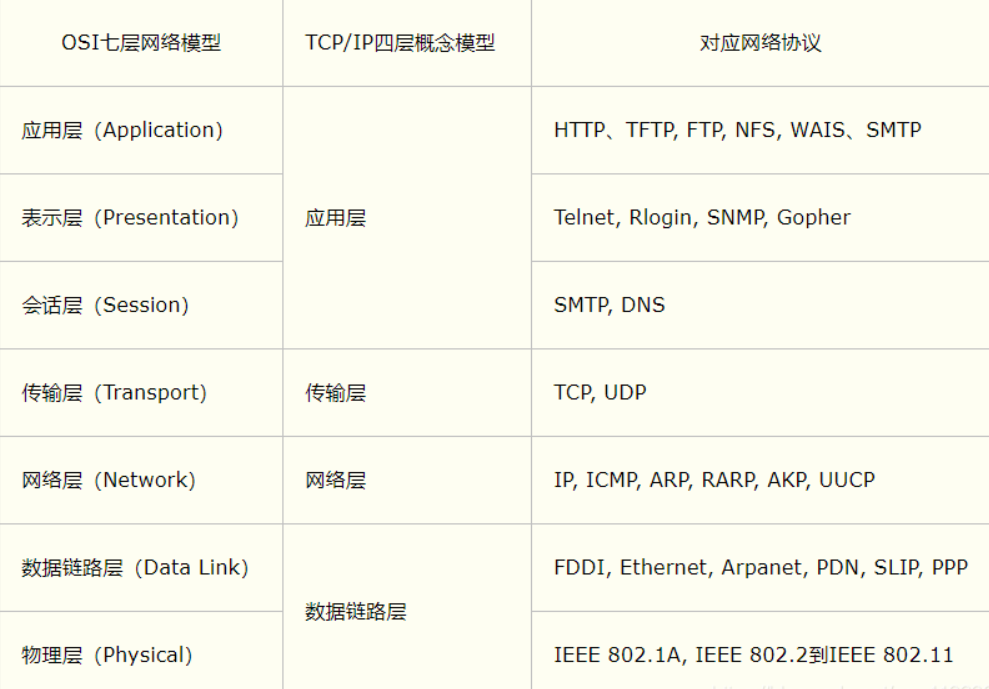
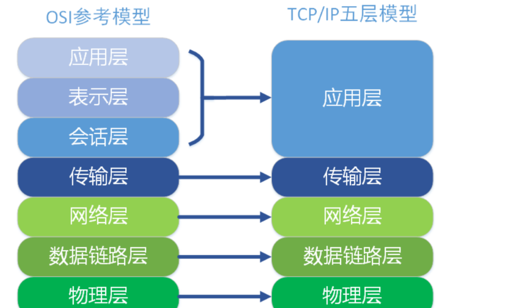
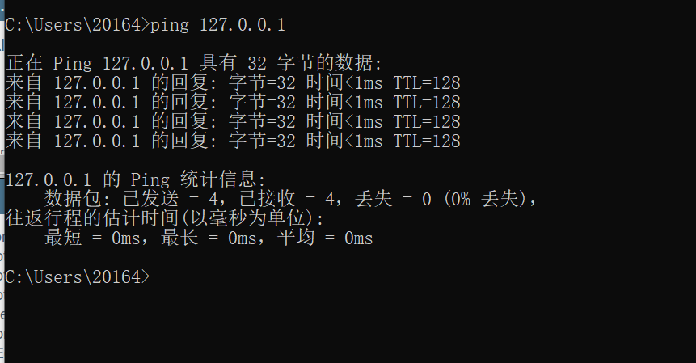
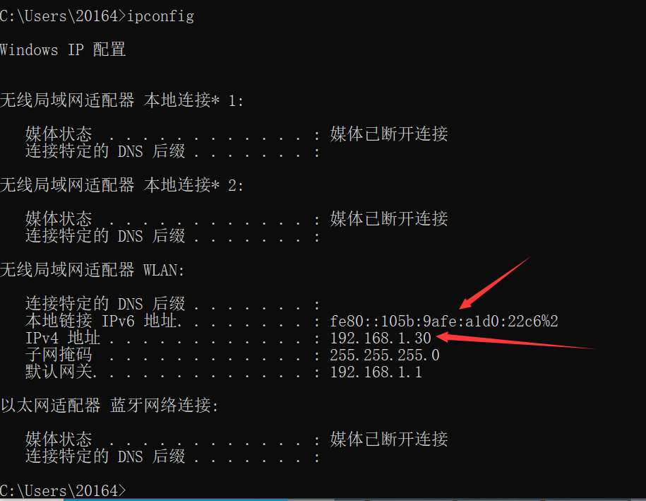
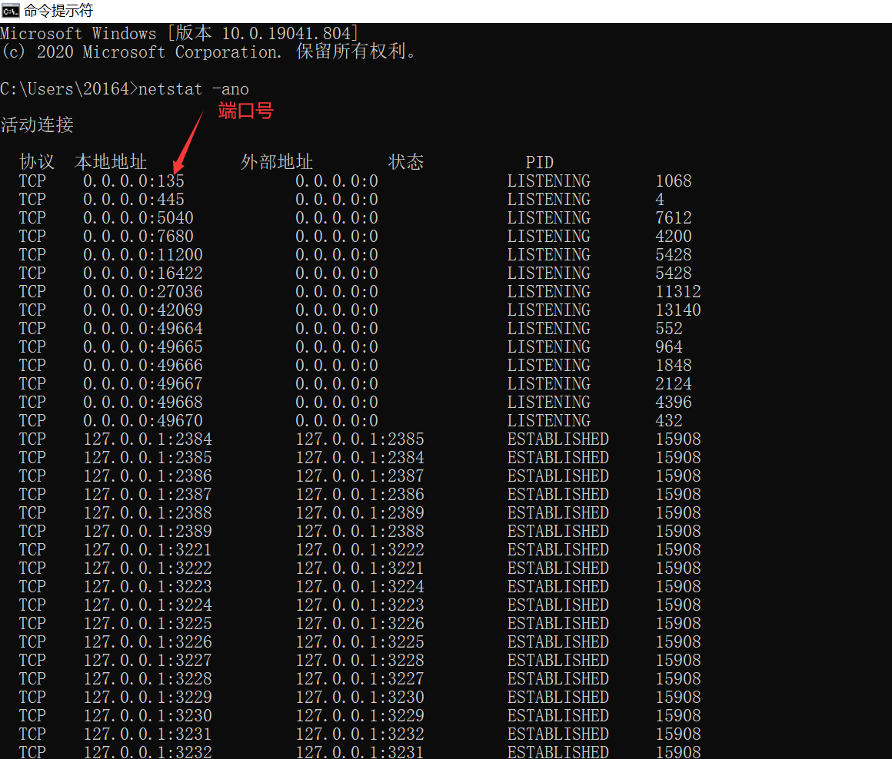
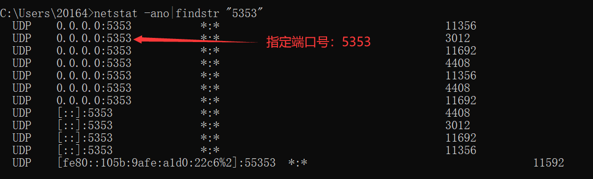
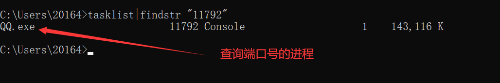

# 网络编程


## 1 概述

打电话--连接--接通--通话              TCP

发短信--发送了就完事了--接收     UDP


***计算机网络：***计算机网络是指将地理位置不同的具有独立功能的多台计算机及其外部设备，通过通信线路连接起来，在网络操作系统，网络管理软件及网络通信协议的管理和协调下，实现资源共享和信息传递的计算机系统。


***网络编程的目的：***传播交流信息，数据交换，通信。

***想要达到这个效果需要什么：***

- 如何准确的定位网络上的一台主机？通过  IP，端口，定位到计算机上的某个资源
- 找到了主机之后如何传输数据？


javaweb    网页编程    B/S架构

网络编程    TCP/IP       C/S架构


## 2 网络通信的要素

如何实现网络的通信？

**1、需要通信双方的地址：**

* IP

* 端口号
* 通过IP和端口号即可确定主机上的某个应用

**2、规则：网络通信的协议**

TCP/IP参考模型：






小结：

1、网络编程中有两个主要的问题

* 如何准确的定位到网络上的一台或多台主机

* 找到主机之后如何进行通信

2、网络编程中的要素

* IP和端口号

* 网络通信协议


## 3 IP

IP地址：Java中InetAddress类可以返回IP

* 使用IP可以唯一定位一台网络上计算机
* 127.0.0.1：是本机localhostIP地址，可以在本地cmd中使用ping命令查看
  *  


+ **IP地址的分类：**
  +  IPV4/IPV6
    +  IPV4 ： 形式上：127.0.0.1，由四个字节组成，0~255，一共有42亿IP，但30亿都在北美，亚洲只有4亿。在2011年IPV4类型IP就已经使用完毕。
    +   IPV6：128位。8个无符号整数。在本地主机上使用ipconfig命令可查看IPV6地址。
      +  
  +   公网IP(互联网)—私网IP(局域网)
     +   ABCD四类地址
     +  192.168.xx.xx,专门给组织内部使用的。

* 域名：为了解决记忆IP问题


**Java中如何获取IP？：**

```java
package com.kuang.lesson01;

import java.net.InetAddress;
import java.net.UnknownHostException;

//测试IP
public class TestInetAddress {
    public static void main(String[] args) {
        try {
            //查询本机的IP
            InetAddress inetAddress1 = InetAddress.getByName("127.0.0.1");
            System.out.println(inetAddress1);
            InetAddress inetAddress3 = InetAddress.getByName("localhost");
            System.out.println(inetAddress3);
            InetAddress inetAddress4 = InetAddress.getLocalHost();
            System.out.println(inetAddress4);

            //查网站的IP地址
            InetAddress inetAddress2 = InetAddress.getByName("www.baidu.com");
            System.out.println(inetAddress2);

            //常用方法
            System.out.println(inetAddress2.getAddress());//返回地址
            System.out.println(inetAddress2.getCanonicalHostName());//返回规范主机名称
            System.out.println(inetAddress2.getHostAddress());//返回主机地址
            System.out.println(inetAddress2.getHostName());//返回主机名称
            
            //未知主机异常
        } catch (UnknownHostException e) {
            e.printStackTrace();
        }
    }
}

```


## 4 端口

端口表示计算机上一个程序的进程。将一栋大楼比作一个IP，端口就像是楼内的房间号一样。

* 不同的进程有不同的端口号！端口号不能冲突，否则会报错。端口号用来区分软件

* 端口号被规定为在0~65535之间

* 端口又被分为TCP端口和UDP端口，每一个端口都有0~65535个端口号。所以计算机上的端口号应该是65535*2个。在单个协议下（TCP或者UDP）端口号不能冲突，在多个协议下，端口号可以重复。

* 端口分类

  *  共有端口 0~1023 尽量不要占用。下面是几个常见端口号：

    *  HTTP:80
    * HTTPS:443
    * Telent:23
    * FTP:21

  *  程序注册端口  1024~49151，分配给用户或者程序。

    *  Tomcat：8080
    * MySQL：3306
    * Oracle：1521

  * 动态、私有端口  49152~65535

    ```
    netstat -ano  #查看所有端口
    netstat -ano|findstr "5353"  #查看指定的端口
    tasklist|findstr "11792"  #查看指定端口的进程
    ctrl+shift+ESC  #快捷键打开任务管理器
    ```

    在CMD中使用上述命令可以查看相应的结果：

    

    + 使用netstat -ano命令：

      

      

      

    + 使用netstat -ano|findstr "5353"命令：

      

      

      

    + 使用tasklist|findstr "11792"命令：

      
      
      

    

    **Java中如何获取端口？：**

    ```java
    package com.kuang.lesson01;
    
    import java.net.InetSocketAddress;
    
    public class TestInetSocketAddress {
        public static void main(String[] args) {
            //参数是hostname(主机)+port(端口号)
            InetSocketAddress socketAddress01 = new InetSocketAddress("127.0.0.1", 8080);
            System.out.println(socketAddress01);
            InetSocketAddress socketAddress02 = new InetSocketAddress("localhost", 8080);
            System.out.println(socketAddress02);
    
            //查看对象的一些方法
            System.out.println(socketAddress01.getAddress());
            System.out.println(socketAddress01.getHostName());
            System.out.println(socketAddress01.getPort());//获取端口号
            System.out.println(socketAddress01.getHostString());
        }
    }
    
    ```

    

## 5 通信协议      

协议：即约定，就好比现在中国人约定使用普通话交流。

**网络通信协议：**速率，传输码率，代码结构，传输控制等等...问题非常复杂。

**如何解决这一复杂问题？**：使用分层的方法，大事化小。

**TCP/IP协议簇（实际上是一组协议而不是两组）中比较重要的两个概念：**

* TCP：用户传输协议
* UDP：用户数据报协议

**出名的协议：**

* TCP:用户传输协议
* IP:网络互联协议

**TCP和UDP的对比：**

* TCP：打电话

  *  双方连接，稳定

  * 三次握手，四次挥手

    ```
    最少需要三次握手，才能保证稳定连接！
    A：你瞅啥？
    B：瞅你咋地？
    A：来干一场
    
    
    断开连接：
    A：我要断开了
    B：我知道你要断开了
    B：你真的要断开了吗
    A：我真的要断开了
    ```

    

  * 客户端，服务端之间进行连接

  * 传输完成，释放连接，效率低

* UDP：发短信

  *  不连接，不稳定
  * 客户端，服务端：但没有明确的界限
  * 不管你有没有准备好，都可以发送给你


## 6 TCP


### 6.1 TCP实现聊天

客户端：

1. 要知道服务端IP与端口号
2. 连接服务器socket
3. 发送消息

服务器：

1. 建议服务的端口号ServeSocket
2. 等待用户的连接，通过accept()方法
3. 从客户端接收用户的消息


测试代码：

```java
package com.kuang.lesson02;

import java.io.ByteArrayOutputStream;
import java.io.IOException;
import java.io.InputStream;
import java.net.ServerSocket;
import java.net.Socket;

//服务端
public class TcpServeDemo01 {
    public static void main(String[] args) {
        //创建对象
        ServerSocket serverSocket=null;
        Socket socket=null;
        InputStream is=null;
        ByteArrayOutputStream baos=null;
        try {
            //1.首先得有一个地址,端口号设置为9999
            serverSocket = new ServerSocket(9999);
            //2.服务端等待客户端连接
            socket = serverSocket.accept();
            //3.从客户端读取消息
            is = socket.getInputStream();

            //管道流
            baos = new ByteArrayOutputStream();
            byte[] buffer = new byte[1024];
            int len;
            while((len=is.read(buffer))!=-1)
            {
                baos.write(buffer,0,len);
            }
            //4.输出消息
            System.out.println(baos.toString());

        } catch (IOException e) {
            e.printStackTrace();
        }finally {
            //服务端关闭资源
            if(baos!=null)
            {
                try {
                    baos.close();
                } catch (IOException e) {
                    e.printStackTrace();
                }
            }
            if(is!=null)
            {
                try {
                    is.close();
                } catch (IOException e) {
                    e.printStackTrace();
                }
            }
            if(socket!=null)
            {
                try {
                    socket.close();
                } catch (IOException e) {
                    e.printStackTrace();
                }
            }
            if(serverSocket!=null)
            {
                try {
                    serverSocket.close();
                } catch (IOException e) {
                    e.printStackTrace();
                }
            }
        }
    }
}

```

```java
package com.kuang.lesson02;

import java.io.IOException;
import java.io.OutputStream;
import java.net.InetAddress;
import java.net.Socket;
import java.net.UnknownHostException;

//客户端
public class TcpClientDemo01 {
    public static void main(String[] args) {
        //创建对象
        Socket socket = null;
        OutputStream os = null;
        try {
            //1.要知道服务器的地址，端口号
            InetAddress serveIp = InetAddress.getByName("127.0.0.1");
            int port = 9999;
            //2.创建一个socket连接
            socket = new Socket(serveIp, port);
            //3.发送消息，IO流
            os = socket.getOutputStream();
            os.write("欢迎学习Java基础知识".getBytes());//写消息

        } catch (Exception e) {
            e.printStackTrace();
        }finally {
            //客户端关闭资源
            if(os!=null) {
                try {
                    os.close();
                } catch (IOException e) {
                    e.printStackTrace();
                }
            }
            if(socket!=null){
                try {
                    socket.close();
                } catch (IOException e) {
                    e.printStackTrace();
                }
            }
        }

    }
}

```


### 6.2 TCP实现文件上传


这里实现的是图片文件的上传：

```java
package com.kuang.lesson02;

import java.io.*;
import java.net.InetAddress;
import java.net.Socket;

//客户端
public class TcpClientDemo02 {
    public static void main(String[] args) throws IOException {
        //1.创建一个socket连接
        Socket socket = new Socket("127.0.0.1", 9000);
        //2.创建一个输出流
        OutputStream os = socket.getOutputStream();
        //3.读取文件,将文件读取成输出流(注意图片文件要复制到总的文件目录下)
        FileInputStream fis = new FileInputStream(new File("img.png"));
        //4.写出文件,发送文件
        byte[] buffer=new byte[1024];
        int len;
        while((len=fis.read(buffer))!=-1)
        {
            os.write(buffer,0,len);
        }

        //通知服务器，我已经传输完了
        socket.shutdownOutput();//我已经传输完了

        //确定服务端接收完毕了，再断开连接
        InputStream inputStream = socket.getInputStream();
        //管道流
        ByteArrayOutputStream baos = new ByteArrayOutputStream();

        byte[] buffer2=new byte[1024];
        int len2;
        while((len2=inputStream.read(buffer2))!=-1)
        {
            baos.write(buffer2,0,len2);
        }
        System.out.println(baos.toString());

        //5.关闭资源
        baos.close();
        inputStream.close();
        fis.close();
        os.close();
        socket.close();

    }
}

```

```java
package com.kuang.lesson02;

import java.io.*;
import java.net.ServerSocket;
import java.net.Socket;

//服务端
public class TcpServeDemo02 {
    public static void main(String[] args) throws IOException {
        //1.创建服务
        ServerSocket serverSocket = new ServerSocket(9000);
        //2.监听客户端连接
        Socket socket = serverSocket.accept();//阻塞式监听，会一直等待客户端连接
        //3.获取输入流
        InputStream is = socket.getInputStream();
        //4.文件输出
        FileOutputStream fos = new FileOutputStream(new File("receive.png"));
        byte[] buffer = new byte[1024];
        int len;
        while((len=is.read(buffer))!=-1)
        {
            fos.write(buffer,0,len);
        }

        // 通知客户端我接收完毕了
        OutputStream os = socket.getOutputStream();
        os.write("我接收完毕了，你那边可以断开了".getBytes());

        //5.关闭资源
        os.close();
        fos.close();
        is.close();
        socket.close();
        serverSocket.close();
    }
}

```


## 7.UDP

类似于发短信：无需连接，但是需要知道对方地址


### 7.1 UDP消息发送

**发送端：**

```java
package com.kuang.lesson03;

import java.io.IOException;
import java.net.*;
import java.nio.charset.StandardCharsets;

//发送端
//UDP发送消息无需建立连接
public class UdpClientDemo01 {
    public static void main(String[] args) throws IOException {
        //1.建立一个socket
        DatagramSocket datagramSocket = new DatagramSocket();

        //2.建立一个包
        String msg = "你好，服务器";
        DatagramPacket packet = new DatagramPacket(msg.getBytes(), 0, msg.getBytes().length, InetAddress.getByName("localhost"), 9090);

        //3.发送包
        datagramSocket.send(packet);

        //4.关闭流
        datagramSocket.close();
    }
}

```

**接收端：**

```java
package com.kuang.lesson03;

import java.io.IOException;
import java.net.DatagramPacket;
import java.net.DatagramSocket;
import java.net.SocketException;

//接收端
//还是要等待客户端连接
public class UdpServeDemo01 {
    public static void main(String[] args) throws IOException {
        //开放端口
        DatagramSocket datagramSocket = new DatagramSocket(9090);
        //接收数据包
        byte[] buffer = new byte[1024];
        DatagramPacket packet = new DatagramPacket(buffer, 0, buffer.length);
        datagramSocket.receive(packet);
        //输出数据
        System.out.println(new String(packet.getData(),0,packet.getLength()));
        //关闭资源
        datagramSocket.close();
    }
}

```


### 7.2 UDP实现聊天-循环发送消息

**发送端：**

```java
package com.kuang.chat;

import java.io.BufferedReader;
import java.io.IOException;
import java.io.InputStreamReader;
import java.net.DatagramPacket;
import java.net.DatagramSocket;
import java.net.InetSocketAddress;

//发送方
public class UdpSenderDemo01 {
    public static void main(String[] args) throws IOException {
        //建立一个socket,打开自身UDP端口6666
        DatagramSocket socket = new DatagramSocket(6666);
        //准备数据，通过控制台读取
        BufferedReader bufferedReader = new BufferedReader(new InputStreamReader(System.in));

        //循环发送消息
        while(true)
        {
            //将读取的数据转化为字符串，再转化为字节流
            String s = bufferedReader.readLine();
            byte[] bytes = s.getBytes();
            //将字节流打包，发送到UDP端口8888
            DatagramPacket packet = new DatagramPacket(bytes, 0, bytes.length, new InetSocketAddress("localhost", 8888));
            //通过socket打包发出
            socket.send(packet);
            //将字符串“bye"作为循环结束条件
            if(s.equals("bye"))
            {
                break;
            }
        }
        //关闭资源
        socket.close();
    }
}

```

**接收端：**

```java
package com.kuang.chat;

import java.io.IOException;
import java.net.DatagramPacket;
import java.net.DatagramSocket;
import java.net.SocketException;

//接收方
public class UdpReceiveDemo01 {
    public static void main(String[] args) throws IOException {
        DatagramSocket socket = new DatagramSocket(8888);

        //循环接收并打印消息
        while(true){
            //创建字节数组用来接收包裹
            byte[] bytes = new byte[1024];
            //创建数据包来接收字节流
            DatagramPacket packet = new DatagramPacket(bytes, 0, bytes.length);
            //阻塞式接收包裹
            socket.receive(packet);
            //这个字节数组用来转换为String类型数据后输出
            byte[] data = packet.getData();
            //将字节流转换为String类型
            String s = new String(data, 0, data.length);
            //打印从Sender传输过来的数据
            System.out.println(s);

            //将从Sender传过来的”bye“作为结束条件
            if(s.equals("bye"))
            {
                break;
            }
        }
        //关闭资源
        socket.close();

    }
}

```


### 7.3 UDP多线程实现在线咨询


**发送方线程：**

```java
//发送方线程
public class TalkSend implements Runnable{
    DatagramSocket socket=null;
    BufferedReader bufferedReader=null;

    //自己的端口号
    private int fromPot;
    //要发送到的IP地址
    private String toIP;
    //要发送到的端口号
    private int toPort;

    public TalkSend(int fromPot, String toIP, int toPort) {
        this.fromPot = fromPot;
        this.toIP = toIP;
        this.toPort = toPort;

        try{
            //建立一个socket
            socket = new DatagramSocket(fromPot);
            //准备数据，通过控制台读取
            bufferedReader = new BufferedReader(new InputStreamReader(System.in));
        }catch(Exception e)
        {
            e.printStackTrace();
        }
    }

    @Override
    public void run() {
        //循环发送消息
        while(true)
        {
            //将读取的数据转化为字符串，再转化为字节流
            String s = null;
            try {
                s = bufferedReader.readLine();
            } catch (IOException ioException) {
                ioException.printStackTrace();
            }
            byte[] bytes = s.getBytes();
            //将字节流打包，发送到UDP端口8888
            DatagramPacket packet = new DatagramPacket(bytes, 0, bytes.length, new InetSocketAddress("localhost", 8888));
            //通过socket打包发出
            try {
                socket.send(packet);
            } catch (IOException ioException) {
                ioException.printStackTrace();
            }
            //将字符串“bye"作为循环结束条件
            if(s.equals("bye"))
            {
                break;
            }
        }
        //关闭资源
        socket.close();
    }
}
```


**接收方线程：**

```java
//接收方线程
public class TalkReceive implements Runnable{
    DatagramSocket socket=null;
    private int port;
    private String msgFrom;

    public TalkReceive(int port,String msgFrom) {
        this.port = port;
        this.msgFrom = msgFrom;
        try {
            socket = new DatagramSocket(this.port);
        } catch (SocketException e) {
            e.printStackTrace();
        }
    }

    @Override
    public void run() {

        //循环接收并打印消息
        while(true){
            //创建字节数组用来接收包裹
            byte[] bytes = new byte[1024];
            //创建数据包来接收字节流
            DatagramPacket packet = new DatagramPacket(bytes, 0, bytes.length);
            //阻塞式接收包裹
            try {
                socket.receive(packet);
            } catch (IOException e) {
                e.printStackTrace();
            }
            //这个字节数组用来转换为String类型数据后输出
            byte[] data = packet.getData();
            //将字节流转换为String类型
            String s = new String(data, 0, packet.getLength());
            //打印从Sender传输过来的数据
            System.out.println(msgFrom+": "+s);

            //将从Sender传过来的”bye“作为结束条件
            if(s.equals("bye"))
            {
                break;
            }
        }
        //关闭资源
        socket.close();
    }
}
```


**发送方：Student/接收方：Teacher**

```java
//模拟学生是发送方，老师是接收方
public class TalkStudent {
    public static void main(String[] args) {
        //线程执行
        new Thread(new TalkSend(7777, "localhost", 9999)).start();
        new Thread(new TalkReceive(8888, "老师")).start();
    }
}
```


**发送方：Teacher/接收方：Student**

```java
//模拟老师是发送方，学生是接收方
public class TalkTeacher {
    public static void main(String[] args) {
        //线程执行
        new Thread(new TalkSend(5555, "localhost", 8888)).start();
        new Thread(new TalkReceive(9999, "学生")).start();
    }
}
```


## 8.URL下载网络资源

**概念：**

因特网上的可用资源可以用简单字符串来表示，该文档就是描述了这种字符串的语法和语义。而这些字符串则被称为：“[统一资源定位器](https://baike.baidu.com/item/统一资源定位器/7682460)”（URL）。

---

```java
//URL一般格式
协议：//ip地址：端口/项目名/资源

//举例说明：https://www.baidu.com/
//DNS域名解析会将百度的域名转换为一个IP地址
```


**案例：通过URL从网易云音乐下载音频文件**

```java
package com.kuang.url;

import org.apache.commons.io.FileUtils;

import java.io.File;
import java.io.FileOutputStream;
import java.io.InputStream;
import java.net.URL;
import java.net.URLConnection;

public class UrlDownload {
    public static void main(String[] args) throws Exception {
        //网易云音乐音频文件的url
        URL url = new URL("https://m701.music.126.net/20210303192900/7019817bd5b0f8ba35d842b7e28a1c88/jdyyaac/obj/w5rDlsOJwrLDjj7CmsOj/7621529945/33ea/1050/0d79/69334c2372339e52e69cc6a801093022.m4a");

        //两种实现方式

        //1.自己写方法实现
        //连接到url资源
        URLConnection urlConnection = url.openConnection();

        InputStream inputStream = urlConnection.getInputStream();

        FileOutputStream fileOutputStream = new FileOutputStream("download.m4a");

        //数据缓冲区
        byte[] buffer = new byte[1024];
        int len;
        while((len=inputStream.read(buffer))!=-1)
        {
            //写出数据
            fileOutputStream.write(buffer, 0, len);
        }

        //2.通过common.io中的方法实现
        FileUtils.copyURLToFile(new URL("https://m701.music.126.net/20210303192900/7019817bd5b0f8ba35d842b7e28a1c88/jdyyaac/obj/w5rDlsOJwrLDjj7CmsOj/7621529945/33ea/1050/0d79/69334c2372339e52e69cc6a801093022.m4a"), new File("downloads.m4a"));
    }
}
```


